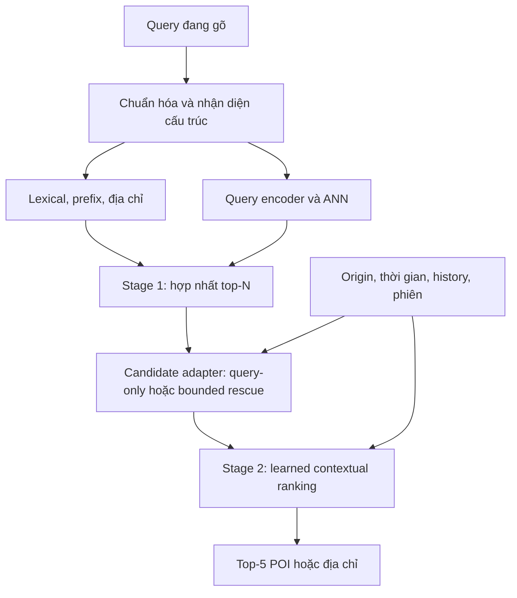

# Thiết kế demo tìm kiếm điểm đến AI hai stage tại Hà Nội

**Phạm vi:** tìm POI/địa chỉ để đặt xe, từ lúc người dùng đang gõ đến khi chọn điểm đến.  
**Kiến trúc:** Stage 1 hybrid retrieval có encoder được fine-tune; Stage 2 learned ranking cá nhân hóa theo không gian, thời gian và lịch sử, chọn model bằng baseline ladder.  
**Artifacts hiện có:** corpus `hn-260910-7f1b69b167`, query dataset `hnq10k-pilot-v3`; chưa train encoder/ranker hay benchmark serving. Các mục triển khai bên dưới là kế hoạch nếu chưa có artifact tương ứng.

**Nguồn dữ liệu:** snapshot OSM Hà Nội cho địa điểm; query tổng hợp và query do người gõ cho search; lịch sử mô phỏng cho thử nghiệm cá nhân hóa, bổ sung log thật khi có.

**Cách triển khai:** hoàn thành và đánh giá Stage 1 độc lập trước, chốt một phiên bản retrieval rồi mới train/eval Stage 2. Tài liệu này là bản dùng chung; mục 2–4 là kế hoạch Stage 1, mục 5 là kế hoạch Stage 2, mục 6 là quy tắc đánh giá áp dụng cho cả hai.

| Giai đoạn | Câu hỏi cần trả lời | Đầu ra nghiệm thu |
|---|---|---|
| Stage 1 — hiểu chuỗi | Có tìm được POI/địa chỉ phù hợp với chuỗi gõ, kể cả lỗi, trong ngân sách tốc độ không? | Corpus, dataset, encoder/index, search API, demo query-only và benchmark độc lập |
| Stage 2 — hiểu người và context | Context có cứu target bị thiếu và xếp đúng điểm lên đầu mà không phá ý định rõ ràng không? | Dataset có sampler contract, thí nghiệm candidate rescue, baseline ladder và demo đặt điểm trên bản đồ |

Stage 1 không cần chờ dữ liệu hành vi và không phải đoán duy nhất một chi nhánh từ query thiếu thông tin. Stage 2 không cần Stage 1 hoàn hảo, nhưng cần biết rõ coverage, retrieval miss và phiên bản ứng viên đang dùng. Có thể chuẩn bị schema history và quy trình thu thập log sớm; huấn luyện ranker thực hiện sau khi chốt retrieval.

## 1. Kiến trúc và cách chạy model

**Stage 1 hiểu chuỗi gõ và tìm đủ ứng viên. Stage 2 chọn đúng ứng viên theo ý định hiện tại của từng người.** AI học biểu diễn query–POI và cách dùng context; hybrid hỗ trợ độ chính xác trên các kiểu chuỗi khác nhau.

Stage 1 có thể chạy neural-only. Với **bi-encoder**, POI được encode offline; online chỉ encode query và tìm vector gần nhất trong ANN index. Không chạy language model lại trên toàn bộ POI mỗi lần gõ. Cách tổ chức encode corpus/query riêng được mô tả trong [Sentence Transformers — Semantic Search](https://www.sbert.net/examples/sentence_transformer/applications/semantic-search/README.html).

**Chọn hybrid cho demo:** dense + lexical/structured retrieval. Hybrid không tự động nhanh hơn dense-only vì có thêm nhánh truy hồi. Lợi ích dự kiến là độ phủ và độ chính xác trên prefix, tên riêng, số nhà, mã tòa; tốc độ được kiểm soát bằng encoder nhỏ, index, cache, giới hạn ứng viên và điều phối nhánh.

| Thành phần | Offline | Online |
|---|---|---|
| Codex sinh dữ liệu | Tạo query diễn đạt tự nhiên và kịch bản theo batch, có validation | Không nằm trên đường xử lý search request |
| POI encoder | Encode tên, alias, category, địa chỉ; ghi vectors vào index | Tra cứu vectors đã có |
| Query encoder | Fine-tune trên query–POI pairs | Encode query một lần khi nhánh dense được bật |
| Lexical/structured index | Index exact, prefix, BM25, địa chỉ, alias | Retrieve theo chuỗi và cấu trúc |
| Context ranker | Train mô hình dùng query, POI, history, không gian–thời gian | Chấm top-N candidates theo context request |



Dùng OpenSearch cho lexical và vector index, Python cho data/model/API, Parquet hoặc JSONL cho dataset. Mô hình khởi đầu là multilingual E5-small được fine-tune theo domain; chọn model cuối bằng benchmark tiếng Việt. Stage 2 đi từ Stage 1 ranking → heuristic geo → LightGBM LambdaMART → AggregateMLP → attention. Bản đồ và preview khoảng cách là phần bắt buộc của demo tích hợp; route theo mạng đường là adapter ngoài đường xử lý suggest.

Cả hai stage được train offline và suy luận online. Cập nhật history online không đồng nghĩa cập nhật trọng số model; không dùng online learning trong pilot. Neural-only retrieval/ranking là một đối chứng bắt buộc; hybrid là lựa chọn triển khai cần benchmark, không phải điều kiện để hệ thống có AI.

## 2. Xây corpus POI/địa chỉ Hà Nội từ OSM

### 2.1 Pipeline dữ liệu

1. Đăng ký source snapshot **`vietnam-260910.osm.pbf`**, 328.214.395 bytes, timestamp `2026-09-10T20:21:06Z`, theo `HANOI_PBF_POI_AUDIT.md`; checksum và evidence ở mục 2.4. Không mặc định tải lại bản “latest”. Chỉ dùng nguồn như [Geofabrik](https://download.geofabrik.de/asia/vietnam.html) để phục hồi đúng snapshot hoặc chủ động tạo version mới.
2. Pipeline đã chạy đọc PBF bằng PyOsmium, lắp boundary relation 1903516 version 183, kiểm tra điểm đại diện trên polygon và xuất Parquet trực tiếp. Không tạo Hanoi PBF extract riêng. Boundary, policy, tool versions và hashes ở `corpus_manifest.json`; nếu đổi chiến lược extract phải tạo corpus version mới.
3. Lấy POI có tên/chức năng tìm kiếm và đối tượng có địa chỉ hữu ích. Nhóm tag chính: `amenity`, `shop`, `tourism`, `office`, `healthcare`, `public_transport`, `building`, `addr:*` và các trường tên/alias.
4. Chuẩn hóa, dedup node/way cùng thực thể, giữ riêng các chi nhánh; xây quan hệ POI–tòa–complex khi có bằng chứng.
5. Xuất canonical corpus, kiểm tra nguồn/tọa độ/địa chỉ, tạo lexical index và POI passages để encode.

Không dùng mọi building không tên làm kết quả tìm kiếm. Giữ đối tượng có số nhà/đường dù không phải cửa hàng. Tên đường và addressable objects cần được lưu nếu demo bao gồm tìm địa chỉ, vì corpus chỉ gồm venue có tên sẽ không đủ.

### 2.2 Schema tối thiểu

| Trường | Nội dung |
|---|---|
| `poi_id`, `canonical_id` | ID nội bộ ổn định; nhóm bản ghi cùng thực thể |
| `name`, `aliases[]` | Tên gốc và alias có nguồn |
| `category`, `brand_id`, `complex_id` | Loại, chuỗi thương hiệu, khu phức hợp |
| `address_text`, `address_fields` | Số nhà, ngõ, đường, đơn vị hành chính, mã tòa nếu nguồn có |
| `ranking_point`, `point_quality.ranking` | Điểm đại diện để hiển thị/tính relevance; lưu method, source, validation status |
| `routing_point`, `routing_point_id`, `point_quality.routing` | Điểm tiếp cận được chọn khi có bằng chứng; có thể null; tòa nhiều cổng lưu thêm `access_points[]` |
| `destination_searchable` | Đủ thông tin đã qua policy để tìm destination; điều kiện lấy target Stage 1 |
| `origin_search_eligible` | Điều kiện origin sampler Stage 2; kế thừa `origin_eligible` trong corpus nguồn |
| `pickup_access_verified` | Bằng chứng tiếp cận điểm đón, độc lập với hai cờ search; hiện false |
| `source_ref`, `raw_tags`, `corpus_version` | OSM type/ID/version, dữ liệu gốc và snapshot |

Giữ song song Unicode có dấu và dạng không dấu, xử lý `đ/Đ`; parse trước khi bỏ dấu câu. Không mặc định `16/2` tương đương `162`, hoặc mã `S702` là duy nhất toàn thành phố. Chỉ tạo alias mã theo namespace và quy tắc đã xác minh. Đơn vị hành chính và tên lịch sử lưu theo nguồn/snapshot.

**Giới hạn coverage:** OSM có thể thiếu số nhà, ngõ, cửa hàng nhỏ và mã căn hộ. AI sinh query không bổ sung được sự tồn tại của các địa chỉ này. Nguồn bổ sung phải tách provenance và đánh giá riêng; không đưa địa chỉ do LLM bịa vào corpus thật. Điểm trên bản đồ cũng chưa chắc là cổng xe tiếp cận được.

Ghi công OpenStreetMap và tuân thủ [ODbL/attribution](https://www.openstreetmap.org/copyright). Không dùng Nominatim public để tải toàn bộ POI hoặc autocomplete; các cách dùng này bị cấm trong [chính sách dịch vụ](https://operations.osmfoundation.org/policies/nominatim/).

### 2.3 Corpus đã xây và search view

Corpus **`hn-260910-7f1b69b167`** đã được xây từ PBF thực, status `built_conservative_pilot_not_production_verified`. Đã kiểm tra trực tiếp bytes/checksums nguồn. `HANOI_OSM_PARQUET_BUNDLE.zip` chứa code, polygon, policy, Parquet và báo cáo thực chạy.

| Artifact/lớp | Số bản ghi |
|---|---:|
| Functional raw | 32.900 |
| Functional có định danh | 24.277 |
| Addressable raw | 26.394 |
| Building có tên | 6.512 |
| Hợp searchable raw | 55.029 |
| Canonical pilot | 46.792 |
| Origin policy pool trong corpus nguồn | 8.135 |
| Origin có nhãn dùng được trong search view v3 | 8.131 |
| Pickup access verified | 0 |
| Destination search view v3 sau audit tên/địa chỉ | 45,693 |

Các nhóm raw giao nhau, không cộng để suy tổng. Canonical mới chỉ dedup bảo thủ (một source merge), vẫn có thể còn nhiều POI trùng/nghi trùng. Có 17 relation không lắp được trên phạm vi toàn quốc; chưa xác định bao nhiêu thuộc Hà Nội. Không coi geometry hợp lệ là bằng chứng đầy đủ mọi member hay điểm đón hợp lệ.

`corpus_search_view.parquet` là lớp dẫn xuất có version `hn-search-view-v3`; giữ 46.792 ID nguồn và đánh dấu `destination_searchable`. Tạo passages và index cho thí nghiệm v3 từ các record có cờ true, dùng trường đã chuẩn hóa, không quay về raw address bẩn. Corpus gốc giữ nguyên để truy vết. Dataset Stage 1 chọn destination từ view này, không lọc bằng origin eligibility. Không cần POI có routing point để trở thành destination tìm kiếm.

`HANOI_PBF_POI_AUDIT.md` là audit đầu vào trước build; số 54.925 và bảng tag-key lệch 36 thuộc báo cáo đó. Build hiện tại có policy và kiểm tra assembled geometry riêng; không ép counts về báo cáo cũ. Chưa có script audit gốc để quy chính xác từng chênh lệch.

### 2.4 Manifest thực và quy trình cập nhật

```yaml
corpus_version: hn-260910-7f1b69b167
source:
  filename: vietnam-260910.osm.pbf
  size_bytes: 328214395
  md5: "8140c9b07d88478bcd6c68b19a06ffb2"
  sha256: "867d3d6d721b50737b39eedf49fd3542254b7c31831485cce38f3bee4f8908b2"
  source_timestamp: "2026-09-10T20:21:06Z"
  verified_directly: true
boundary:
  relation_id: 1903516
  relation_version: 183
  artifact: hanoi_boundary.geojson
  sha256: "4f83ca81c0cac8a44433afc1bada002767db6c8f5a427a193a74c26c8e581147"
extraction:
  strategy: pyosmium_assembled_geometry_to_parquet
  hanoi_pbf_extract: null
canonical:
  artifact: hanoi_poi_canonical.parquet
  count: 46792
  sha256: "a485d688feabe1da530b593d416d90d1c01253bb385b5695791a0a7980ee66bb"
search_view:
  version: hn-search-view-v3
  artifact: corpus_search_view.parquet
  destination_searchable_count: 45693
```

`corpus_policy.json` là config thực đã chạy; không cần dựng thêm `configs/corpus.yaml` giả chỉ để khớp tên trong bản thiết kế cũ. Manifest đầy đủ có counts, runtime, command và output hashes. Query bundle có `generation_policy.json` và `dataset_manifest.json` riêng cho search view/dataset. Join bằng ID và cả corpus/search-view/dataset versions khi phù hợp.

Bổ sung/sửa POI: chuẩn hóa và encode/index record mới bằng encoder đã khóa; không mặc định train lại. Khi đổi encoder phải tạo lại vectors toàn catalog để đồng bộ không gian embedding. Huấn luyện lại khi có dữ liệu query/hành vi mới hoặc chất lượng cần cải thiện, rồi qua eval trước khi thay checkpoint.

### 2.5 Ngữ nghĩa điểm đại diện và điểm tiếp cận

`point_quality` là object theo vai trò, không dùng một enum duy nhất cho hai điểm. Mỗi vai trò lưu `method` (`centroid`, `point_on_surface`, `explicit_node`, `entrance`, `road_snapped_fallback`), `source_ref`, `validation_status` và accuracy/uncertainty khi có. Explicit node hoặc entrance cũng chưa tự chứng minh ô tô được phép tiếp cận.

`ranking_point` dùng hiển thị POI và feature `ranking_distance_m` theo khoảng cách địa lý; với polygon có centroid ngoài hình, dùng point-on-surface hoặc điểm đại diện có nguồn, gắn đúng method. `routing_point` dùng route preview theo vehicle profile; lưu access evidence, graph/profile version, snap distance và validation status. Có thể giữ null nếu chưa xác minh. Road-snapped fallback chỉ là điểm suy ra, không tự nâng thành cổng hợp lệ; kiểm tra đường cấm, barrier, phía đường và khoảng cách snap theo policy.

Tòa nhiều cổng giữ `access_points[]`; điểm được chọn trong request đi cùng `routing_point_id` và policy version. Không ghi đè centroid bằng snap point. Phân biệt `ranking_distance_m`, `route_distance_m`, `route_duration_s`; không dùng khoảng cách thẳng làm ETA hoặc quãng đường chạy xe. Origin hợp lệ cho search không mặc nhiên là pickup đã xác minh; route demo chỉ dùng access point đạt policy hoặc hiển thị đường thẳng có nhãn rõ.

## 3. Dataset Stage 1: từ POI tới query nhiều trạng thái

### 3.1 Đơn vị dữ liệu và thứ tự xây dựng

Pipeline: **corpus đã làm sạch → giữ riêng cold POI → tạo/group seed queries → chia family split → sinh query variants → kiểm tra nhãn → negatives → train/eval artifacts**. Sau generation kiểm tra lại near-duplicates xuyên split; nếu có, group hoặc loại trước khi khóa dữ liệu, không chuyển test samples vào train trong quá trình tuning.

Một seed query là cách hỏi gốc về một ý định: tên đầy đủ, tên + chi nhánh, địa chỉ, alias hoặc category. Mỗi seed có `family_id`; toàn bộ prefix, typo và cách viết dẫn xuất giữ cùng family. Hai seed gần trùng ý nghĩa/cách viết phải dedup hoặc group trước khi chia split.

Khởi đầu bằng pilot **1.000 POI đủ chất lượng nếu corpus có đủ**, phân tầng category/vùng/chi nhánh/địa chỉ. Mỗi POI thử 2–4 seed queries và 4–6 biến thể mỗi seed, khoảng 8–24 query trước dedup. Sau audit mới mở rộng theo số POI thực tế; số lượng này là cấu hình khởi đầu, không phải thống kê coverage OSM.

### 3.2 Kết hợp rules và AI generation

| Nhóm query | Cách tạo | Điều kiện giữ nhãn |
|---|---|---|
| Tên/địa chỉ chuẩn | Từ trường nguồn, template | Không bổ sung trường thiếu |
| Thiếu dấu/sai dấu | Rules Unicode có kiểm soát | Kiểm tra collision với tên khác |
| Thêm/xóa/lặp/đảo ký tự | Rules với vị trí và seed cố định | Ghi edit operations và mức nhiễu |
| Telex/VNI chưa hoàn tất | Mô phỏng thao tác bàn phím/IME | Phân biệt chuỗi phím với text ứng dụng thực nhận |
| Prefix đang gõ | Cắt tại vài mốc ký tự/token | Giữ trạng thái mơ hồ; không ép một chi nhánh duy nhất |
| Thiếu/đảo token, viết tắt | Rules và LLM | Kiểm tra có làm mất định danh branch/address không |
| Diễn đạt tự nhiên/category | LLM chỉ dựa trên metadata đã cung cấp | Không gán một positive duy nhất nếu nhiều POI hợp lệ |
| Nhiều lỗi kết hợp | Ghép 1–2 phép biến đổi trước | Không để toàn tập thành chuỗi quá hỏng, thiếu thực tế |

**Vai trò của AI:** tạo cách diễn đạt và tình huống khó nghĩ hết bằng template. **Vai trò của rules:** tạo lỗi ký tự có thể tái lập, biết chính xác điều gì đã đổi. Không cần dùng LLM cho mọi thao tác bỏ dấu hoặc xóa một ký tự.

Ví dụ cấu trúc, không phải xác nhận địa điểm thật: từ `Quán Mây — Cơ sở A` có thể tạo query đầy đủ, không dấu, viết tắt hoặc prefix. Khi rút còn `quán mây`, cơ sở A/B đều có thể phù hợp với text. Một địa chỉ bị đổi số hoặc mất slash cần review lại nhãn, không tự giữ nguyên target.

### 3.3 Sinh dữ liệu bằng Codex và kiểm soát chất lượng

Chọn **Codex** làm công cụ sinh cách diễn đạt và kịch bản theo batch; không cần vận hành model LLM local để sinh dữ liệu. “Offline generation” ở đây chỉ nghĩa là tạo dữ liệu trước training, tách khỏi luồng phục vụ search. Rules Python vẫn tạo các lỗi ký tự có kiểm soát.

Chuẩn bị batch pilot 20–50 POI/seed families đã chuẩn hóa, kèm danh sách trường được phép sử dụng và split. Yêu cầu Codex xuất JSONL có `source_record_id`, `family_id`, `query`, `intent_type`, `source_fields`, `ambiguity`, `generation_type`; pipeline xác minh ID với input rồi liên kết target. Vòng sinh train chỉ dùng input của train, không truy cập locked human test hoặc cold-test POI. Chi tiết artifacts/workflow nằm ở mục 6.1 của `HANOI_POI_TECHSTACK_AND_MODELS.md`.

Chỉ dẫn sinh dữ liệu:

> Viết các cách người dùng có thể gõ để tìm địa điểm từ metadata được cung cấp. Không thêm số nhà, chi nhánh, địa danh lân cận hoặc tên dân gian chưa có nguồn. Ghi rõ query nào không đủ để xác định riêng một địa điểm. Trả JSON theo schema; không tự tuyên bố query đã được xác minh.

Sau generation:

1. Validate JSON/ID, đối chiếu `source_fields`, kiểm tra số nhà/mã/địa chỉ phát sinh ngoài input.
2. Dedup exact và gần trùng, loại template lặp quá nhiều; giới hạn số sample của từng POI và từng prompt.
3. Retrieve để tìm collisions: cùng query có thể phù hợp nhiều branch/địa điểm. Retrieval chỉ giúp phát hiện vấn đề, không tự xác nhận ground truth.
4. Giữ nhãn mạnh cho query có định danh đủ rõ; chuyển query mơ hồ sang multiple positives/weak label hoặc loại khỏi supervised single-target training.
5. Review thủ công mẫu phân tầng theo generator và loại lỗi; sửa generator nếu có nhiều lỗi. Model thứ hai có thể hỗ trợ review nhưng không thay human-gold.

Lưu `generator_tool=codex`, batch ID, thời gian, input/prompt/raw-output hashes và validator/rules versions. Model/revision hoặc generation settings chỉ ghi nếu thực sự được cung cấp, nếu không thì null/unknown. Rules giữ seed và edit operations. Giữ nguyên output đã sinh để tái lập dataset; không giả định gọi lại Codex luôn trả cùng nội dung. Query sinh cho test không được bổ sung ngược thành alias trong index hoặc dùng sửa rules trước khi chấm. Chất lượng Codex được audit theo batch; human-gold vẫn được người viết độc lập.

### 3.4 Nhãn, negatives và schema

Schema vật lý trong v3: `query_id`, `query`, `clean_query`, `query_family_id`, `case_type`, `track`, `query_surface`, `intended_poi_id`, `known_compatible_poi_ids`, `compatible_count`, `label_status`, `generation_method`, `split`, `leakage_group_id`, `corpus_version`, `search_view_version`, `dataset_version`. `intended_poi_id` chỉ là nguồn sinh; tập compatible chưa phải qrels adjudicated. Metadata/clean query/target ID không được đưa vào query encoder như đầu vào người dùng. `typing_sessions.parquet` bổ sung session/event/keystroke index; main table có thể null các trường session.

- **Query định danh cụ thể:** target chính là POI/địa chỉ gốc sau kiểm tra. Negative khó là cùng brand khác branch, tên giống khác đường hoặc số/mã gần giống nhưng sai.
- **Query mơ hồ/category/prefix ngắn:** các POI chấp nhận được là positives hoặc chưa được xác định; không mặc định mọi POI ngoài target gốc đều là negatives. Có thể bỏ nhóm chưa có nhãn đủ tốt khỏi contrastive training vòng đầu, vẫn giữ để đánh giá.
- **Hard-negative mining:** lấy từ lexical/dense retrieval trên train queries, trộn random negatives, loại canonical duplicates và positives đã biết. Near-origin POI chỉ là negative nếu thật sự sai ý định.

### 3.5 Train, validation và test

| Tập | Cách xây | Mục đích |
|---|---|---|
| Train synthetic | Seed/variants theo rules + LLM; nhãn đã lọc | Học prefix/noise/query–POI |
| Validation | Families tách khỏi train; cùng quy tắc kiểm tra | Chọn model, weights hybrid, N và thresholds |
| Synthetic stress test | Families/seed độc lập, thêm tổ hợp lỗi chưa dùng train | Kiểm tra robustness theo simulator |
| Human-gold test | Người tự gõ, ghi ý định trước khi thấy search output; người khác kiểm tra nhãn | Bằng chứng chính về search quality |
| Cold-POI test | Giữ một nhóm canonical POI ngoài mọi dữ liệu training/model adaptation | Kiểm tra encode/index địa điểm chưa được học |

Pilot v3 dùng split kế thừa group/held-out của các bản trước: train **8190**, dev **925**, test **885** dòng. Không chuyển POI held-out sang train để ép tỷ lệ. Khi mở rộng mới thiết kế thêm known-catalog/cold-POI tracks; chưa coi đó là artifact đã xây. POI held-out không làm positive/negative train, nhưng vẫn được encode bằng model frozen để lập index eval. Test v1 đã được xem khi sửa generator; v3 có trạng thái `provisional_not_locked`, cần freeze độc lập sau khi người dùng hoàn thiện eval. Worksheet chỉ lấy train/dev.

Human-gold đề xuất **300–500 ý định độc lập**, mỗi ý định ghi 2–4 trạng thái gõ thực. Tách một phần để validation trước tuning, khóa phần test; mọi trạng thái cùng ý định ở cùng split. Gồm tên, địa chỉ, nhiều chi nhánh, query ngắn, alias, lỗi thực và POI ít phổ biến. Đánh giá thêm coverage trên khoảng **200 mục tiêu lấy từ nguồn độc lập với OSM** để không báo coverage 100% chỉ vì lấy target từ chính index. Các quy mô trên cần điều chỉnh theo pilot và độ rộng khoảng tin cậy.

### 3.6 Dataset pilot v3 đã tạo

**10.000 dòng / 2.000 destinations**, trong đó 1615 POI ngoài origin pool, 325 tên một token, 499 address-only, 58 có slash, 63 có unit trong nguồn. `HANOI_QUERIES_10K.zip` chứa cả dữ liệu và hai tài liệu đồng bộ. Có 200 sessions / 4276 trạng thái bổ sung; không cộng các trạng thái thành intent độc lập.

Prefix 1/2/3/5/8 ký tự có track riêng. Có bỏ dấu toàn bộ, mất dấu từng phần, sai dấu thanh, Telex/VNI raw keys. Chuỗi raw keys không được mặc định là committed text của app; session generator chưa mô phỏng IME/browser thực, cursor hoặc backspace. Mã unit đi cùng namespace lấy từ nguồn, không tự sinh căn hộ/tòa ngoài corpus.

Address audit chạy trước generation: NFKC + mapping `ᴄ → c` có kiểm soát; chặn mã nội bộ/underscore và malformed fields, giữ raw. Road vocabulary lấy từ địa chỉ OSM; road-ref có regex, tên phố kiểm tra plausibility chứ chưa đối chiếu mạng đường độc lập. `address_field_audit.parquet` và `street_vocabulary.parquet` lưu quyết định. Tên POI hợp lệ vẫn có thể được chọn khi một trường địa chỉ bị loại.

Tracks: `retrieval_core`, `autocomplete`, `ambiguity_stress`, `ime_keystream`, `structured_code`. Raw IME và mã ngắn có track ưu tiên riêng; các query còn lại ≤3 ký tự hoặc >50 compatible IDs thuộc stress; không trộn MRR/Hit@1 chính. `main_metric_candidate` chỉ chọn phạm vi kỹ thuật, không chứng minh nhãn đúng. Prefix trùng text giữa nhiều families được giữ có chủ đích ở stress; không ép tất cả chúng vào một split hoặc gán một target duy nhất. Labeling/ngưỡng nghiệm thu do người dùng hoàn thiện sau.

Nguồn sinh hiện có: 45 dòng dùng seed viết riêng, phần còn lại ghép metadata và rules; không phải 10.000 lần LLM gen độc lập. Chưa train model hoặc benchmark serving. README và validation report trong gói ghi counts từng loại và giới hạn.

### Chính sách trước training và serving — query v3

`adjacent_transpose` chỉ đổi chỗ hai chữ cái liền nhau và khác nhau; không có cặp thì bỏ thao tác. `typo_source`, `typo_result` cho phép kiểm tra số ký tự/hoán đổi trong artifact. Telex ghép cụm `ươ → uow` theo ký tự nguồn; `trường → truowngf`, `đường → dduowngf`. Không gọi đây là IME thực hay cam kết keystream tối giản toàn bộ tiếng Việt.

Mỗi dòng có `review_reasons[]`, `main_metric_exclusion_reasons[]`, `training_exclusion_reasons[]`, `missing_address_sibling`. Flag main/training được tính từ các lý do đó; không phải đọc lại corpus/code để biết vì sao bị loại. Các code/label rất ngắn thuộc `structured_code` (heuristic có version), giữ `namespace_fields_json` và `namespace_in_query`; có `structured_metric_candidate` để đánh giá riêng, không nhập vào main metric hoặc core training. Namespace chỉ lấy từ street/housename có nguồn; thiếu thì giữ query diagnostic.

Origin pool phục vụ phải qua `origin_eligibility_policy AND usable origin_display_label`. `origin_display_candidates.parquet` có **8.131 records**; source policy ban đầu có 8.135. `GET /origins` dùng pool đã qua display gate, không dùng lại cờ legacy trên raw corpus. Cờ này vẫn độc lập với destination và pickup verification.

`entity_resolution.parquet` cung cấp `entity_group_id`, `branch_id`, `complex_id`, member IDs và evidence/status. `entity_candidates.parquet` có **1.624 cặp** nghi trùng theo label/category và bán kính 100 m; đây không phải số duplicate đã xác nhận. Có **một cặp node–way** đủ rule collapse bảo thủ: cùng tên venue/loại/địa chỉ đầy đủ, matching specificity tags, node trong polygon hợp lệ và chỉ khớp một polygon. Platform/entrance/stops luôn giữ riêng. Không gộp chỉ vì cùng brand hoặc gần nhau. Có 83 branch IDs từ tag branch + địa chỉ; complex ID để null nếu không có membership evidence, housename chỉ làm hint.

`entity_resolution.py::collapse_ranked_candidates` là adapter đã có kiểm thử: chạy sau ranking trước top-5, giữ representative có hạng cao nhất và backfill từ danh sách đã chấm; có công tắc tắt collapse để so sánh. Chưa tích hợp/chạy API UI thực. Không đổi canonical corpus; index/qrels/result phải resolve qua cùng entity policy khi báo entity-level metrics, đồng thời giữ canonical IDs gốc. Không coi mapping entity là split group: split group có thể cố ý gom nhiều chi nhánh cùng brand để chống leakage.

## 4. Huấn luyện và phục vụ Stage 1 hybrid

### 4.1 Mô hình học

Fine-tune pretrained bi-encoder: `query → query vector`, `POI passage → POI vector`. Dùng contrastive loss với positives/negatives đã kiểm tra; mask false negatives cùng canonical hoặc acceptable set. Không dùng classifier có một output class cho mỗi POI.

Chạy zero-shot trước, sau đó fine-tune; chọn checkpoint bằng validation retrieval metrics. Với prefix ngắn, sampling phải cân bằng theo family để hàng trăm prefix của một tên không áp đảo. Có thể thêm auxiliary loss cho cấu trúc số/địa chỉ nếu các hard negatives chưa đủ.

Sau khi freeze model: encode toàn corpus, xây vector index và pin model/tokenizer/pooling/dimension/distance metric. Thêm POI mới chỉ cần encode/index. So exact-vector search với ANN để phân biệt lỗi model và lỗi approximate indexing.

### 4.2 Điều phối các nhánh online

| Kiểu query | Xử lý khởi đầu |
|---|---|
| 1–2 ký tự | Prefix/alias; có thể bỏ dense và fuzzy rộng |
| Tên có typo, thiếu dấu hoặc thiếu từ | Lexical chịu lỗi + dense chạy song song |
| Category/diễn đạt tự nhiên | Dense + lexical trên category/alias |
| Số nhà/ngõ/mã tòa | Structured/exact + lexical; dense hỗ trợ nếu còn mơ hồ |
| Tên chi nhánh/địa chỉ đầy đủ | Ưu tiên bằng chứng khớp định danh; context không lấn át mâu thuẫn cấu trúc |

Các gate này được tune trên validation, không phải quy tắc đúng cho mọi traffic. Giữ raw query; chuẩn hóa hoặc sửa lỗi chỉ tạo biến thể có provenance. Mã/số nhà chỉ được coi là unique khi đủ đường/complex/namespace.

Mỗi nhánh lấy top-L có giới hạn, dedup theo canonical ID, fusion bằng RRF hoặc score normalization rồi giữ **N=50** làm điểm khởi đầu cho Stage 2; thử 20/50/100 trên dev. Không cộng trực tiếp BM25 và cosine chưa chuẩn hóa. OpenSearch hỗ trợ các cách fusion này trong [hybrid search](https://docs.opensearch.org/latest/vector-search/ai-search/hybrid-search/index/).

### 4.3 Ngân sách tốc độ

Online dùng query encoder nhỏ, tối đa một query embedding trong đường chính, candidates/index có cache, batch/vectorize Stage 2 và history được chuẩn bị trước. Cache phải có corpus/model version; kết quả cá nhân hóa cần context/history version phù hợp. UI xử lý IME composition, debounce và bỏ response cũ.

Cross-encoder chấm từng cặp query–POI trên toàn catalog hoặc LLM sinh tự do mỗi keystroke là thiết kế quá tốn cho MVP. Model nặng có thể dùng offline làm teacher; nếu cần chấm sâu, chỉ thử trên top nhỏ và đo latency. Hybrid vẫn có thể tăng chi phí; phải đo end-to-end thay vì suy ra nhanh từ tên kiến trúc.

Stage 1 query-only giữ vai trò đối chứng và được nghiệm thu độc lập. Thí nghiệm `query-only` so với `query-only ∪ bounded origin/history rescue` là hạng mục bắt buộc ngay đầu Stage 2 theo mục 5.5, trước khi chọn ranker. Không hard-filter mọi ứng viên theo origin; đích đến xa vẫn phải được giữ khi đúng ý định.

### 4.4 Kế hoạch thực hiện và nghiệm thu Stage 1

Thực hiện theo thứ tự dưới đây; mỗi mốc phải có artifact chạy lại được. Quy mô pilot ở mục 3 là điểm bắt đầu, chưa phải quy mô đủ để khẳng định uplift nhỏ có ý nghĩa thống kê.

| Mốc | Công việc cụ thể | Đầu ra và điều kiện hoàn thành |
|---|---|---|
| S1-A: corpus | Đối chiếu snapshot audit, xuất boundary/extract; chuẩn hóa/dedup/point policies; kiểm tra assembled geometry cắt biên | Source/config/manifest + destination/origin candidate outputs + tag reconciliation/coverage audit; không coi raw counts là canonical |
| S1-B: gold và split | Viết rubric cho query rõ/mơ hồ; giữ cold POI; group seed families; thu query người gõ và khóa human test | Split manifest + qrels + rubric; không có family xuyên split; người gán nhãn không thấy thứ hạng hệ đang thử |
| S1-C: baseline | Dựng lexical, dense pretrained và hybrid chưa fine-tune trên cùng corpus | Per-query candidates/metrics + traces tốc độ; xác định lỗi nằm ở coverage, text matching hay ANN |
| S1-D: training data | Sinh rules/LLM từ train seeds, validate nhãn, audit phân tầng, mine negatives trên train | JSONL train/dev/stress + raw generation + audit; ambiguity không bị ép thành single-target và cold POI không lọt vào training |
| S1-E: model và serving | Fine-tune, chọn checkpoint trên dev, tune fusion/routing/N; dựng API và UI chỉ có query | Checkpoint/index/config có version; xử lý input rỗng, IME, timeout và response cũ; mọi kết quả thuộc catalog |
| S1-F: benchmark khóa | Chọn cấu hình trên dev; chạy locked human/stress/cold test và load test | Metrics theo slice, khoảng tin cậy, latency/QPS/RAM, danh sách lỗi; quyết định giữ model mới hay baseline |
| S1-G: bàn giao | Freeze corpus, encoder, index, normalizer, fusion và API schema | Gói retrieval tái lập được + candidate snapshots; xác định đủ điều kiện thử Stage 2 hay cần sửa corpus/retrieval trước |

Training không bắt đầu bằng việc sinh thật nhiều query. Cần chạy baseline và audit một batch nhỏ trước để biết lỗi nào cần bổ sung dữ liệu. Sửa generator trên train/dev; nếu đã xem locked test để sửa hệ, tập đó trở thành diagnostic và phải có test độc lập mới cho lần xác nhận tiếp theo.

### 4.5 Ma trận thí nghiệm Stage 1

| Thí nghiệm | Giữ cố định | Điều cần chứng minh |
|---|---|---|
| Lexical / dense pretrained / hybrid pretrained | Corpus, query set, N | Nhánh nào cứu hoặc làm hại từng loại query |
| Hybrid pretrained / hybrid fine-tuned | Cùng fusion/routing/N cho đối chứng ban đầu | Dữ liệu train và encoder mới có đóng góp thực sự không |
| Rules-only / rules + LLM | Cùng model, training budget và phân bố lỗi gần tương đương | LLM có giúp trên human-gold, hay chỉ tăng số sample tổng hợp |
| Exact-vector / ANN | Cùng embeddings và queries | Recall bị mất do model hay do approximate index |
| N = 20 / 50 / 100 | Cùng kết quả truy hồi đã fusion đến top 100 khi phân tích chất lượng | Target có được giữ lại khi cắt tập; sau đó đo runtime riêng với cấu hình serving thực tế |
| Bật dense mọi query / routing có chọn lọc | Cùng model và index | Tiết kiệm inference có gây hại cho prefix/viết tắt không |

Chạy thí nghiệm tuần tự theo rủi ro đã thấy, không nhân mọi lựa chọn thành một grid lớn. Chỉ cấu hình thắng trên dev mới đi vào locked test. Nếu có log/output baseline công ty, bổ sung phép so trực tiếp cùng điều kiện; nếu chưa có, ghi rõ baseline tái dựng.

Với query đủ định danh, đo CandidateHit@20/50, MRR và Hit@1/5 của thứ hạng Stage 1. Với query mơ hồ, dùng qrels nhiều POI phù hợp: đo có ít nhất một kết quả hợp lệ trong top-K và độ bao phủ các positives đã được gán nhãn. Chỉ gọi là recall đầy đủ khi acceptable set đã được xác định đủ; nếu qrels chưa đầy đủ phải ghi giới hạn. Không phạt một chi nhánh phù hợp chỉ vì khác target gốc dùng để sinh prefix.

Với request có ý định cụ thể được ghi độc lập nhưng query ngắn chưa bộc lộ ý định, báo thêm tỷ lệ **target dự định lọt vào top-N** để ước lượng khả năng Stage 2 sửa thứ hạng. Tách metric này khỏi text relevance: Stage 1 chưa dùng history nên không được kỳ vọng đặt target ẩn ở vị trí 1.

### 4.6 Benchmark tốc độ và quyết định chuyển giai đoạn

Load test ghi rõ CPU/GPU, RAM, số POI/vectors, số chiều embedding, index parameters, concurrency, QPS đưa vào và throughput thực đạt. Tách cache hit/miss, warm/cold start và từng nhóm độ dài query. Thu trace normalization, query encode, retrieval, fusion và serialization; đo percentile trên request hoàn chỉnh, không cộng p95 từng thành phần thành p95 hệ thống. Báo timeout/fallback cùng latency để tránh cấu hình nhanh chỉ vì bỏ xử lý query khó.

**Ngân sách ban đầu để kiểm chứng:** Stage 1 API p95 ≤100 ms trên workload chốt sau pilot; toàn pipeline hai stage hướng đến p95 ≤150 ms theo mục 6. Đây là mục tiêu thiết kế, không phải số đo hay cam kết SLA. Không suy rằng Stage 2 chắc chắn còn 50 ms chỉ bằng phép trừ hai percentile. Latency cảm nhận ở UI còn gồm debounce, mạng và rendering; đo riêng thời gian từ thay đổi input đến danh sách ổn định. Timeout trả fallback hợp lệ theo lexical nếu có, đánh dấu degraded và tính vào đánh giá chất lượng.

Hai quyết định nghiệm thu phải tách nhau:

- **Có nên giữ encoder fine-tune?** Dùng tiêu chí uplift/non-inferiority ở mục 6 và chi phí serving. Nếu không hơn baseline đủ rõ, giữ baseline tốt nhất; không coi việc đã train model là lý do để đưa vào hệ.
- **Có thể bắt đầu Stage 2 chưa?** Corpus có coverage được biết, nhãn đáng tin, retrieval/API ổn định và phần lớn lỗi trong tập Stage 2 là xếp hạng giữa ứng viên đã có. Khóa trước test một mức CandidateHit@N tối thiểu cho các slice mục tiêu dựa trên pilot và yêu cầu sản phẩm. Nếu target thường vắng mặt, sửa corpus/retrieval trước. Nếu bằng chứng chưa đủ, chỉ mở thử nghiệm Stage 2 có kiểm soát và giữ kết luận chưa xác nhận.

Không cần chờ mọi typo đều được giải quyết. Ngược lại, không dùng Stage 2 để che việc corpus thiếu địa chỉ hoặc target không vào candidates. Stage 2 vẫn có thể được thử trên hybrid baseline nếu encoder mới chưa chứng minh giá trị.

### 4.7 Hợp đồng đầu ra Stage 1 cho Stage 2

API query-only nhận `request_id`, `query_raw`, `top_n`; service giới hạn `top_n` theo cấu hình. Stage 2 nhận thêm context ở lớp gọi của nó, không buộc Stage 1 phải có `user_id` hay history trong giai đoạn đầu.

| Nhóm | Trường cần bàn giao |
|---|---|
| Request và version | `request_id`, `query_raw`, các normalization variants có provenance, `corpus_version`, `stage1_version`, `schema_version` |
| Candidates theo thứ tự | `canonical_id`, `rank_s1`, `fusion_score`, `lexical_score`, `dense_score`, `matched_branches`, `exact_match_flags`; missing score dùng null/mask |
| Feature snapshot | Tên/địa chỉ/category, tọa độ và chất lượng điểm, hoặc khóa tra cứu snapshot bất biến; embedding ref và encoder version nếu tái sử dụng |
| Diagnostics | Số candidates, nhánh thực chạy, cache/degraded flags, lỗi và elapsed times; không đưa debug scores vào UI người dùng cuối |

`stage1_version` phải truy ra corpus/index, model/tokenizer, normalization, fusion và routing config. Score giữa các nhánh không cùng thang đo và không phải xác suất đúng. Candidate snapshots cho train/eval Stage 2 giữ nguyên thứ tự và feature values; nếu đổi Stage 1, tạo version mới và đánh giá lại, không âm thầm dùng candidates mới với nhãn/feature snapshot cũ.

Demo nghiệm thu Stage 1 riêng gồm ô gõ, top-5 tên/địa chỉ và chọn kết quả; màn hình kiểm tra có top-N, branch provenance và latency. Có thể nghiệm thu phần này trước persona/history. Demo tích hợp đặt xe phải bổ sung map, origin/destination details, selection event và preview theo mục 7.1.

## 5. Dataset và mô hình Stage 2

**OSM cung cấp địa điểm, không cung cấp ý định hay thói quen người dùng.** Vì vậy Stage 2 cần một dataset riêng có query, origin, thời gian, history và destination label.

### 5.1 Tạo dữ liệu khi chưa có log thật

1. Sau khi có canonical corpus, chọn origin từ tập `origin_search_eligible` bằng sampler có seed/phân tầng ở mục 5.6. Origin, target và POI features phải cùng `corpus_version`; missing origin là track riêng với null. Lưu riêng ranking distance và access/routing metadata theo mục 2.5.
2. Tạo người dùng mô phỏng với nhiều điểm quen và lịch hoạt động, không chỉ một home/work cố định. Dùng Codex viết persona/scenario từ metadata có nguồn; Python simulator có seed chuyển thành events.
3. Sinh lịch sử trước, sau đó sinh request tiếp theo theo phân phối có cả lặp lại, khám phá, đổi thói quen và ý định explicit mâu thuẫn history. Không tạo mọi target là POI gần nhất.
4. Dùng các query generators ở mục 3, nhưng giữ latent persona/simulator rule ngoài model input. Không dùng chính ranker hoặc công thức score đang thử để tạo nhãn cho mình.
5. Freeze Stage 1 và candidate-policy versions để tạo hai candidate snapshots C0/C1 theo mục 5.5; nhãn ý định được xác định độc lập với thứ hạng. Retrieval miss phải được ghi nhận, không lén chèn target vào offline eval.

Pilot có thể bắt đầu **500–1.000 synthetic users, mỗi người 20–50 events** để kiểm tra pipeline. Không coi số lượng events là số người dùng thật hoặc bằng chứng mô hình hiểu hành vi Hà Nội.

### 5.2 Cấu trúc và chia tập

| Dữ liệu | Trường chính |
|---|---|
| Event | `event_id`, `user_id`, `event_time`, `origin_poi_id`, `selected_poi_id`, `session_id`, `corpus_version`, `event_source` |
| Request | `case_id`, `pair_id`, `family_id`, `query_raw`, `request_time`, `origin_poi_id`, `user_id`, `history_cutoff`, `target_ids`, `label_source`, `corpus_version`, sampler metadata theo mục 5.6 |
| Candidates/qrels | `case_id`, `stage1_version`, `candidate_policy_version`, `candidate_ids`, per-candidate source flags, nhãn relevance theo POI |

Mọi feature chỉ dùng `event_time < request_time`, với giờ địa phương Asia/Ho_Chi_Minh. Tách temporal train/validation/test cho warm users và giữ một nhóm user-disjoint riêng; cold-user không có history là slice riêng. Group toàn bộ prefixes và context twins cùng family/split.

Giữ **100–150 locked golden pairs** do người kiểm tra làm diagnostic; tạo thêm **2.000–5.000 synthetic counterfactual pairs** ở pilot theo sampler version/seed, tách train/dev/test trước tuning. Quy mô lớn hơn giúp phủ tổ hợp, không biến synthetic thành bằng chứng hành vi thật hoặc bảo đảm đủ power. Chi tiết strata, metrics và denominators ở mục 5.7. Human-reviewed synthetic chỉ chứng minh scenario hợp lý; cần user study/log thật để xác nhận thói quen thực. Khi có log, lưu exposure/position và selected destination; unclicked không tự động là negative chắc chắn.

### 5.3 Baseline ladder và điều kiện dùng neural ranker

Thứ tự bắt buộc: **Stage 1 ranking → heuristic geo → LightGBM LambdaMART → AggregateMLP → ContextRanker attention**. LambdaMART là learned ranking và có thể là model phục vụ đầu tiên nếu có bằng chứng tốt hơn; không mặc định attention là người thắng. LightGBM cung cấp `LGBMRanker` với dữ liệu group theo request: [tài liệu chính thức](https://lightgbm.readthedocs.io/en/stable/pythonapi/lightgbm.LGBMRanker.html).

LambdaMART và AggregateMLP dùng cùng tabular feature schema: text scores/masks, geo/time, explicit-match evidence và thống kê history trước request. Attention dùng thêm sequence history với pretrained query/POI embeddings frozen. Giới hạn thử nghiệm: **20–50 events, 50 candidates**. Để quy đóng góp cho attention, có thêm matched-information control: cùng per-event inputs/masks/time/embeddings được cung cấp cho baseline qua biểu diễn cố định hoặc flattened window, không chỉ cho attention thêm dữ liệu rồi gọi đó là cải thiện kiến trúc. Dùng cùng splits/candidates, giới hạn tuning budget và báo rõ model nào nhận features nào.

Train từng model bằng objective phù hợp: LambdaMART dùng LambdaRank, neural dùng listwise loss. Với known-item, sai chi nhánh = relevance 0 dù cùng brand; chỉ cho alternative positive khi task chấp nhận. Không dùng raw user ID như feature số hoặc coi attention weights là giải thích nhân quả. Attention chỉ được chọn khi vượt LambdaMART/AggregateMLP trên cùng điều kiện, giữ explicit/far-destination safeguards và latency budget. Chỉ thắng synthetic hoặc chưa thắng human-reviewed counterfactuals thì chưa kết luận “hiểu người dùng”; dùng baseline tốt nhất hoặc giữ trạng thái chưa đủ dữ liệu.

### 5.4 Kế hoạch thực hiện và nghiệm thu Stage 2

| Mốc | Công việc cụ thể | Đầu ra và điều kiện hoàn thành |
|---|---|---|
| S2-A: candidates và trần retrieval | Replay C0 query-only và C1 bounded rescue trên requests có sampler contract | Snapshots, CandidateHit@N, rescue/harm và latency ở cùng N; chọn policy trên dev trước khi so rankers |
| S2-B: dữ liệu context | Tạo history trước request, time/user splits và context pairs theo mục 5.1–5.2; kiểm tra temporal leakage | Dataset có source/version/cutoff; cả ca cần đổi kết quả và ca phải giữ nguyên ý định explicit |
| S2-C: baseline ladder | Stage 1 ranking → geo → LambdaMART → AggregateMLP trên cùng candidates/features | Hit@1/5, nDCG@5, wrong-branch, latency; baseline được chọn trên dev |
| S2-D: train neural ranker | Train attention + MLP; chọn history length và hyperparameters trên dev | Checkpoint + feature schema; cold-user/missing-context có đường xử lý xác định |
| S2-E: nghiệm thu riêng và tích hợp | Locked evaluation, ablation cần thiết, load test cả pipeline; UI đổi riêng origin/time/user | Kết quả conditional và end-to-end, CI, context-pair accuracy, latency; quyết định giữ ranker hay baseline |

Tách đánh giá **conditional** trên requests có target trong candidates để biết ranker làm tốt đến đâu, và **end-to-end** trên toàn requests để phản ánh chất lượng thực. Với known-item một target, oracle Hit@1 của một ranker chỉ được sắp xếp candidates bằng CandidateHit@N: target vắng mặt thì không thể xếp lên đầu. Nếu dùng tập intent ngoài OSM, báo thêm corpus miss trong mẫu số end-to-end. Không thêm target vào candidates eval để làm đẹp giới hạn này.

Requests train mà mọi candidate đều không liên quan không có tín hiệu listwise positive: tách để phân tích retrieval miss, không giả gán một candidate đúng. Nếu thử bổ sung positive trong train, phải đánh dấu augmentation và đo ảnh hưởng của khác biệt train/serve; bản đầu ưu tiên train trên candidate lists có positive và luôn báo tỷ lệ bị loại.

Khi bắt đầu Stage 2, dùng query/POI embeddings đã khóa của Stage 1, không joint-train ngược encoder retrieval trong vòng thử nghiệm đầu. Mỗi thay đổi ranker được đo trên cùng candidates để xác định phần tăng chất lượng đến từ context. Thử bỏ history, bỏ time và bỏ origin bằng các đối chứng phù hợp; chỉ giữ attention nếu vượt LambdaMART và AggregateMLP trong ngân sách tốc độ. Khi đổi candidate policy, tạo snapshots và train/eval tương ứng; phép so cuối gồm policy × ranker để tách retrieval uplift khỏi ranking uplift.

### 5.5 Candidate rescue là thí nghiệm trong kế hoạch chính

Chạy trước lựa chọn model Stage 2, ưu tiên prefix rất ngắn, category, brand nhiều branches và POI quen. Giữ Stage 1 query-only nguyên định nghĩa; adapter giữa retrieval và ranking cung cấp hai policies:

- **C0:** top-N query-only đã fusion.
- **C1:** union query-only với origin/history candidates có text/category compatibility, dedup canonical, rồi giới hạn lại đúng N. Khởi đầu N=50, dành tối đa 10 slots rescue (tối đa 5 geo và 5 history); quotas thực dùng, ordering và protected exact IDs có policy version. Rescue không đủ thì backfill query-only. Exact address có đủ namespace không bị đẩy ra; `origin=null` bỏ geo, history rỗng bỏ history. N vẫn là giới hạn tối đa khi catalog có ít ứng viên.

Geo rescue truy hồi có query evidence trong vùng theo policy, history rescue chỉ dùng events trước cutoff; không lấy target label hoặc tương lai để chọn. Không thay toàn candidate set bằng POI gần nhất. Ghi pool sizes trước cắt và số nhánh/requests thực chạy: cùng N cuối không có nghĩa cùng chi phí retrieval.

Trên cùng request set, **rescue rate** = tỷ lệ target vắng ở C0 nhưng có ở C1; **harm rate** = có ở C0 nhưng mất ở C1; cả hai dùng toàn bộ eligible requests làm mẫu số và báo counts. Với một target, chênh CandidateHit@N bằng rescue rate trừ harm rate. Báo thêm conditional rescue trên C0 misses, ranking damage và p95/p99/QPS. Với multiple positives công bố rõ đang dùng any-hit hay recall, không trộn định nghĩa.

Chọn quota/fusion trên dev, khóa `candidate_policy_version`; rankers so trên cùng snapshot trong từng policy. Trong matched-candidate diagnosis của counterfactuals, dùng union hai vế rồi cắt theo policy không dùng nhãn, giữ cùng pool cho hai vế; vẫn báo end-to-end với candidates thực của từng vế. Chính sách rescue không loại bỏ nhu cầu cải thiện corpus/retrieval khi target tiếp tục vắng mặt.

### 5.6 Origin sampler contract

`origin_poi_id` là đại diện có kiểm soát cho origin trong demo; không phải giả định mọi GPS pickup thực đều trùng một POI. Offline chỉ sample từ **canonical origin-eligible pool**, không uniform trên mọi OSM object.

| Quy tắc | Contract |
|---|---|
| Eligible pool | Canonical có ranking point hợp lệ, trong vùng origin được phép, phù hợp loại origin trong rubric; loại duplicates, geometry thiếu, nơi bị loại bởi access policy; kiểm tra mẫu các nhóm platform/pitch/ATM |
| Hai cấp chất lượng | `origin_search_eligible` cho search/context demo; `pickup_access_status` riêng cho route/điểm đón. Search-eligible không tự đồng nghĩa routable |
| Phiên bản | `origin_sampler_version`, `origin_eligibility_version`, `corpus_version`, polygon/point-policy hashes và hash của eligible ID list |
| Tái lập | RNG algorithm/version cố định, master seed + per-case seed từ hash ổn định của case ID; sort canonical IDs, lưu sample thực và rejection log; không dùng hash ngẫu nhiên của process |
| Distance strata | Theo `ranking_distance_m` địa lý origin–target: `[0,1)`, `[1,3)`, `[3,10)`, `[10,30)`, `>=30` km; missing origin là stratum riêng |
| Phân bổ | Pilot cân bằng các strata khả thi và phân tầng thêm loại/vùng origin; quota/probability lưu trong config; bin không khả thi ghi thiếu, không chuyển mẫu âm thầm |
| Không gian/nhãn | Mặc định origin khác canonical target, trừ dedicated same-place cases. Distance bin dùng cho thiết kế tập đánh giá, không được đưa target hoặc bin tính từ target vào feature input |
| Snapshot | Origin, targets, candidates và features resolve trên cùng `corpus_version`; history khác version phải qua explicit mapping hoặc gắn missing, không join âm thầm |

Không coi tập cân bằng distance là traffic thật. Báo theo stratum và macro average; chỉ báo traffic-weighted metric khi có phân phối traffic đáng tin. Kiểm tra quotas/duplicates và lưu `sampling_probability`, `distance_stratum`, `pair_type`, `origin_pool_hash`, `seed`, `rejection_reason` trong dataset/manifest. Cùng seed nhưng khác corpus, ID order hoặc sampler version không được gọi là cùng dataset.

`target-is-nearest rate` đo trên known-target requests có origin và một **comparison pool query-compatible độc lập với model**, ví dụ cùng brand/category có ít nhất hai alternatives. Dùng cùng ranking points; target được coi nearest nếu khoảng cách nằm trong tie tolerance đã khóa của minimum. Lưu pool definition/hash, tolerance, denominator và n/a khi không có alternatives. Không tính nearest chỉ trên top-N của model hoặc qrels single-target vì sẽ làm metric phụ thuộc retrieval/trở nên tầm thường. Đây là audit thiên lệch dataset, không phải objective cần tối đa hóa.

### 5.7 Counterfactual evaluation contract

Mỗi pair chỉ đổi một yếu tố context; hai vế giữ cùng family/split. Scenario và target/acceptable set được xác định trước khi xem model output. Không phải mọi đổi origin đều buộc target đổi.

| Track | Biến can thiệp | Kỳ vọng |
|---|---|---|
| Origin-sensitive | Đổi origin, giữ query/user/history/time | Target khác khi rubric xác nhận ý định phụ thuộc vị trí |
| Origin-invariant | Đổi origin với địa chỉ/branch explicit hoặc mục tiêu xa đã rõ | Target phải giữ nguyên |
| Time-sensitive / invariant | Đổi request time và cutoff nhất quán, giữ các yếu tố khác khả thi | Chỉ đổi target ở scenario có căn cứ thời gian; lịch sử không chứa sự kiện tương lai |
| User-sensitive / invariant | Đổi user cùng history tương ứng, origin/time/query cố định | Thay đổi theo sở thích chỉ khi query cho phép; user và history là một can thiệp persona |
| Missing origin | `origin_poi_id=null`, giữ phần context còn lại | Bỏ geo features/rescue đúng policy, không đặt distance=0 |
| Remote explicit | Target cách origin `>=10 km`, gồm stratum `>=30 km` nếu khả thi | Giữ địa chỉ xa đúng, không ép về POI gần |

Locked golden 100–150 pairs dùng diagnostic/manual inspection; synthetic counterfactual 2.000–5.000 pairs dùng stress coverage với disjoint families/scenario seeds, có dev và locked test riêng. Không chia golden thành quá nhiều ô rồi tuyên bố uplift nhỏ có ý nghĩa. Báo số independent families/users, feasible strata và CI; bổ sung số mẫu dựa trên power/CI từ pilot. Golden dùng sửa model sẽ mất vai trò locked test.

**Context flip accuracy:** trên sensitive pairs, cả hai vế chọn đúng target/acceptable set đã ghi và thay đổi theo yêu cầu; không chỉ đo danh sách có thay đổi. **Invariant pair accuracy:** cả hai vế giữ đúng target. **Remote-destination preservation:** tỷ lệ cả hai vế giữ target xa explicit trong top-1/top-5; báo thêm CandidateHit@N để phân biệt retrieval miss. Các denominators riêng được công bố, không bỏ timeout/null-origin khỏi track tương ứng. Báo target-is-nearest rate theo track/distance, pair accuracy trên fixed candidates và trên pipeline thực, latency và degraded rate. Human-reviewed synthetic chưa chứng minh causal preference của người dùng thật.

## 6. Đánh giá và tiêu chí nghiệm thu

So sánh bắt buộc: hybrid hiện tại; lexical-only/dense-only; hybrid fine-tuned; C0/C1 ở cùng N; trong từng candidate snapshot so Stage 1 ranking, geo, LambdaMART, AggregateMLP và attention. Dùng cùng corpus/query set, công bố feature schema và tuning budget. Nếu chưa có output hệ công ty, chỉ báo baseline tái dựng, không coi là B0 thật.

| Lớp | Metric chính | Cách hiểu |
|---|---|---|
| Dữ liệu | Coverage, duplicate, tỷ lệ nhãn sai | Tách corpus thiếu khỏi thuật toán sai |
| Stage 1 | CandidateHit@20/50, MRR, rescue/harm theo lỗi | Target có vào tập gửi Stage 2; với một target, Hit@K cũng thường gọi Recall@K |
| Stage 2 | Hit@1/5, nDCG@5, wrong-branch, explicit damage | So trên cùng candidates; báo thêm end-to-end gồm mọi retrieval/corpus miss |
| Context | Flip/invariant pair accuracy, remote preservation, null-origin, target-is-nearest rate | Theo sampler/denominators mục 5.6–5.7; audit nearest là thống kê dữ liệu, không phải accuracy |
| Hiệu năng | p50/p95/p99 API, QPS, timeout/fallback, RAM | Bao gồm query encode + retrieval + features + ranking |

Human-gold cần nhãn độc lập, không thấy model/score nguồn. Pool ứng viên từ các hệ và known targets; category có nhiều positives. nDCG dùng IDCG từ toàn qrels, không chỉ retrieved candidates; unjudged không mặc định là sai. Missing/error requests không bị bỏ khỏi mẫu số.

Báo synthetic, human-gold và real-log riêng, kèm số families/users từng slice. Bootstrap paired theo family hoặc user, không coi các prefix là mẫu độc lập. Validation dùng tuning; locked test dùng xác nhận. Inference masking kiểm tra độ nhạy, còn ablation đóng góp học cần retrain khi bỏ feature group.

**Ngưỡng đề xuất để khóa sau pilot, trước test:** Stage 1 tăng ít nhất 2 điểm phần trăm CandidateHit@50 trên noisy human slice so hybrid chưa fine-tune; learned Stage 2 tăng ít nhất 3 điểm phần trăm Hit@1 so geo trên cùng candidates. Chỉ chọn attention nếu cải thiện so cả LambdaMART và AggregateMLP được xác nhận trên evaluation độc lập có người review; cận dưới CI 95% của cải thiện >0, không suy từ synthetic-only. Explicit Hit@1 giảm không quá 1 điểm phần trăm, wrong-branch tăng không quá 0,5 điểm phần trăm, kiểm tra non-inferiority bằng CI và báo remote preservation. Mục tiêu p95 API Stage 1 ≤100 ms, toàn suggest pipeline gồm rescue/features/ranking ≤150 ms; route preview có budget riêng, không gộp vào suggest. Nếu thiếu mẫu hoặc CI quá rộng, kết luận chưa đủ dữ liệu. Uplift để chọn model và điều kiện bắt đầu Stage 2 là hai quyết định khác nhau theo mục 4.6.

Không suy uplift kinh doanh từ synthetic evaluation. Giá trị đầu tư phụ thuộc tỷ trọng lỗi thật được sửa, baseline công ty, chi phí serving và khả năng giữ chính xác trên địa chỉ/chi nhánh quan trọng.

## 7. Các đầu ra cần xây

| Mốc | Artifact |
|---|---|
| Corpus | Source/boundary/extract artifacts, `configs/corpus.yaml`, `corpus_manifest.json`, `pois.parquet`, destination/origin candidate outputs, tag/geometry/coverage audit |
| Dataset Stage 1 | Đã có `queries_10k.*`, các split Parquet, sessions, search view, audit và manifest v3; human-gold/real-log là bước tiếp theo |
| Model/index/API Stage 1 | Encoder checkpoint, tokenizer/config, lexical + vector index, API schema/version, query traces |
| Nghiệm thu Stage 1 | Demo query-only, per-query metrics/slices/CI, load-test report, cấu hình retrieval đã khóa và quyết định chuyển giai đoạn |
| Dataset Stage 2 | Origin-eligible pool/sampler manifest, `history.parquet`, `s2_requests.jsonl`, C0/C1 snapshots, golden/synthetic pairs và time/user splits |
| Model Stage 2 | LambdaMART/AggregateMLP/attention artifacts, feature schemas, training config và model-selection result |
| Nghiệm thu Stage 2 | Rescue/harm, conditional/end-to-end metrics, nearest/context/remote/null-origin slices và CI; map UI, suggest/select/details/preview API contracts |

Thứ tự thực hiện: **OSM corpus → split/gold rubric → baseline và sinh/audit query → fine-tune Stage 1 + hybrid → locked evaluation Stage 1 → freeze/bàn giao retrieval → history/context dataset → train Stage 2 → locked evaluation Stage 2 và toàn pipeline**. Quy mô mở rộng sau pilot; gold test của từng giai đoạn phải được tách trước khi tune. Stage 1 có thể được bàn giao như một demo search độc lập; không cần chờ demo cá nhân hóa.

Demo cuối cần thể hiện: query lỗi vẫn tìm thấy target; cùng query đổi context có thể đổi đúng chi nhánh; query explicit giữ đúng điểm dù history mâu thuẫn; người dùng mới vẫn được phục vụ; một ca thất bại xác định được nằm ở corpus, Stage 1 hay Stage 2. Mọi kết quả trỏ tới ID thật trong catalog.

### 7.1 Demo tích hợp cho đặt xe

Luồng tối thiểu: **chọn origin từ tập eligible → gõ destination → xem top-5 trên danh sách/bản đồ → chọn destination → xem origin/destination details → đường thẳng và khoảng cách hoặc route preview → đổi user/time/origin để quan sát Stage 2**. Có ca origin=null và missing routing point; giao diện giải thích trạng thái dữ liệu, không trình bày centroid như pickup đã xác minh.

Contract chi tiết được giữ ở mục 7.3 của `HANOI_POI_TECHSTACK_AND_MODELS.md`: `GET /origins`, `POST /suggest`, `POST /suggest/personalized`, `GET /pois/{canonical_id}`, `POST /select`, `POST /route-preview`. Suggest trả exposure ID và corpus/stage1/candidate-policy/ranker/feature/history/point-policy versions cùng degraded flags. Select idempotent, gắn với exposure đã hiển thị, ghi event demo riêng và không thay gold labels hoặc frozen evaluation history.

Map bắt buộc cho demo tích hợp, route đường bộ chưa bắt buộc. Preview mặc định là đường thẳng giữa ranking points, ghi rõ khoảng cách địa lý, không có ETA. Route adapter chỉ dùng routing points/profile/graph đủ điều kiện; NoRoute/timeout hoặc access chưa xác minh có fallback được gắn nhãn. Origin=null thì preview chờ chọn origin, không vẽ đường giả. Search latency đo riêng, không chờ route hay tile requests. Đây là demo chọn điểm, chưa phải hệ thống booking/dispatch.

## 8. Cơ sở nghiên cứu

- [Improving First-stage Retrieval of Point-of-interest Search by Pre-training Models](https://dl.acm.org/doi/full/10.1145/3631937): tham khảo domain pretraining và geographic retrieval. Đã đối chiếu abstract nhà xuất bản qua Crossref; chưa xác minh chi tiết toàn văn.
- [Personalized Query Auto-Completion for Large-Scale POI Search at Baidu Maps](https://dl.acm.org/doi/10.1145/3394137): tham khảo learned features từ không gian–thời gian và lịch sử, kết hợp ranking. Đã đối chiếu abstract nhà xuất bản; không chuyển các con số uplift sang dự án này.
- [P3AC — Personalized Prefix Embedding](https://github.com/PaddlePaddle/Research/tree/master/ST_DM/KDD2020-P3AC): tham khảo học biểu diễn prefix và POI; đã đối chiếu README chính thức.
- [STAN: Spatio-Temporal Attention Network for Next Location Recommendation](https://arxiv.org/abs/2102.04095): tham khảo history attention. Bài toán next-location khác search có query, cần thích nghi và đánh giá riêng.

Kiến trúc và dataset ở trên là phương án triển khai của dự án; các quy mô, gate và ngưỡng latency là giả định kỹ thuật cần kiểm chứng, không phải kết quả đã đạt.
