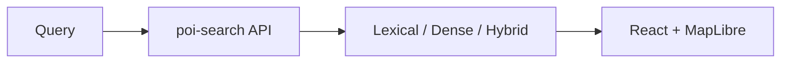

# Trạng thái triển khai hiện tại

Cập nhật: **2026-09-18**.  
SoT dữ liệu đánh giá: **gold_stage1_v1** + **vn-poi-core-v1**. Legacy Hanoi corpus/eval đã gỡ khỏi repo.

## 1. Dữ liệu (SoT)

| Thành phần | Giá trị | Path |
|---|---|---|
| Corpus | `vn-poi-core-v1`, ~186,322 searchable | `data/vietnam/poi_corpus_v1/` |
| Admin | `admin_regions_v1` | `data/vietnam/admin_regions_v1/` |
| Gold Stage 1 | 180 case · 1,080 query locked | `data/vietnam/gold_stage1_v1/` |
| W1 evidence | EDA · taxonomy · DQ · problem statement | `docs/deliveries/w1_evidence/` |

Hướng corpus: [`NATIONWIDE_CORPUS_DIRECTION.md`](NATIONWIDE_CORPUS_DIRECTION.md).

## 2. Runtime FE/BE (giữ lại)

`apps/poi-search/` (API FastAPI + web React) **vẫn giữ** để demo/serving.  
Cấu hình/index hiện tại có thể còn trỏ bản Hanoi cũ — **chưa nối lại** OpenSearch/ANN sang `vn-poi-core-v1`. Việc migrate index/encoder là ticket riêng sau Round-1 model screen.

## 3. Stage 1 evaluation (đang chạy)

| Việc | Trạng thái |
|---|---|
| Round-1 exact D=1000 (BM25 + 6 dense) | Kaggle `vn-poi-gold-stage1-w1-exact-dense-bm25` |
| Round-1b prefix-char FHC/SHC/PrefixAUC | Kaggle `vn-poi-gold-stage1-prefix-char` |
| Protocol | `docs/specs/SEARCH_2.0_STAGE1_MODEL_SELECTION_PROTOCOL.md` |

Primary gate: AcceptableRecall@100/500/1000 · K@95/98.  
Đơn vị thống kê: `case_id`.

## 4. Đã gỡ (2026-09-18)

- `HANOI_POI_STABLE_V1`, `HANOI_QUERIES_20K`
- Pilot-100/110 datasets, Kaggle packages, bench scripts
- Freeze replay / stable-v1 eval artifacts & docs
- OpenSearch `runtime/` download cache, `web/node_modules`

## 5. Việc tiếp theo

1. Hoàn tất Round-1 + Round-1b → VERDICT model Stage 1  
2. Nối FE/BE sang corpus toàn quốc (rebuild index/encoder)  
3. W2 metric/baseline formal trên gold đã khóa  
