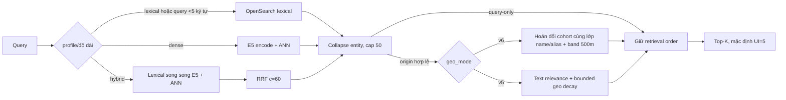

# Trạng thái triển khai hiện tại

Cập nhật: 15/09/2026. Tài liệu này mô tả **code và artifact đang chạy**, không mô tả kiến trúc đích. Khi có mâu thuẫn về trạng thái triển khai, ưu tiên file này và manifest runtime; dùng [`specs/`](../specs/README.md) cho hướng phát triển.

## 1. Release matrix

| Thành phần | Giá trị hiện tại | Nguồn |
|---|---|---|
| Runtime release | `hanoi-poi-demo-r1` | `apps/poi-search/models/MODEL_RELEASE.json` |
| Corpus | `hn-poi-stable-v1`, 46.792 rows, 45.692 searchable | corpus manifest/validation |
| Evaluation data | `hnq20k-stable-v1-eval1`, 20.000 queries | query manifest/validation |
| OpenSearch index | `hanoi-poi-stable-v1-release1` | model release + Docker Compose |
| Encoder | `e5-v4-finetuned`, 384d, context passage | model artifact + evaluation report |
| Search policy | `search-policy-stable-demo-v6` (`geo_mode=v6`, rollback `v5`) | `apps/poi-search/api/search_policy.json` |
| Candidate policy | `safe-candidates-v5`, profile-specific | API `/v1/status` |
| Context ranker | `heuristic-geo-v6` (cohort swap); `heuristic-geo-v5` khi `geo_mode=v5` | API `/v1/status` |
| Event/history store | `in-memory-demo-v1`; không có learned history | API process memory |

## 2. Luồng thực sự đang chạy

- Lexical và dense lấy depth 50; ANN dùng `candidates=200`.
- Hybrid dùng RRF với trọng số hai nhánh bằng nhau. Query ngắn hơn 5 ký tự compact chạy lexical-only.
- Candidate được collapse theo `entity_group_id` nhưng giữ branch/platform/access point riêng; budget cố định 50.
- Query-only không dùng origin và giữ thứ tự Stage 1.
- Personalized endpoint chỉ dùng origin hợp lệ.
  - **geo-v6 (default):** giữ thứ tự Stage 1; chỉ hoán đổi các slot cùng lớp khớp name/alias với head trong window 10, RRF ratio ≥0.5, band 500 m. Không cộng distance vào RRF.
  - **geo-v5 (rollback):** blend text relevance với `exp(-distance/5000)`; exact name/alias được bảo vệ, token có số phải tương thích trước khi nhận geo boost.
- Hiện không có category hard-filter, learned correction, scope router nhiều lane, candidate rescue, time feature hoặc user-history ranker.

## 3. API và UI đã có

| Có trong demo | Chưa có theo target spec |
|---|---|
| Session, status, origins, query-only/personalized suggest | PostgreSQL persistence, auth/subject policy, exposure TTL |
| Exposure displayed + idempotent select trong một process | Multi-worker-safe transaction/idempotency |
| GPS/map/POI origin và xử lý GPS accuracy >200 m | Stale-time enforcement và scope router primary/global |
| React + MapLibre, marker tương tác, địa chỉ phụ, camera ổn định khi gõ | POI details endpoint và admin/debug tooling đầy đủ |
| Straight-line preview; Goong road route khi có key | Routing-point verification và production routing adapter |
| Hybrid, dense-only, lexical-only ports | Deadline, queue cap, cache, circuit breaker và degraded fallback hoàn chỉnh |

## 4. Bằng chứng chất lượng hiện có

[`STAGE1_EVALUATION.md`](STAGE1_EVALUATION.md) chứng minh trên corpus stable rằng fine-tuned E5 thắng E5 zero-shot ở main retrieval; hybrid tăng CandidateHit@20/50 trên dev so lexical; lexical tốt hơn hybrid cho autocomplete sớm; ANN gần như giữ nguyên exact top-50. Báo cáo này vẫn dùng synthetic weak labels và architecture holdout đã được data-QA.

Các đo runtime mới nhất nằm trong `apps/poi-search/bench/results/`. Chúng là mốc demo local, không phải SLA. Phần runtime geo-v5 đã thay đổi sau một số phép đo v4; do đó không dùng số cũ để tuyên bố uplift của geo-v5.

## 5. Khoảng trống cần xử lý theo thứ tự

1. **Replay benchmark cho runtime v5.** Chạy cùng dev/test/candidate budget cho lexical, dense, hybrid; thêm các case nhiễu đã thấy trên FE, geo-sensitive/explicit-far/null-origin và session stability.
2. **Khóa metadata release.** Sau benchmark, tạo release ID mới hoặc ghi rõ code/policy hash; không tiếp tục dùng `demo-r1` cho nhiều hành vi khác nhau.
3. **Contract parity.** So runtime OpenAPI với `contract-package-v1`; quyết định endpoint/field nào là target và field nào sẽ bỏ. Ưu tiên POI details, error envelope, degraded flags và input state `typing|submitted`.
4. **Serving robustness.** Thêm deadline, queue metrics, exposure TTL/persistence và test multi-worker trước khi gọi là tích hợp production.
5. **Stage 2 chỉ dùng heuristic khi chưa có data.** Đánh giá geo-v5 và ứng viên geo-v6 bằng origin lấy từ POI thật; chưa train learned ranker/history.
6. **Nâng cấp Stage 1 có kiểm soát.** Hard-negative/multi-positive masks trước; MRL khi index cost là nút thắt; late interaction chỉ khi CandidateHit tốt nhưng thứ hạng text còn sai.

## 6. Điều không được suy ra

- 20.000 synthetic queries không chứng minh production relevance.
- Khoảng cách gần không phải ground truth và không được biến thành negative Stage 1.
- `ranking_point` không phải pickup/routing point đã xác minh.
- Kết quả geo-v5 chưa chứng minh geo-v6; kết quả Stage 1 không chứng minh learned Stage 2.
- OSM Hà Nội không đại diện coverage hoặc latency của corpus toàn quốc.
