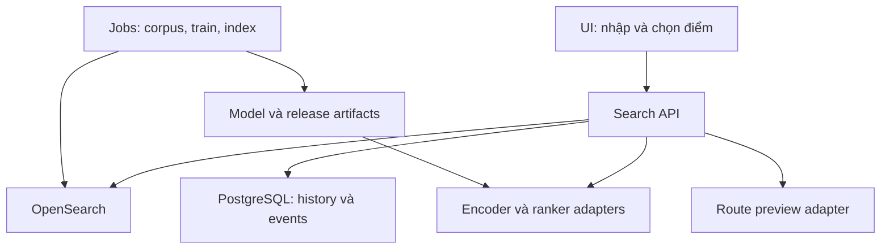
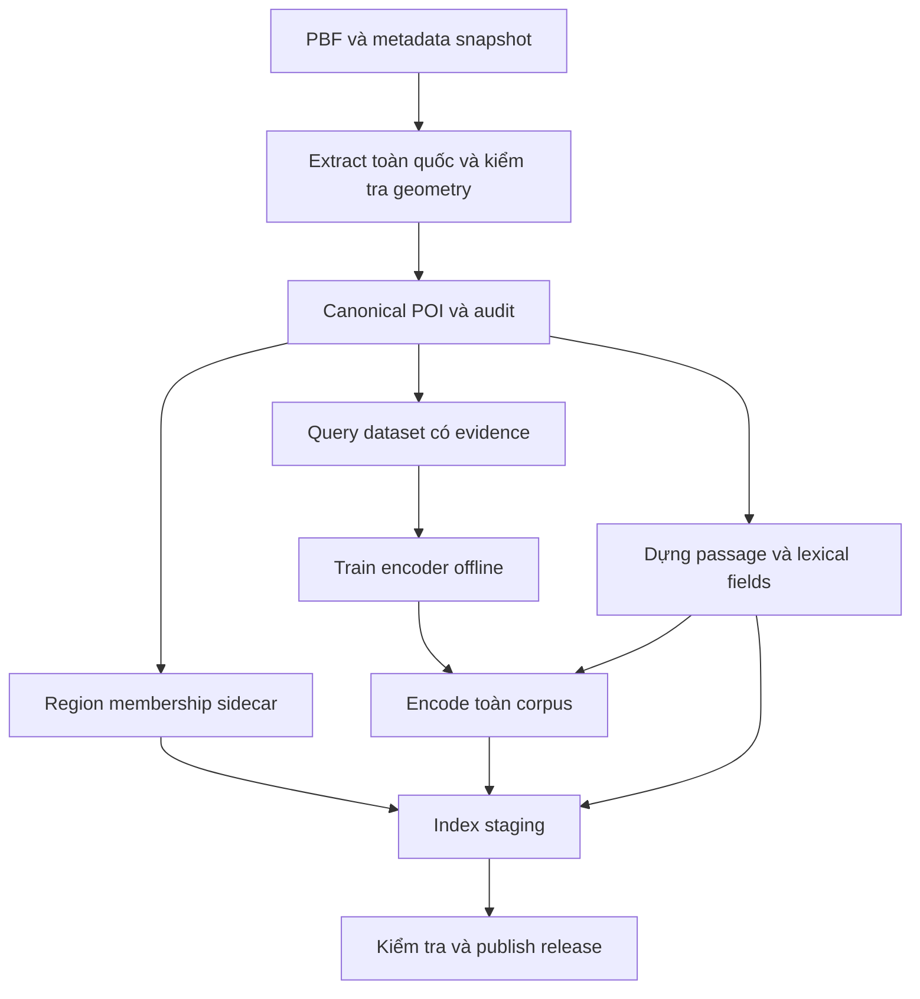
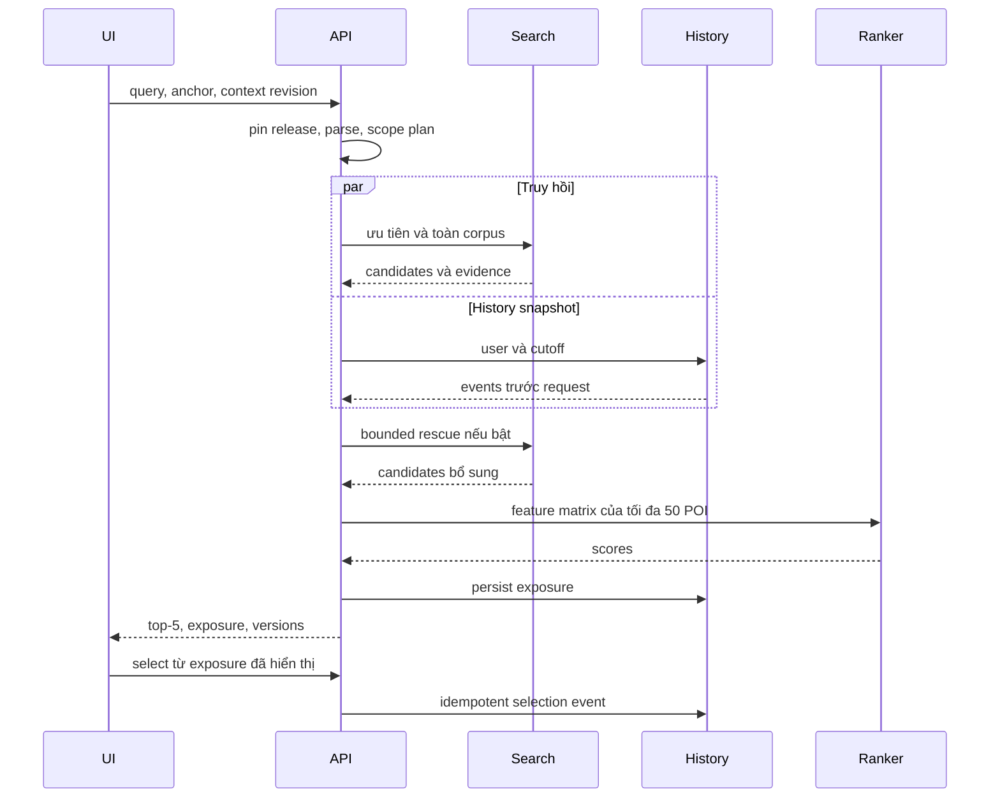
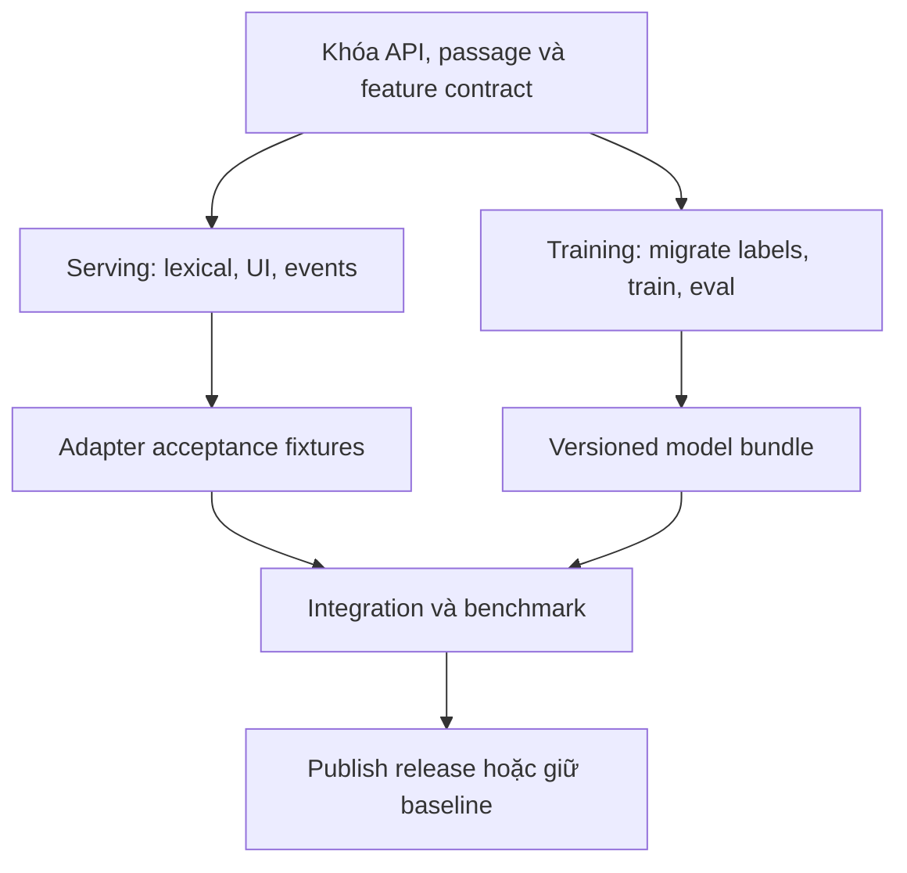
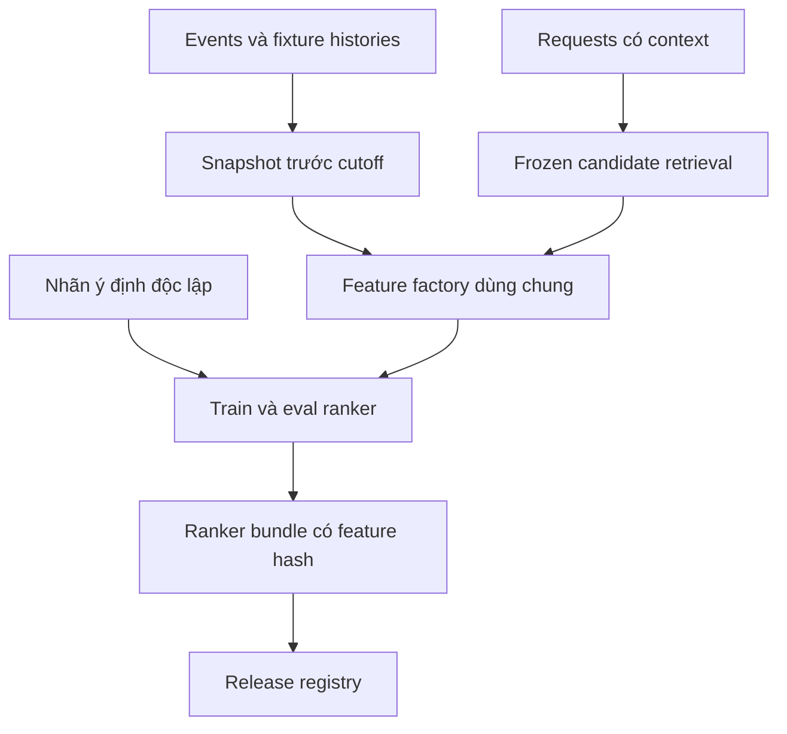

# Thiết kế hệ thống tìm kiếm địa điểm gọi xe — v1

Ngày chốt: 14/09/2026. Trạng thái: **đặc tả để bắt đầu triển khai**, chưa phải hệ thống đã benchmark. Tài liệu này và TECHNICAL_SPEC.md là bộ thiết kế dùng cho code mới; tài liệu Hanoi hai stage trước đây được giữ làm tham chiếu lịch sử. Không dùng số liệu/schema cũ để ghi đè contract này.

## 1. Mục tiêu và giới hạn

Người dùng chọn điểm đón, gõ tên/địa chỉ điểm đến, nhận top-5 trên danh sách và bản đồ, rồi chọn địa điểm. Hệ thống phải xử lý prefix, thiếu/sai dấu, lỗi phím, tên viết tắt có nguồn, địa chỉ ngõ/ngách và mã tòa; dùng không gian, thời gian, lịch sử để phân biệt các lựa chọn còn mơ hồ.

AI học biểu diễn chuỗi và cách xếp hạng theo context. Hai model được train offline, suy luận online. Cập nhật history online không phải cập nhật trọng số. Không có LLM sinh câu trả lời, agent hoặc gọi Codex trên đường xử lý một lần gõ. Lexical và các ràng buộc địa chỉ là thành phần của hệ thống AI này.

MVP không tạo booking, không cam kết điểm đón tiếp cận được, không suy ETA từ đường thẳng. Golden context và bằng chứng hành vi thật triển khai sau; không ngăn bắt đầu code các interface và baseline.

### Dữ liệu thực sự sẵn có

| Artifact | Trạng thái |
|---|---|
| PBF Việt Nam `vietnam-260910.osm.pbf` | Snapshot 10/09/2026; hash nguồn trong corpus manifest |
| `hn-poi-stable-v1` | 46.792 POI; 45.692 searchable; 8.131 origin demo; 0 pickup verified |
| Dataset query v8 | 20.000 query; toàn bộ intended target vẫn searchable trong stable v1 |
| Qrels khi chuyển v8 → stable v1 | 4 links tới POI nay không searchable cần xử lý; label evidence còn cần audit lại |
| E5 fine-tuned v1 | Có báo cáo training trước đây; chưa xác nhận chất lượng với corpus/passage mới |
| Corpus searchable toàn quốc | Chưa extract/đếm theo policy mới; không giả định hàng chục triệu POI |
| Golden có context, learned Stage 2 | Chưa hoàn thành |

18 cột POI và các struct của stable v1 được giữ nguyên. Corpus quốc gia sẽ có version mới và sidecar địa lý; không thêm tùy tiện trường vào POI chính. Pipeline quốc gia phải mở rộng extraction/enrichment theo toàn bộ hình học nguồn, không chỉ bỏ điều kiện Hà Nội khỏi script vốn dùng evidence Hà Nội.

## 2. Ba khối logic trên đường search

| Khối | Nhận gì? | Làm gì? | Không chịu trách nhiệm |
|---|---|---|---|
| Scope router | Query structure, loại pickup/destination, anchor, vùng người dùng chọn | Lập kế hoạch nhánh ưu tiên + nhánh rộng | Đoán chắc ý định từ GPS hoặc quyết định model cá nhân hóa |
| Stage 1 retrieval | Query và search scope đã chọn | Lexical/structured + dense, fusion, top-N | Học history/time hoặc buộc chọn một branch từ query thiếu thông tin |
| Stage 2 context | Candidates, query evidence, origin/time/history | Bounded rescue và contextual ranking | Sinh POI không tồn tại, gán routing point hoặc sửa ý định explicit |

Model Stage 1 là query-only. Trong pipeline thực tế, **candidate set sau scope router đã phụ thuộc vị trí**. Vì vậy chỉ gọi Stage 1 độc lập là query-only khi chạy trên phạm vi cố định, không router, không history và không geo boost.

## 3. Kiến trúc triển khai

MVP là modular monolith: một Python API chứa router, retrieval orchestration, encoder adapter, feature builder và ranker adapter. OpenSearch phục vụ lexical/ANN; PostgreSQL lưu exposures, selections và history. UI React + TypeScript + MapLibre. ETL/train/eval là jobs riêng, không chạy chung trong phép đo serving.

Chọn PostgreSQL ngay để tránh đổi contract ghi sự kiện khi thêm worker; PostGIS, Redis, Kafka, Kubernetes và model RPC riêng chưa là dependency của MVP. Exact dense evaluator dùng vector matrix/chunks ngoài OpenSearch. ANN được thêm vào serving sau khi có mốc chất lượng exact.

## 4. Luồng dữ liệu offline

### Corpus quốc gia

1. Xác minh byte size, SHA-256, source timestamp của PBF. Giữ source ID/type/version/timestamp và extraction-policy hash.
2. Extract node/way/relation bằng pipeline có geometry đầy đủ. Tách raw objects, canonical objects, searchable objects; report coverage/tag theo vùng.
3. Áp dụng sanitizer thống nhất trên direct tags và mọi nguồn enrich. Tombstone trường bị loại ngăn phục hồi mã nội bộ từ chính node gần nhất. Không dùng số nhà của hàng xóm làm địa chỉ.
4. Kế thừa tuple số nhà–đường từ building chỉ khi geometry và fields không xung đột. Consensus node cần định danh đầy đủ nguồn và kiểm tra mọi địa chỉ mâu thuẫn; khi chưa có bằng chứng, để audit.
5. Giữ address, nearby context và admin context riêng. Point-on-surface không phải pickup point; origin eligibility không phải pickup verification.
6. Dedup bảo thủ theo bằng chứng node/way; giữ branch, platform, entrance khi policy yêu cầu. Không merge chỉ vì trùng tên/bán kính gần.
7. Tạo `poi_regions.parquet` qua point-in-polygon; sử dụng relation ID và admin scheme version, không dùng tên phường làm khóa. Lưu tập membership khi overlap, không chọn phần tử theo thứ tự STRtree. Unknown membership không làm POI biến mất khỏi nhánh toàn quốc.
8. Publish immutable corpus. Hà Nội là subset theo boundary của corpus quốc gia; nếu policy/data khác stable v1, lưu migration map và report, không ép số lượng phải bằng bản cũ.

Job ETL phải chạy được theo checkpoint/batch, có exclusion report và đủ bằng chứng rerun. Không load toàn bộ PBF/geometry/vectors quốc gia vào list Python không giới hạn.

## 5. Luồng online

Query encoder gọi tối đa một lần/request, reuse vector giữa các scope. Khi route lexical-only, Stage 2 không gọi encoder lại để che chi phí. Feature missing được biểu diễn bằng mask.

### Scope policy v1

Ưu tiên: vùng được người dùng chọn rõ → địa danh trong query được parser xác định chắc → anchor hợp lệ → toàn corpus. Gazetteer phải nhận dạng span/alias có nguồn; chỉ thấy một từ trùng tên tỉnh bên trong tên quán chưa đủ để hard-route. Tín hiệu mơ hồ giữ nhiều khả năng trong diagnostic và dùng nhánh rộng.

Anchor của destination là điểm đón đã chọn hoặc GPS khi chưa chọn; anchor của pickup là GPS/tâm người dùng chủ động chọn. Không tự dùng POI người dùng tìm làm vị trí đứng. Anchor null, stale hoặc accuracy kém được bỏ khỏi geo policy; không chuyển thành tọa độ 0,0.

MVP chạy tối đa hai lane ban đầu: primary và global. Primary là vùng explicit hoặc radius quanh anchor; global không có geo filter. Default radius: pickup 5 km, destination 15 km. Nếu primary không đủ candidates, được một lần mở lên 20/60 km khi còn deadline; query explicit-region không tự chuyển sang vòng bán kính. Các số là config khởi đầu, không phải tối ưu đã đo.

Nhánh toàn corpus luôn được giữ, kể cả pickup; location là prior, không phải biên giới ý định. Trường hợp có tên/địa chỉ xa rõ ràng được ưu tiên evidence explicit và không bị ép về gần. Nếu corpus chỉ Hà Nội thì “global” hiện có nghĩa toàn corpus Hà Nội; response phải công bố coverage, không giả tìm toàn quốc.

Một geo filter chỉ giảm tập ứng viên logic; không tự bảo đảm giảm số shard/RAM. Đầu tiên dùng index logic thống nhất và filtered ANN phù hợp. Chỉ chia vật lý theo vùng khi benchmark cho thấy cần; luôn có đường cross-region/global lookup.

### Stage 1

- Chuỗi gốc được giữ để hiển thị/audit. NFKC, khoảng trắng, lowercase và accent-fold tạo các biểu diễn riêng; giữ dấu `/`, số nhà, mã. Không tự sửa query có dấu thành tên khác.
- Lexical gồm exact/name, alias, accent-folded, prefix và address/ref fields. Prefix 1–2 ký tự ưu tiên lexical; query dài/lỗi/ngữ nghĩa chạy hybrid. Structured query vẫn giữ field-aware lexical. Các route là config thử nghiệm, không dùng nhãn dataset để routing.
- E5-small là model khởi đầu; POI encode offline, query encode online. RRF dùng thứ hạng, không cộng BM25 và cosine trực tiếp.
- Baseline chất lượng chạy lexical / exact dense / hybrid exact ở final K=5/20/50. Serving ANN được đo loss so với exact sau đó.

### Candidate assembly và Stage 2

Trong mỗi lane: lexical depth=100, dense depth=100, RRF c=60 với weights 1/1; dedup theo poi_id. Lanes có thể trả cùng POI: dùng max lane score đã chuẩn hóa, không cộng lợi thế vì POI xuất hiện hai lần.

Candidate budget cuối N=50. Chọn tối đa 5 POI có evidence địa chỉ/mã có namespace rõ; tiếp đến tối đa 10 global candidates chưa chọn; tiếp đến primary, rồi global remainder cho đủ 50. Nếu không có primary, lấy global top-50. “Bảo vệ explicit” không áp dụng cho exact brand/name nhiều chi nhánh; nó bảo vệ không bị loại khỏi candidates, không bắt buộc đứng top-1.

Stage 2 rescue được thử ngay trong plan: tối đa 5 geo và 5 history candidates mới, mỗi source retrieve tối đa 20. Chỉ nhận candidate khớp query evidence hoặc compatibility rule đã khóa, không lấy nearest/history bất kể query. Thay tối đa 10 slots thấp nhất không được bảo vệ; giữ protected explicit và global reserved, N không đổi. Không nhân đôi cùng một nguồn geo đã có: đo marginal rescue trên candidates sau router.

Ranker ladder: Stage 1 order → heuristic geo → LightGBM LambdaMART → AggregateMLP → attention khi có bằng chứng. Attention có thêm history sequence phải được so với baseline có cùng thông tin; không quy mọi gain cho attention. Encoder frozen ở vòng Stage 2 đầu tiên.

Guardrails dùng evidence rõ: mismatch số nhà/street/ref hoặc vùng explicit không được history/nearby tự ghi đè. Khi parser không chắc, không áp hard constraint. Chưa có log thật thì learned ranker được ghi rõ synthetic-trained; không gọi việc đổi kết quả theo user là đã hiểu hành vi thật.

## 6. Model training và serving song song

Serving không chờ fine-tune: lexical-only là profile hợp lệ; tiếp đến pretrained E5 được pin; fine-tuned model thay qua adapter. Không dùng vector ngẫu nhiên/mock để báo chất lượng. Stage 2 identity/heuristic chạy được trước learned ranker; response công bố ranker_id và pipeline profile.

Model bundle là đầu ra training, không phải một file weight rời. Bao gồm tokenizer/checkpoint hashes, pooling, normalization, length limits, passage builder hash, training dataset manifest và eval report. Query vector, corpus vectors và model revision phải cùng một không gian embedding; cùng 384 chiều vẫn có thể không tương thích.

Thêm POI không bắt buộc train lại: encode POI bằng model đang dùng, cập nhật index theo release mới. Đổi checkpoint hoặc passage policy bắt buộc encode lại các document bị ảnh hưởng và kiểm tra quality. Không quảng bá một checkpoint cũ sang corpus/passage mới chỉ dựa trên báo cáo v1.

### Luồng dữ liệu train Stage 2

Exposure/selection logs chỉ là quan sát có thiên lệch hiển thị; không tự biến unclicked thành negative. Nhãn scenario độc lập với ranker dùng để sinh features. Snapshot history được cố định trước request, không đưa lựa chọn của request đó trở lại làm input.

## 7. Đánh giá không trộn mục tiêu

| Track | Điều kiện | Metric chính |
|---|---|---|
| Stage 1 độc lập | Fixed corpus/scope, không router/context | CandidateHit@20/50, Hit@1/5, MRR@10 trên query đủ định danh |
| Autocomplete | Session/prefix có qrels thích hợp | Hit@5, MRR@5, prefix-length slices, ký tự tối thiểu target vào top-K |
| Ambiguity | Nhiều địa điểm phù hợp | Any-compatible hit và known-compatible recall; không bắt đoán một branch |
| IME | Raw keys chưa engine-verified | Diagnostic, không quality gate |
| Structured code | Có/thiếu namespace tách riêng | Case study và metric khi đủ mẫu, không gộp tên POI thông thường |
| Scope router | So global retrieval và scoped retrieval cùng N | CandidateHit delta, explicit remote miss, latency; đo actual candidates sau cap |
| Stage 2 fixed candidates | Cùng candidate snapshot | Ranking uplift, conditional Hit/MRR/nDCG theo rubric |
| Toàn pipeline | Router + rescue + ranker | End-to-end Hit, wrong branch, remote preservation, pair accuracy, latency |

Corpus càng lớn, positive/negative càng cần theo đúng query: một branch ngoài Hà Nội vẫn có thể phù hợp với query “Highlands”. Train positive có thể vẫn ở Hà Nội; hard negatives lấy toàn quốc nhưng phải loại known-compatible/entity siblings, không mặc định mọi object mới là negative. Stage 1 không được học “gần origin” từ nhãn single-target khi input không có origin.

Giữ v3 test như frozen comparison/regression set. Holdout 20k đã được data-QA không gọi là untouched blind. Golden context tạo sau: khóa scenario/label trước khi mở model output; gồm origin-sensitive/invariant, null-origin, explicit far destination, time/user intervention. Có thể bắt đầu 100–150 diagnostic pairs và 2.000–5.000 synthetic pairs để phủ điều kiện; không suy số mẫu lớn là bằng chứng thực tế.

Sampler origin có sorted IDs, RNG/version/seed, pool hash, distance strata `[0,1), [1,3), [3,10), [10,30), >=30 km`, null-origin riêng; origin/target/candidates cùng corpus. Target-distance-bin chỉ là audit, không phải feature. Audit target-is-nearest trên comparison pool query-compatible độc lập với retrieval.

Chọn cấu hình bằng dev; khóa trước comparison/holdout. Paired cluster bootstrap theo query_family_id cho Stage 1, theo independent user/scenario cluster cho Stage 2; không coi nhiều keystroke cùng phiên là mẫu độc lập. Unknown/unjudged không tự thành relevance 0. Timeout/degraded vẫn nằm trong mẫu số end-to-end.

## 8. Performance, failure và cập nhật

Mục tiêu ban đầu để đo: API Stage 1 p95 ≤100 ms; personalized p95 ≤150 ms, p99 ≤300 ms ở profile 10 QPS, 8 vCPU/32 GiB, một API worker/model instance, OpenSearch local single-node, không chạy ETL/train đồng thời. Đây là budget thử nghiệm, không SLA hoặc benchmark đã có. Client debounce 120 ms đo riêng; không cộng p95 các bước thành p95 tổng.

Server deadline 180 ms; branch deadline và admission control mô tả trong config. Khi model/search branch hết hạn, trả fallback hợp lệ với degraded flags; không kéo dài vô hạn để đủ 5 POI. Không có dependency nào trả kết quả hợp lệ thì 503. Query hợp lệ nhưng không match trả 200 với empty results. Track timeout, cache, route và query length riêng.

Một triệu vector 384 chiều FP32 có 1,536 GB thập phân dữ liệu vector thô; 10 triệu có 15,36 GB, chưa gồm ANN, text index, heap, bản sao. Quy mô thật phải audit và load-test. Không suy QPS từ công thức dung lượng.

Release registry pin một tuple corpus/index/encoder/passage/feature/ranker/policy. Build staging → kiểm tra hash/ID/vector/norm → quality/latency gate → warmup → đổi active release pointer → giữ release cũ cho requests đang chạy và rollback. Mỗi request resolve index name cụ thể từ tuple, không đọc alias có thể đổi giữa hai nhánh. Không tái sử dụng ranker có feature schema hoặc candidate policy không tương thích.

## 9. Thứ tự triển khai

| Mốc | Serving / data | Training song song | Hoàn thành khi |
|---|---|---|---|
| M0 contract | Import stable POI, API models, release registry, text builder | Audit migration v8 labels; pin checkpoint/passages | Contract tests, IDs/versions, sample request pass |
| M1 demo chạy được | Lexical, query-only UI, details/select, map/distance | Exact dense baseline và fine-tune Stage 1 | Không cần trained model để chạy demo; ghi đúng lexical profile |
| M2 scale và retrieval | National ETL/audit, region sidecar, router/global lane | Hard negative mining và eval corpus mở rộng | Có C0/C1 snapshots, fallback, remote cases; không tune test |
| M3 hybrid serving | Nạp model bundle, ANN, cache/latency | Khóa encoder và quality config | Exact-vs-ANN report, no mixed releases |
| M4 Stage 2 | History snapshots, rescue, feature builder, heuristic | Context sampler/eval, LambdaMART → MLP | Candidate/ranking gains tách riêng, cutoff đúng |
| M5 integrated demo | User/time/origin panel, trace/debug, release switch | Golden/independent evaluation | Cả thiếu context và đích xa hoạt động; quyết định model bằng evidence |

Gates correctness phải pass trước khi tích hợp. Mốc metric chất lượng tuyệt đối được khóa sau pilot khi biết rubric/golden; không bịa một mức Hit@1 cho query mơ hồ. Kỹ thuật và train chạy song song, nhưng công bố chất lượng Stage 2 chờ candidate policy và encoder snapshot đã khóa.

## 10. Cơ sở kỹ thuật và nguồn

E5-small có embedding 384 chiều; retrieval dùng prefix query/passsage tương ứng, pooling và normalization phải khớp giữa train và inference. [Model card chính thức E5-small](https://huggingface.co/intfloat/multilingual-e5-small/raw/main/README.md).

Filtered vector search cần đặt filter đúng cơ chế của engine; post-filter có thể thiếu top-K dù vùng còn nhiều POI phù hợp. [OpenSearch filtering vector search](https://docs.opensearch.org/latest/vector-search/filter-search-knn/index/).

Edge n-gram dùng ở index, search analyzer đơn giản hơn; cần field full-name để không mất query vượt max_gram. [OpenSearch edge n-gram](https://docs.opensearch.org/latest/analyzers/tokenizers/edge-n-gram/).

LambdaMART triển khai bằng LGBMRanker với group theo request; không chia candidate rows của một request qua nhiều splits. [LightGBM LGBMRanker](https://lightgbm.readthedocs.io/en/stable/pythonapi/lightgbm.LGBMRanker.html).

Các bài Baidu Maps người dùng đưa là tham khảo nghiên cứu lịch sử. Bản v1 không lấy số latency/uplift trong bài làm cam kết, không bắt buộc sao chép attention/prefix model để bắt đầu code. Lựa chọn hiện tại là quyết định thiết kế của dự án cần được benchmark trên corpus của dự án.
