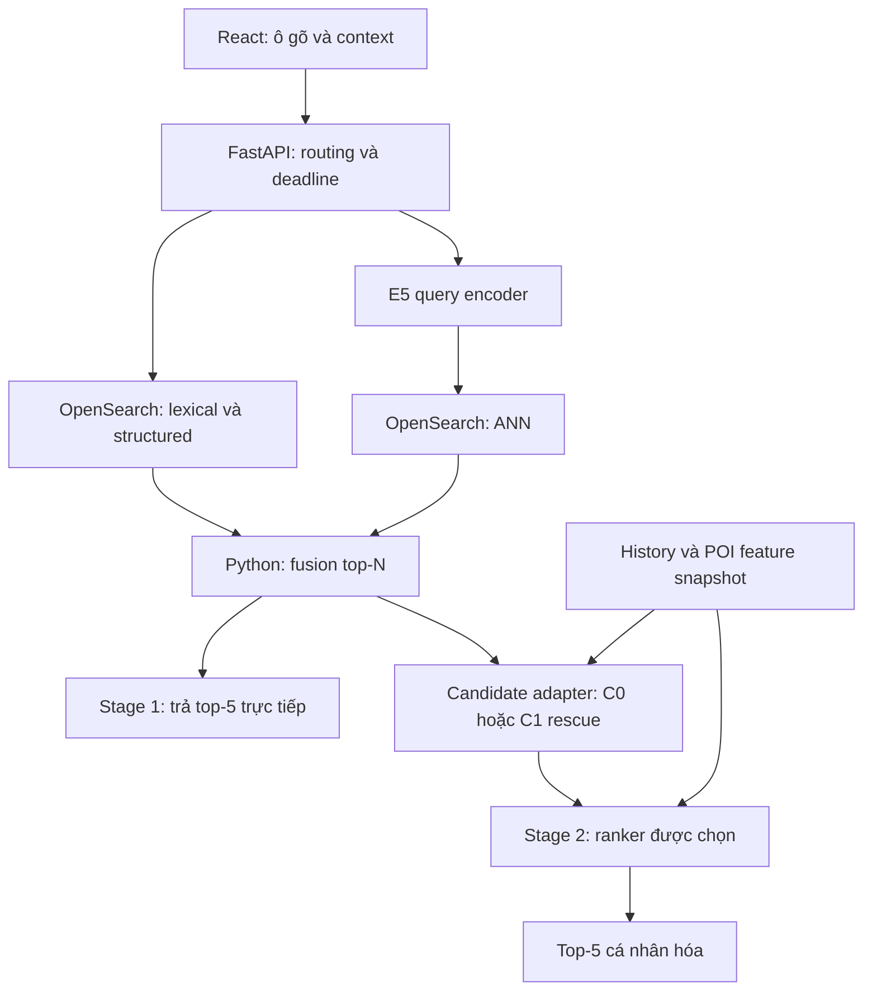

# Tech stack và model cho hệ tìm kiếm POI/địa chỉ Hà Nội

> **Tài liệu nghiên cứu/lịch sử.** Contract mục tiêu ở [Technical spec](../specs/TECHNICAL_SPEC.md), trạng thái chạy thật ở [Current state](../as-built/CURRENT_STATE.md). Corpus/dataset pilot và lựa chọn deployment cũ bên dưới không phải source of truth. Quyết định model mới: [Training và nâng cấp retrieval](../specs/TRAINING_AND_RETRIEVAL_PROTOCOL.md).


**Tài liệu đi kèm:** `HANOI_POI_TWO_STAGE_TECHNICAL_DESIGN.md`, bản triển khai và nghiệm thu riêng từng stage.  
**Mục đích:** chốt lựa chọn kỹ thuật đủ cụ thể để bắt đầu xây MVP; Stage 1 hoàn thành trước, Stage 2 bổ sung sau.  
**Trạng thái:** đã chạy pipeline PBF → corpus `hn-260910-7f1b69b167` và query pilot `hnq10k-pilot-v3`; chưa train encoder/ranker, build search service hay benchmark serving. Dependency của pipeline thực nằm trong manifests; dependency của serving/training vẫn cần khóa khi triển khai.

## 1. Cấu hình được chọn

**MVP sử dụng Python + FastAPI + OpenSearch; Stage 1 là multilingual E5-small fine-tuned kết hợp lexical/structured retrieval. Stage 2 chọn theo ladder: Stage 1 ranking → geo → LightGBM LambdaMART → AggregateMLP → ContextRanker attention.** Embeddings Stage 1 được khóa; attention là ứng viên thử nghiệm, chưa được chọn mặc định. Dùng Codex sinh dữ liệu theo batch trước training. “Offline” nghĩa là xử lý ngoài luồng search online, không yêu cầu cài model generation. UI React có bản đồ, chọn origin/destination và preview khoảng cách.

| Lớp hệ thống | Lựa chọn chính | Vai trò | Thời điểm |
|---|---|---|---|
| Ingest OSM | PyOsmium + Shapely; Osmium Tool tùy chọn | Pipeline thực đọc PBF và xuất Parquet trực tiếp, không tạo PBF extract riêng | Stage 1 |
| Làm sạch và dataset | Python, Polars, PyArrow, Shapely, Pydantic | Chuẩn hóa, dedup, kiểm tra schema, xuất Parquet/JSONL | Stage 1 |
| Sinh query | Codex + rules Python | Codex tạo diễn đạt/scenario; rules tạo lỗi gõ có kiểm soát | Stage 1; tái sử dụng cho Stage 2 |
| Train retrieval | PyTorch + Transformers + Sentence Transformers | Fine-tune bi-encoder query–POI | Stage 1 |
| Model retrieval | `intfloat/multilingual-e5-small` → checkpoint của dự án | Encode query online; encode corpus offline | Stage 1 |
| Search index | OpenSearch + `opensearch-py` | BM25, prefix, exact/structured và ANN vectors | Stage 1 |
| Fusion và routing | Module Python trong search service | Chọn nhánh, RRF, dedup, giới hạn candidates | Stage 1 |
| Candidate adapter | Python + OpenSearch geo/text + history lookup | So C0 query-only và C1 bounded rescue ở cùng N | Đầu Stage 2 |
| API | FastAPI + Uvicorn + Pydantic | Query-only API, sau đó thêm personalized API | Stage 1–2 |
| Model cá nhân hóa | LightGBM `LGBMRanker`; AggregateMLP/ContextRanker bằng PyTorch | Train/so baseline ladder, chọn theo chất lượng và latency | Stage 2 |
| Lưu history của demo | SQLite; Parquet làm snapshot train/eval | Tra history theo user và thời điểm | Stage 2 |
| Evaluation | NumPy + `ir_measures` + Locust | Retrieval/ranking metrics, bootstrap, load test | Stage 1–2 |
| UI | React + TypeScript + Vite + Leaflet | Top-5 trên list/map, origin/destination, context panel | Stage 1–2 |
| Preview khoảng cách/route | Python distance adapter; OSRM adapter tùy chọn | Đường thẳng có nhãn mặc định; route đường bộ khi đủ dữ liệu | Demo tích hợp |
| Đóng gói | Docker Compose; `uv` cho Python | Môi trường local tái lập, service profiles | Stage 1–2 |
| Theo dõi thí nghiệm | Config YAML + JSON metrics + Git commit + artifact manifest | Truy vết dataset/model/index và kết quả | Stage 1–2 |

OpenSearch giữ cả lexical và vector retrieval để MVP vận hành một search engine. Chưa cần một vector database riêng, feature-store service, hàng đợi streaming hoặc Kubernetes. Những thành phần này chỉ được bổ sung khi quy mô và đo đạc cho thấy cần thiết.

## 2. Các thành phần chạy ở đâu?

### 2.1 Online serving



S1 và S2 là hai chế độ phục vụ. Giai đoạn đầu chỉ bật S1. Trong MVP, encoder, fusion và ranker là các module trong cùng backend process, không bắt buộc triển khai thành các microservice riêng. Lexical và vector là hai cách truy vấn cùng OpenSearch deployment.

Backend dùng một instance model được load khi khởi động. Tác vụ inference đồng bộ được đưa vào worker/thread có giới hạn, không chặn event loop đang chờ I/O. Đo contention thực tế trước khi tăng số worker; mỗi process có thể tải thêm một bản model vào RAM/VRAM. FastAPI mô tả cách vận hành nhiều Uvicorn workers trong [tài liệu deployment](https://fastapi.tiangolo.com/deployment/server-workers/).

### 2.2 Offline jobs

| Job | Input | Output | Công nghệ |
|---|---|---|---|
| Corpus build | PBF + polygon + config | `pois.parquet`, provenance, corpus manifest | Osmium/PyOsmium + Python |
| Query generation | Train seeds + metadata đã lọc | Query variants, raw Codex outputs, labels sau validation | Codex + Python rules/validators |
| Stage 1 training | Query–positive–negative, split manifest | Encoder checkpoint + training metrics | Sentence Transformers/PyTorch |
| Index build | Corpus + encoder đã chọn | POI vectors + OpenSearch index | Batch encoder + bulk indexing |
| Stage 2 dataset | Origin sampler + requests/history + Stage 1 cố định | C0/C1 candidate/feature/qrels snapshots và counterfactual sets | Python + Parquet |
| Stage 2 training | Candidate lists có nhãn + history | Baseline ladder + model được chọn | LightGBM + PyTorch |
| Evaluation | Frozen artifacts + locked tests | Per-case metrics, CI, latency report | Python + Locust |

Cả Stage 1 và Stage 2 train offline, inference online. History có thể cập nhật online mà không đổi trọng số. Thêm/sửa POI dùng encoder frozen để cập nhật index; đổi checkpoint phải re-encode toàn catalog. Không có online learning trong pilot.

ETL, validation và training chạy bằng CLI với config có version. Sinh dữ liệu qua Codex là bước làm việc theo batch: chuẩn bị input/prompt, lưu output rồi đưa qua validators. Không yêu cầu dựng model server cho generation. Training có thể chạy ở máy GPU khác; search API chỉ cần artifacts đã được chọn.

## 3. Model Stage 1

### 3.1 Chọn multilingual E5-small cho vòng đầu

Checkpoint gốc: **`intfloat/multilingual-e5-small`**. Model card ghi embedding 384 chiều, 12 layers, hỗ trợ nhiều ngôn ngữ gồm tiếng Việt và giới hạn 512 tokens. Đây là encoder pretrained để bắt đầu fine-tune, chưa phải model đã được chứng minh cho prefix/địa chỉ Hà Nội. Nguồn: [E5-small model card](https://huggingface.co/intfloat/multilingual-e5-small/raw/main/README.md).

Quy ước input theo model card: query thêm `query: `; POI passage thêm `passage: `, kể cả tiếng Việt. Dùng mean pooling có attention mask và L2 normalization. Một wrapper chung chịu trách nhiệm thêm prefix đúng một lần cho cả train và serving; không vừa thêm thủ công vừa dùng prompt tự động của thư viện.

Passage đề xuất của dự án:

```text
passage: {tên chính}; {chi nhánh nếu có}; {địa chỉ}; {category}; {aliases có nguồn}
```

Chỉ ghép trường có dữ liệu; ưu tiên tên, chi nhánh, số/đường trước khi cắt token. Giữ tọa độ thành feature riêng, không kỳ vọng encoder hiểu khoảng cách khi chỉ nối số latitude/longitude vào passage.

| Cấu hình dự án | Khởi đầu | Cách kiểm chứng |
|---|---|---|
| Max query tokens | 64 | Đo tỷ lệ truncation và lỗi mất số/địa chỉ |
| Max passage tokens | 128; thử 256 nếu cần | Đảm bảo phần định danh không bị cắt |
| Embedding dimension | 384 | Assert đồng nhất checkpoint, vector file và index mapping |
| Similarity chuẩn | Cosine trên vectors L2-normalized | Đối chiếu dot product exact và thứ hạng ANN |
| Runtime đầu tiên | PyTorch FP32 | Baseline số học trước khi thử tối ưu |
| Training | Full fine-tune encoder nhỏ | So zero-shot và fine-tuned trên cùng dev/test |
| Learning rate | Thử `1e-5` và `2e-5` trên dev | Chọn theo retrieval metrics, không chỉ train loss |
| Batch queries thực | Bắt đầu 16, tăng nếu memory cho phép | Ghi cả số passages/negatives thực tế mỗi batch |
| Epochs | Tối đa 3 ở pilot, chọn checkpoint trên dev | Không mặc định train lâu hơn sẽ tốt hơn |

Các max lengths và hyperparameters ở bảng là lựa chọn thí nghiệm của dự án, không phải khuyến cáo đã được tác giả model xác nhận cho POI. Một wrapper encode riêng query/passages áp dụng hai giới hạn; không giả định chỉ đặt một `max_seq_length` toàn cục sẽ thực hiện được cả hai.

### 3.2 Loss và negative sampling

Dùng contrastive training trên query–POI pairs. Sentence Transformers cung cấp các loss cho pairs/triplets; cách chọn phụ thuộc cấu trúc nhãn. Tham khảo [Loss Overview](https://sbert.net/docs/sentence_transformer/loss_overview.html).

Vòng đầu ưu tiên nhãn đủ rõ. Với in-batch negatives, batch sampler tránh các query có positives trùng canonical; đồng thời dùng positive/ignore masks cho các POI phù hợp đã biết. `MultipleNegativesRankingLoss` mặc định không tự giải quyết nhãn nhiều chi nhánh hợp lệ: chỉ dùng trực tiếp khi batch thỏa giả định, còn trường hợp nhiều positives triển khai masked contrastive loss bằng PyTorch. Hard negatives phải lấy từ train queries và loại positives/duplicates; không dùng cold-test POI trong training.

Gradient accumulation giúp giảm memory cho optimizer batch nhưng không tự làm tập in-batch negatives lớn bằng toàn bộ accumulated batch. Nếu cần thêm negatives, đo và triển khai cơ chế tương ứng thay vì chỉ tăng `gradient_accumulation_steps`.

### 3.2a Protocol training hiện hành

Ưu tiên mixed lexical/dense/random negatives với multi-positive/ignore masks và manifest, rồi mới tăng kiến trúc. Không dùng distance của origin ẩn để gán negative Stage 1. Chi tiết triển khai, quota và gates: [Training và nâng cấp retrieval](../specs/TRAINING_AND_RETRIEVAL_PROTOCOL.md).

### 3.2b Nhánh model nghiên cứu

| Nhánh | Trạng thái | Điều kiện triển khai |
|---|---|---|
| E5 hiện tại + negatives cải thiện | Ưu tiên thí nghiệm đầu | Quality exact retrieval, split/masks đúng |
| E5 + MRL 96/192/384 | Optional | Index/vector cost cần giảm; non-inferiority đạt; không hứa encoder nhẹ hơn |
| Late-interaction text adapter | Optional, tắt mặc định | Fixed top-50 text rerank thắng identity, Việt–Anh và latency được xác nhận |
| Student nhỏ Việt–Anh | Hướng khi encode là nút thắt | Tokenizer/runtime/domain quality kiểm chứng; không tự xóa vocabulary/ngôn ngữ trong E5 |

Các nhánh chưa có weights/index artifacts không được ghi thành model phục vụ. Benchmark và nguồn nghiên cứu tập trung trong protocol để tránh lặp các thông số chưa đồng bộ.

### 3.3 Model đối chứng và điều kiện nâng cấp

| Model | Vai trò | Chi phí cần xét | Khi nào thử |
|---|---|---|---|
| E5-small zero-shot | Baseline bắt buộc | Cùng kiến trúc serving với bản fine-tuned | Trước khi sinh/train quy mô lớn |
| E5-small fine-tuned | Lựa chọn chính | Chi phí train và re-encode corpus; không đổi kích thước kiến trúc | Khi dataset qua audit |
| `intfloat/multilingual-e5-base` | Encoder đối chứng lớn hơn | Vector 768 chiều, thêm memory/compute cần đo | Nếu lỗi semantic còn rõ sau cải thiện data |
| `BAAI/bge-m3` dense-only | Đối chứng khác họ model | Vector 1024 chiều; index/ranker cần đổi dimension | Nếu cần kiểm tra giới hạn của E5, chưa dùng mọi mode ngay |

E5-base có hidden size 768 trong [config chính thức](https://huggingface.co/intfloat/multilingual-e5-base/raw/main/config.json). BGE-M3 hỗ trợ dense, sparse và multi-vector; bản so đầu tiên chỉ bật dense để dễ xác định đóng góp, giữ lexical OpenSearch như cũ. BGE-M3 không dùng quy ước prefix E5. Nguồn: [BGE-M3 model card](https://huggingface.co/BAAI/bge-m3).

Không chọn model chỉ theo benchmark đa ngôn ngữ tổng quát. Chọn bằng human-gold tiếng Việt, noisy/prefix/address slices và p95/QPS trên cùng phần cứng. Thay model phải re-encode corpus, rebuild vector index và tạo lại feature snapshots phụ thuộc embedding.

## 4. Stage 1 search engine và fusion

### 4.1 OpenSearch index

Khởi đầu một node cho demo, một primary shard và không replica trên máy local. Đây là cấu hình pilot, chưa có dự phòng sự cố. Pin image version/digest khi dựng môi trường; không chạy benchmark trên tag `latest`.

| Field | Kiểu/thiết kế | Mục đích |
|---|---|---|
| `canonical_id` | `keyword` | Dedup, join feature snapshots |
| `name`, `aliases`, `address_text` | Text có dấu và field folded riêng | BM25 trên tên/địa chỉ |
| `name_prefix` | Field với edge n-gram index analyzer | Query đang gõ; search analyzer không tạo n-gram |
| `name_exact` | `keyword` đã normalize có kiểm soát | Bằng chứng tên khớp chính xác |
| `house_number`, `street_id`, `complex_id`, `building_code` | `keyword`; giữ slash và namespace | Không đánh đồng số nhà/mã gần giống |
| `category` | `keyword` + text label nếu có | Filter và query category |
| `ranking_point` | `geo_point` | Điểm đại diện, feature ranking distance |
| `routing_point`, `access_points` | Nullable point + point metadata | Điểm/cổng tiếp cận, tách khỏi ranking point |
| `point_quality` | Object theo vai trò | Provenance/method/status |
| `destination_searchable`, `origin_search_eligible`, `pickup_access_verified` | Ba boolean độc lập | Target Stage 1 / origin sampler Stage 2 / access evidence |
| `embedding` | `knn_vector`, dimension 384 | ANN retrieval |
| `corpus_version`, `encoder_version` | `keyword` | Truy vết và chặn phối nhầm snapshot |

Dạng folded được tạo bằng module Unicode chung, bao gồm xử lý `đ/Đ`; không mặc định analyzer tích hợp đã đáp ứng mọi tình huống tiếng Việt. Giữ field gốc có dấu. Không bắt buộc thêm word segmenter vòng đầu; chỉ thử khi lỗi cho thấy tokenization đang giới hạn lexical retrieval.

Đề xuất edge n-gram 1–20 cho tên/alias; cấu hình giới hạn n-gram của index phù hợp. Query dài vẫn đi qua text/exact fields nên không phụ thuộc token n-gram dài tối đa. Nhánh prefix 1–2 ký tự phải giới hạn số kết quả và fuzzy expansion. Cơ chế và khác biệt index/search analyzer được mô tả ở [OpenSearch edge n-gram](https://docs.opensearch.org/latest/analyzers/token-filters/edge-ngram/).

ANN khởi đầu HNSW với Lucene engine và cosine; pin mapping cụ thể tương thích với bản OpenSearch được chọn. Thử `m=16`, `ef_construction=128` như cấu hình pilot, đo recall so exact và memory trước khi đổi. Không sao chép `ef_search` giữa engines: OpenSearch có hành vi/tham số theo engine và version; kiểm tra trường `k`, `size` và query parameters trong [k-NN API](https://docs.opensearch.org/latest/vector-search/api/knn/) cùng [mapping knn_vector](https://docs.opensearch.org/latest/mappings/supported-field-types/knn-vector/).

### 4.2 Retrieval và RRF

Backend khởi chạy lexical và query encoding song song; khi có embedding mới gọi ANN. Mỗi nhánh lấy top-L, khởi đầu **L=100**, hợp nhất canonical rồi giữ **N=50**, trả top-5 cho UI. `k`/`size` cần cấu hình đủ để thực sự nhận được L ứng viên, không chỉ đặt kích thước cuối của HTTP response.

MVP triển khai RRF trong Python để dễ lưu từng nhánh và tái lập thí nghiệm:

\[
\operatorname{RRF}(p)=\sum_{b\in\{lexical,dense\}}\frac{w_b}{c+rank_b(p)}
\]

Chỉ cộng nhánh có POI đó, rank bắt đầu từ 1. Thử `w_lexical=w_dense=1`, `c=60`; đây là cấu hình khởi đầu, chưa được tối ưu cho Hà Nội. Dedup trong từng nhánh trước fusion, tie-break theo ID để tái lập. RRF sử dụng rank, không cộng trực tiếp BM25 với cosine.

OpenSearch cũng có hybrid search processors; backend RRF là lựa chọn của MVP để giữ traces rõ ràng. Chỉ chuyển fusion vào engine sau khi có phép kiểm tra tương đương. Tham khảo [OpenSearch hybrid search](https://docs.opensearch.org/latest/vector-search/ai-search/hybrid-search/index/).

Structured evidence xử lý riêng: chỉ bảo vệ exact address/branch khi đủ namespace và đã kiểm tra tính duy nhất; giữ flags cho Stage 2. Không áp dụng fuzzy làm biến đổi số nhà rồi tự coi đó là exact. Lưu cả fusion rank và rank sau chính sách bảo vệ định danh.

### 4.3 Tối ưu inference theo thứ tự

1. Đo PyTorch FP32 với model load sẵn, batch query thực tế; tách encode, ANN và lexical latency.
2. Giới hạn token length, concurrency và CPU threads; batch encode corpus offline.
3. Cache query embeddings/candidates theo query variants + model/corpus/routing version. Cache query-only không chứa kết quả cá nhân hóa.
4. Nếu CPU encode là nút thắt, thử ONNX Runtime FP32, sau đó INT8; nếu dùng GPU, thử FP16/BF16 phù hợp phần cứng.
5. So tensor outputs, top-N overlap và retrieval metrics trước/sau tối ưu; chỉ giữ khi đáp ứng non-inferiority trên dev và load test.

Sentence Transformers hỗ trợ các backend/tối ưu inference trong [tài liệu efficiency](https://sbert.net/docs/sentence_transformer/usage/efficiency.html). ONNX/quantization là nhánh thử nghiệm sau baseline; không coi export thành công là bằng chứng chất lượng giữ nguyên. Nếu query encoder dùng runtime khác POI encoder offline, kiểm tra độ tương thích không gian embedding trên index đang có.

## 5. Model và dữ liệu phục vụ Stage 2

### 5.1 ContextRanker-v1 — ứng viên attention sau baseline ladder

**Đây là model custom dự kiến train sau LambdaMART và AggregateMLP, chưa được chọn làm serving mặc định.** Pretrained knowledge đến từ E5 embeddings; các tầng projection, attention và MLP học từ context dataset. Stage 2 chỉ sắp xếp candidates được nhận; adapter rescue được đánh giá riêng theo mục 5.5.

| Thành phần | Cấu hình khởi đầu của dự án |
|---|---|
| Candidates | Tối đa 50, dùng padding mask khi ít hơn |
| History | 20 events gần nhất để bắt đầu; thử 50 trên dev; aggregate dài hạn tính riêng trước request |
| Query/POI vectors | E5 384 chiều, frozen; reuse query embedding nếu Stage 1 đã encode |
| Projection | Query/POI: 384 → 128; history event gồm POI embedding + time features → 128 |
| Attention | Một block cross-attention, hidden 128, 4 heads; query attention tạo từ query + candidate |
| History order/time | Event time, time gap, thứ tự/position; không chỉ đưa một tập vectors không có thời gian |
| Ranking head | Concat projected query, candidate, history summary và structured features; MLP 128 → 64 → 1 sau lớp input projection |
| Output | Một score cho mỗi candidate; score không mặc định là xác suất người dùng chọn |
| Loss | Listwise cross-entropy với target distribution trên các positives đã xác minh; mask padding/unknown labels theo rubric |
| Optimizer | AdamW, thử learning rate `1e-3` và `3e-4`, early stop theo dev ranking metrics |

Tính attention cho toàn bộ candidates bằng tensor batch. History keys/values được project một lần/request và dùng lại; không chạy encoder văn bản lại cho từng history event. Với 50 candidates và 20–50 events, có 1.000–2.500 cặp candidate–event trước khi tính số heads/batch; đây chỉ là quy mô tương tác, không suy ra millisecond từ con số này.

Các features đưa vào ranker: lexical/dense score và missing masks, thứ hạng Stage 1, exact/structure flags, khoảng cách origin–candidate, giờ/ngày theo Asia/Ho_Chi_Minh, số lần/độ gần thời gian đã chọn candidate/brand, độ dài history và context completeness. Chuẩn hóa numerical features bằng statistics từ train; cùng một module được dùng offline và online.

Cold-user không có history dùng learned empty-history vector và mask, tránh attention trên toàn vị trí bị mask tạo NaN. Missing origin không được điền khoảng cách 0 vì sẽ bị hiểu là rất gần.

### 5.2 Baseline ladder và lựa chọn model

| Model | Cách sử dụng | Ý nghĩa đối chứng |
|---|---|---|
| Stage 1 ranking | Giữ thứ hạng query-only; với C1 có deterministic adapter ordering | Mốc trước cá nhân hóa |
| Geo baseline | Thứ hạng Stage 1 + feature khoảng cách, với trọng số tune trên dev | Context đơn giản có đủ không? |
| LightGBM LambdaMART | `LGBMRanker(objective="lambdarank")` trên tabular features | Learned ranking trước khi cần neural |
| AggregateMLP | MLP trên scores, geo/time và thống kê history; không dùng attention | Learned personalization có cần sequence/history attention không? |
| ContextRanker-v1 | Aggregate features + history attention | Attention có thêm chất lượng xứng với chi phí không? |

LambdaMART train trên các hàng candidate liên tiếp theo request; `group` là số candidates từng request, tổng bằng số hàng. Known-item có nhãn 0/1; graded task dùng integer labels và `label_gain` đã khóa, không đưa missing/unjudged thành 0 tự động. Groups không có phân biệt relevance được thống kê riêng khi train; eval giữ mọi request theo rubric. Đây là cách tổ chức theo [LGBMRanker API](https://lightgbm.readthedocs.io/en/stable/pythonapi/lightgbm.LGBMRanker.html) và [LightGBM parameters](https://lightgbm.readthedocs.io/en/stable/Parameters.html).

Pilot LambdaMART chạy CPU, thử `num_leaves=15/31`, `learning_rate=0.05`, tối đa 300 boosting rounds với early stopping trên dev. Đây là config đề xuất; pin LightGBM version và cú pháp callbacks/validation theo bản cài thực tế. Group/split toàn requests/families, không chia ngẫu nhiên từng candidate row. Lưu booster, feature order, categorical mappings và candidate-policy version.

LambdaMART và AggregateMLP nhận cùng tabular feature schema, cùng candidates và tuning budget được công bố. Attention nhận thêm sequence; để kết luận về kiến trúc phải chạy matched-information controls với cùng history window, per-event attributes/masks và frozen embeddings được đưa cho baseline ở dạng cố định/flattened. Nếu chỉ so aggregate với sequence, báo đó là cải thiện cả biểu diễn lịch sử lẫn model, không gọi là lợi ích riêng của attention.

Chọn model tốt nhất đã xác nhận trên dev rồi locked evaluation. Attention chỉ được giữ khi vượt LambdaMART/AggregateMLP, không hại explicit/remote cases và đáp ứng latency. Chỉ thắng synthetic hoặc không thắng bộ human-reviewed counterfactual độc lập thì không kết luận đã “hiểu người dùng”; bằng chứng hành vi thật vẫn cần log/user study. LambdaMART là AI học từ dữ liệu và có thể là serving model cuối của MVP.

Một text cross-encoder query–POI thông thường không tự sử dụng history/geo/time của hệ này. Chưa đưa model reranker văn bản nặng vào đường online mặc định; nếu thử về sau, xem đó là một thành phần text relevance riêng và đo chi phí top-K.

### 5.3 Trường hợp Stage 1 bỏ query encoder

Routing bỏ dense ở prefix cực ngắn đồng nghĩa **chưa có query embedding để reuse**. Dùng tabular ranker đã được chọn (LambdaMART hoặc AggregateMLP) với lexical/geo/time/history features và missing masks; train/eval trên đúng route đó. Trước khi learned baseline được duyệt, fallback về geo/Stage 1 theo policy. Không gọi lại encoder ở Stage 2 rồi vẫn báo đã tiết kiệm inference.

Nếu dev cho thấy attention giúp rõ ở prefix ngắn, thử cấu hình encode query một lần tại lớp điều phối rồi chia sẻ cho hai stage; đo lại latency toàn pipeline. Mọi route ghi `encoder_executed`, `ranker_used`, `degraded` để kiểm tra đúng đường thực chạy.

### 5.4 Feature/history storage

MVP lưu events trong SQLite, index theo `(user_id, event_time)`; mọi truy vấn chỉ lấy events trước request time. Tách `demo_selection` khỏi simulator, real-log và locked evaluation bằng event source/dataset namespace. Export Parquet để train/eval tái lập. Cache history có khóa user + cutoff/history/corpus version; không dùng chung personalized response giữa người dùng. Hành động `/select` không tự ghi vào gold labels hoặc dữ liệu train.

POI embeddings và metadata là snapshot theo canonical ID, load/memory-map từ NumPy/Parquet vào feature layer. Lấy features theo batch, tránh N lần gọi database hoặc lấy toàn vectors từ search response cho từng candidate. History POI bị thiếu/xóa phải có missing mask và policy được version hóa.

Feature store giữ riêng `ranking_point`, nullable `routing_point`, `access_points[]` và `point_quality.{ranking,routing}`: method/source/status cho từng vai trò. `ranking_distance_m` là khoảng cách địa lý cho relevance; route distance/duration chỉ có từ adapter mạng đường. `road_snapped_fallback` chưa tự chứng minh cổng hợp lệ; lưu graph/profile version, snap distance và access evidence. Search origin eligibility không thay thế pickup access validation. Mọi ID/point/embedding join theo `(corpus_version, canonical_id)`; không trộn centroid và entrance dưới cùng feature name.

SQLite đáp ứng demo một backend với lượng ghi thấp theo giả định hiện tại. Khi có nhiều instance hoặc log ghi đồng thời, chuyển history store sang PostgreSQL; nếu cần truy vấn không gian ngoài OpenSearch, bổ sung PostGIS. Redis chỉ thêm khi cần cache dùng chung và invalidation đã được thiết kế.

### 5.5 Candidate adapter và origin sampler

Đây là công việc bắt buộc đầu Stage 2, không đợi attention thất bại mới thử. C0 giữ query-only top-N; C1 hợp thêm geo/history candidates rồi cắt về cùng N. Khởi đầu N=50, tối đa 10 rescue slots (5 geo, 5 history), bảo vệ exact IDs có đủ namespace, dedup và backfill theo versioned policy. Lấy history trước cutoff; geo query có text/category compatibility, không uniform/all-nearest. OpenSearch hỗ trợ [geo-distance queries](https://docs.opensearch.org/latest/query-dsl/geo-and-xy/geodistance/); filter này chỉ thuộc nhánh rescue, không giới hạn toàn query-only pool.

Rescued POI có thể thiếu Stage 1 rank/dense score: giữ null/mask và source flags, không giả score 0 tương đương đã được chấm. Snapshot schema bổ sung `candidate_policy_version`, `candidate_sources`, `rank_query_only`, `rank_adapter`, `rescue_quota_used`. C1 cache phụ thuộc origin/user/history version; cache query-only vẫn tách riêng. Latency phải gồm lookup/geo query/fusion và queueing mới phát sinh.

Python sampler xuất `origin_eligible.parquet` và `origin_sampler_manifest.json`: eligibility/point-policy/corpus versions, eligible IDs hash, RNG algorithm/version, seed derivation, distance bins, quotas, sampling probabilities và rejected strata. Khóa thứ tự IDs; lưu sample thực. Origin/target/candidates resolve cùng corpus. Bins ranking distance: `[0,1)`, `[1,3)`, `[3,10)`, `[10,30)`, `>=30` km, thêm null-origin riêng; không đưa target-distance-bin vào model features. Origin search-eligible và pickup access status là hai trường riêng.

Theo mục 5.5–5.7 của thiết kế, audit target-is-nearest trên query-compatible comparison pool độc lập với top-N, lưu tie tolerance/denominator. Tạo origin-sensitive/invariant tracks, golden 100–150 pairs và synthetic counterfactual 2.000–5.000 pairs có seed/split riêng; pair số lượng lớn vẫn là synthetic. Báo C0/C1 CandidateHit@N, rescue/harm, flip/invariant accuracy, remote preservation, null-origin, latency và CI theo family/user.

## 6. Stack sinh dữ liệu và kiểm chứng model

### 6.1 Corpus và query generation

Pipeline thực đã xác minh PBF `vietnam-260910.osm.pbf` (328.214.395 bytes, timestamp `2026-09-10T20:21:06Z`), lắp boundary relation 1903516 version 183 và xuất Parquet bằng PyOsmium/Shapely. Source hashes, polygon hash và policy ở mục 2.3–2.4 của thiết kế và `corpus_manifest.json`. Không tạo Hanoi PBF extract riêng.

Kết quả thực: 55.029 raw searchable / 46.792 canonical pilot / 8.135 origin policy candidates trong corpus nguồn / 0 pickup verified. Search view v3 giữ toàn bộ IDs, có 45693 destinations sau audit tên/địa chỉ. Không dùng origin gate cho Stage 1. Dedup canonical hiện bảo thủ, còn cần giải quyết duplicates thực thể; không xem `origin_search_eligible` là bằng chứng đón xe.

Dùng Polars/PyArrow cho bảng lớn và Parquet, Shapely cho kiểm tra geometry/polygon, Pydantic cho schema records. Raw source, canonical corpus, train/dev/test và rejected records được lưu riêng cùng manifest. Split/rubric tuân theo tài liệu thiết kế; không sao chép dữ liệu test vào alias index.

**Chọn Codex để sinh cách diễn đạt và kịch bản context theo yêu cầu dự án.** Generation không yêu cầu model server hoặc GPU riêng trong stack dự án. Việc chọn Codex là quyết định về workflow; chất lượng nhãn và mức tự nhiên của query vẫn được xác nhận bằng audit, không mặc định đúng vì tên công cụ.

**Artifact đang dùng:** `HANOI_QUERIES_10K.zip`, version `hnq10k-pilot-v3`: 10.000 dòng / 2.000 targets; train/dev/test 8190/925/885. `build_queries.py` chạy bằng Python + PyArrow, input là canonical Parquet + `editorial_seeds.json` + `prior_split_map.parquet`; không gọi model generation offline. `package_dataset.py` tạo README, manifest, ZIP.

Dùng `corpus_search_view.parquet` với `destination_searchable=true` để dựng passages/index v3. Ba cờ destination/origin/pickup độc lập. `address_field_audit.parquet` ghi NFKC/confusable mapping, field bị chặn và trường chưa xác minh; `street_vocabulary.parquet` chỉ là từ vựng OSM quan sát, không phải authoritative road gazetteer. Không chuẩn hóa mất slash hay tự thêm mã căn hộ.

Query schema vật lý: `query`, `query_family_id`, `case_type`, `track`, `query_surface`, `intended_poi_id`, `known_compatible_poi_ids`, split và versions. `typing_sessions.parquet` có 200 sessions / 4276 events với `session_id`, `keystroke_index`, `input_event`, `is_final`. Telex/VNI là raw key streams, chưa phải text emitted bởi IME thực. Phải tách raw-key testing khỏi committed-text retrieval. V2 có single-token names, prefix 1/2/3/5/8, sai dấu và địa chỉ/namespace có nguồn.

`ambiguity_stress` (≤3 ký tự hoặc >50 compatible IDs), `autocomplete`, `ime_keystream` và `structured_code` không nằm trong main MRR/Hit@1. Worksheet chỉ train/dev; test v3 provisional, không gọi locked sau khi generator đã được điều chỉnh theo các quan sát trước đó. Phần chấm nhãn do người dùng hoàn thiện sau. Counts/hashes đầy đủ lấy từ validation report/manifest trong bundle, không suy từ số raw POI.

Quy trình batch đề xuất:

1. **Chuẩn bị input:** lấy 20–50 POI/seed families mỗi batch để pilot; chỉ cấp metadata đã lọc của split tương ứng, kèm `batch_id`, `family_id`, nguồn và rubric. Không cho vòng sinh train truy cập locked human test hoặc cold-test POI.
2. **Yêu cầu Codex sinh JSONL:** mỗi dòng gồm `source_record_id`, `family_id`, `query`, `intent_type`, `source_fields`, `ambiguity`, `generation_type`. Chỉ diễn đạt từ metadata; đánh dấu thiếu định danh. Pipeline đối chiếu ID với input và gắn target, không tin ID/nhãn do công cụ tự xác nhận.
3. **Lưu output nguyên bản rồi validate:** Pydantic kiểm tra schema; validators phát hiện số/địa chỉ phát sinh, ID sai, trùng lặp và query mơ hồ. Dòng lỗi vào rejected records với lý do; mọi lần sửa giữ bản gốc.
4. **Tạo biến thể bằng rules:** áp dụng bỏ dấu, typo, prefix, IME states với seed và edit operations được lưu. Kiểm tra lại nhãn sau biến đổi; các variants giữ cùng family/split. Codex có thể hỗ trợ viết generator code, nhưng output dữ liệu và phiên bản code phải được truy vết riêng.
5. **Review và khóa batch:** người kiểm tra mẫu phân tầng, đo tỷ lệ hợp lệ, đúng nhãn, tự nhiên và trùng lặp. Chỉ mở rộng batch sau khi rubric/generator ổn định; so rules-only với rules + Codex trên human-gold độc lập.

Prompt/spec được lưu thành artifact của dự án, nêu rõ số query/seed, loại diễn đạt, định dạng output, trường được phép dùng và cách biểu diễn ambiguity. Không yêu cầu Codex tự tạo POI, địa chỉ hoặc tên dân gian ngoài nguồn. Đúng JSON không đồng nghĩa đúng nội dung.

Manifest generation lưu `generator_tool=codex`, `batch_id`, thời gian, input/prompt hashes, raw output hash, validator/rules versions và kết quả review. Model/revision hoặc generation settings chỉ ghi nếu thực sự được cung cấp; nếu không có thì dùng null/unknown, không tự suy ra. Tái lập dataset bằng artifacts đã lưu, không trông chờ gọi lại Codex sẽ sinh đúng cùng nội dung.

Stage 2 dùng Codex viết persona/scenario có cả lặp lại, khám phá và ý định explicit mâu thuẫn history; Python simulator chuyển scenario thành events có seed và thứ tự thời gian. Human-gold search vẫn do người viết độc lập; human-reviewed synthetic context chỉ kiểm chứng scenario, chưa chứng minh thói quen thật. Chi phí generation theo dõi qua thời gian làm batch, số dòng được chấp nhận và công review; không đưa vào latency serving.

### Chính sách trước training và serving — query v3

`adjacent_transpose` chỉ đổi chỗ hai chữ cái liền nhau và khác nhau; không có cặp thì bỏ thao tác. `typo_source`, `typo_result` cho phép kiểm tra số ký tự/hoán đổi trong artifact. Telex ghép cụm `ươ → uow` theo ký tự nguồn; `trường → truowngf`, `đường → dduowngf`. Không gọi đây là IME thực hay cam kết keystream tối giản toàn bộ tiếng Việt.

Mỗi dòng có `review_reasons[]`, `main_metric_exclusion_reasons[]`, `training_exclusion_reasons[]`, `missing_address_sibling`. Flag main/training được tính từ các lý do đó; không phải đọc lại corpus/code để biết vì sao bị loại. Các code/label rất ngắn thuộc `structured_code` (heuristic có version), giữ `namespace_fields_json` và `namespace_in_query`; có `structured_metric_candidate` để đánh giá riêng, không nhập vào main metric hoặc core training. Namespace chỉ lấy từ street/housename có nguồn; thiếu thì giữ query diagnostic.

Origin pool phục vụ phải qua `origin_eligibility_policy AND usable origin_display_label`. `origin_display_candidates.parquet` có **8.131 records**; source policy ban đầu có 8.135. `GET /origins` dùng pool đã qua display gate, không dùng lại cờ legacy trên raw corpus. Cờ này vẫn độc lập với destination và pickup verification.

`entity_resolution.parquet` cung cấp `entity_group_id`, `branch_id`, `complex_id`, member IDs và evidence/status. `entity_candidates.parquet` có **1.624 cặp** nghi trùng theo label/category và bán kính 100 m; đây không phải số duplicate đã xác nhận. Có **một cặp node–way** đủ rule collapse bảo thủ: cùng tên venue/loại/địa chỉ đầy đủ, matching specificity tags, node trong polygon hợp lệ và chỉ khớp một polygon. Platform/entrance/stops luôn giữ riêng. Không gộp chỉ vì cùng brand hoặc gần nhau. Có 83 branch IDs từ tag branch + địa chỉ; complex ID để null nếu không có membership evidence, housename chỉ làm hint.

`entity_resolution.py::collapse_ranked_candidates` là adapter đã có kiểm thử: chạy sau ranking trước top-5, giữ representative có hạng cao nhất và backfill từ danh sách đã chấm; có công tắc tắt collapse để so sánh. Chưa tích hợp/chạy API UI thực. Không đổi canonical corpus; index/qrels/result phải resolve qua cùng entity policy khi báo entity-level metrics, đồng thời giữ canonical IDs gốc. Không coi mapping entity là split group: split group có thể cố ý gom nhiều chi nhánh cùng brand để chống leakage.

### 6.2 Evaluation tooling

| Công cụ/artifact | Việc thực hiện |
|---|---|
| `ir_measures` | MRR/nDCG và retrieval metrics trên qrels/run files theo định nghĩa đã khóa |
| NumPy evaluator | C0/C1 rescue/harm, CandidateHit, wrong-branch, context flip/invariant accuracy, remote preservation/null-origin và nearest-rate audit |
| Bootstrap theo family/user | CI của chênh lệch, tránh coi mọi prefix là mẫu độc lập |
| Locust | Load profile, latency p50/p95/p99, QPS, errors/degraded rate |
| JSON request traces | Encode/retrieval/fusion/features/rank time, cache status, model/index version |
| Manifest + Git commit | Tái lập corpus, split, checkpoint và serving config |

`ir_measures` nhận qrels và ranked runs, giúp dùng định nghĩa metric nhất quán: [tài liệu chính thức](https://ir-measur.es/en/latest/). Custom metrics vẫn phải kiểm tra bằng các ví dụ nhỏ có kết quả biết trước: target ngoài candidates, nhiều positives, query lỗi/timeout, history rỗng, branches cùng tên.

Giữ separate reports cho synthetic, human-gold và real-log. Với qrels chưa đầy đủ, không tự coi unjudged là negative. Stage 2 báo cả conditional ranking và end-to-end gồm retrieval miss; việc model attention đã train được không phải bằng chứng hiểu hành vi thật.

## 7. Deployment, hardware và giới hạn tốc độ

### 7.1 Môi trường khởi đầu

| Môi trường | Cấu hình lập kế hoạch | Phạm vi |
|---|---|---|
| Local serving | 8 CPU cores, RAM 16 GB, SSD | Đo trên search view v3: 45693 destinations từ 46.792 canonical pilot; chưa có latency benchmark |
| Máy serving có dư địa | RAM 32 GB nếu OpenSearch/model/ETL cùng máy | Điều chỉnh sau đo heap, native memory, page cache và kích thước corpus |
| Train E5-small | Một GPU 16–24 GB VRAM, giảm batch/length nếu cần | Ước lượng lập kế hoạch; phải chạy pilot đo peak memory |
| Sinh dữ liệu bằng Codex | Dùng Codex theo batch; không dự trù GPU generation riêng | Máy dự án chỉ chạy rules, validators và lưu artifacts |
| Train Stage 2 | CPU cho LambdaMART; CPU/GPU đang có cho neural | Baseline ladder với frozen embeddings, đo trước khi mua thêm tài nguyên |

Không suy QPS hay latency từ cấu hình máy trong bảng. Với 100.000 POI, vectors 384 chiều FP32 chiếm khoảng **153,6 MB thập phân** chỉ cho dữ liệu vector (`100000 × 384 × 4`); OpenSearch còn HNSW, lexical index, metadata, heap và các bản sao feature store. Đây là phép tính dung lượng, không phải benchmark RAM toàn hệ.

Stage 1 đặt mục tiêu p95 API ≤100 ms; toàn pipeline ≤150 ms trên workload đã chốt, đồng bộ với tài liệu thiết kế. Đo percentile end-to-end, không cộng/trừ p95 từng thành phần để suy ngân sách chắc chắn. UI latency còn debounce, mạng và rendering.

### 7.2 Profile Docker Compose

| Profile | Services/jobs | Cách dùng |
|---|---|---|
| `serve-s1` | OpenSearch + search API + static UI | Demo và benchmark Stage 1 |
| `offline` | ETL, rules/validation, simulator và trainer jobs, mounted artifact volumes | Import outputs từ Codex; chạy theo lệnh, dừng sau khi có artifacts |
| `serve-s2` | Stage 1 + candidate adapter + ranker được chọn + SQLite volume + map UI | Demo cá nhân hóa và chọn origin/destination |
| `route-road` | OSRM service/adapter với graph và vehicle profile đã khóa, tùy chọn | Nâng cấp từ straight-line preview; chỉ gọi sau chọn destination |
| `benchmark` | Evaluation runner + load generator | Chạy sau warmup với workload định danh |

Search service dùng bounded cache trong process ở MVP; Redis/PostgreSQL chưa là dependencies bắt buộc. Training không chạy cạnh serving trên cùng GPU trong một phép đo latency chuẩn. Codex không nằm trên đường xử lý search request. Chỉ public API/UI khi triển khai; OpenSearch và history store thuộc mạng nội bộ.

UI xử lý composition events, debounce và bỏ response cũ; top-5 hiển thị cùng canonical IDs trên list/map. Dùng Leaflet cho markers, polyline và GeoJSON theo [API reference](https://leafletjs.com/reference.html). Basemap provider/attribution được cấu hình riêng; nếu dùng OSM standard tiles phải theo [Tile Usage Policy](https://operations.osmfoundation.org/policies/tiles/), không dùng load test suggest để phát sinh bulk tile requests. Map là yêu cầu của demo tích hợp; tile lỗi không làm suggest lỗi.

### 7.3 Demo và API contract tối thiểu

Luồng nghiệm thu: **chọn origin hợp lệ → gõ destination → top-5 trên list/map → chọn destination → hiển thị hai điểm và preview khoảng cách → đổi user/time/origin để quan sát Stage 2**. Stage 1 vẫn có màn hình query-only riêng để nghiệm thu trước. Demo là chọn điểm, chưa tạo booking hoặc khẳng định pickup hợp lệ khi chưa có access evidence.

FastAPI/Pydantic triển khai các contract dưới đây và xuất OpenAPI khi code. Đây là spec cần xây, không phải endpoints đã chạy. Tọa độ dùng object `{lat, lon}` trong API, GeoJSON dùng `[lon, lat]`; thời gian ISO-8601 có timezone, lưu UTC và tính local features theo Asia/Ho_Chi_Minh. Distances dùng mét, durations dùng giây.

| Endpoint | Request/params | Response chính |
|---|---|---|
| `GET /origins` | `corpus_version`, query/filter, cursor, limit có cap | Origin-eligible POI summaries, eligibility/point status, next cursor |
| `POST /suggest` | `request_id`, `session_id`, `query_raw`, `top_n`, `expected_corpus_version` | Query-only suggestions và response envelope bên dưới |
| `POST /suggest/personalized` | Trường của suggest + `user_id` nullable, `origin_poi_id` nullable, `context_time` nullable; demo mode chọn user/time | Top-5 đã rank, resolved origin/context, `exposure_id`, route/policy/model metadata |
| `GET /pois/{canonical_id}` | `corpus_version`; optional access-point ID | Tên/địa chỉ, ranking point, access points, routing point được chọn, point quality/source/eligibility |
| `POST /select` | `idempotency_key`, `exposure_id`, `request_id`, `session_id`, `selected_poi_id`, optional selected access-point ID | `selection_id`, `event_source=demo_selection`, recorded time, origin/destination details, history version mới |
| `POST /route-preview` | `corpus_version`, `origin_poi_id` nullable, `destination_poi_id`, optional access-point IDs, `mode=straight_line/road/auto`, `allow_fallback`, vehicle profile | Geometry, point roles/status, `distance_kind`, distances/duration nullable, adapter/graph/profile versions, fallback reason |

**Personalized request resolution:** các ID/version là strings, `top_n` là integer mặc định 50 và cap 100 theo config; `query_raw` là string, query rỗng trả danh sách rỗng trong MVP để zero-query recommendation không bị trộn vào benchmark. Backend resolve origin/target candidates trong expected corpus; `origin=null` là hợp lệ và bỏ geo, `user=null` dùng cold-user policy. `context_time` chỉ cho phép override trong chế độ demo, nếu null dùng server time; history cutoff được backend xác định từ context time/version, không cho client truyền history tùy ý. Model và candidate policy do cấu hình server/experiment quyết định; client demo chỉ chọn trong các cấu hình đã đăng ký. UI có tùy chọn origin=null để trình diễn thiếu GPS.

**Suggest response envelope:** `request_id`, `exposure_id`, `schema_version`, `corpus_version`, `stage1_version`, `candidate_policy_version`, `ranker_version`, `feature_version`, `history_version`, `point_policy_version`, `resolved_context_time`, `candidate_count`, `results[]`, `degraded`, `degraded_reasons[]`, `timings_ms`. Stage 1-only có ranker/history version null. Mỗi result gồm `canonical_id`, display name/address, rank, ranking point, nullable routing point/quality, nullable `ranking_distance_m` và candidate source flags. Scores là debug fields; không hiển thị như xác suất đúng. Top-N là budget nội bộ có cap, UI trả tối đa 5; full candidate snapshot giữ trong backend phục vụ eval.

**Selection:** backend dùng exposure snapshot để lấy origin/user/time, corpus và danh sách đã hiển thị, không tin rank/version do client tự gửi. Chỉ nhận selected ID có trong exposure hợp lệ và access-point ID thuộc đúng POI. `idempotency_key` duy nhất theo session; retry cùng payload trả lại event cũ, payload khác cùng key trả conflict. Lưu cả server recorded time và demo context time; event chỉ ảnh hưởng requests sau cutoff tương ứng. Tách event namespace khỏi frozen history/test; không tự biến click demo thành nhãn gold. Exposure cần lưu ranked IDs/versions từ suggest và cờ UI đã hiển thị nếu có; không coi unselected là negative chắc chắn.

**Errors/fallback:** payload/schema sai hoặc origin không eligible trả 422; ID không tồn tại 404; corpus/exposure version không còn tương thích hoặc idempotency conflict 409; timeout không có kết quả hợp lệ 503. Nhánh dense/rescue/ranker lỗi nhưng còn fallback hợp lệ trả 200 với `degraded=true` và lý do, ghi metric. Null-origin theo thiết kế không phải lỗi degraded. UI bỏ response cũ bằng request ID; chọn destination từ exposure cũ sau đổi origin phải yêu cầu suggest lại.

**Route adapter:** mặc định `straight_line` tạo GeoJSON LineString giữa hai ranking points và tính khoảng cách địa lý, ghi `distance_kind=geodesic`, `route_distance_m=null`, `route_duration_s=null`, nhãn UI “Đường thẳng — chưa phải lộ trình xe”. Chế độ road cần hai routing points đạt policy, graph coverage và profile tương thích. OSRM Route API cung cấp geometry/distance/duration và lỗi `NoRoute`: [OSRM API](https://project-osrm.org/docs/v5.24.0/api/). Dùng endpoint do dự án quản lý/cấu hình, không mặc định public demo server đáp ứng workload.

Road response giữ cả input access points và snapped waypoints, kiểm tra snap tolerance/access policy; graph/profile version bắt buộc, kiểm tra tương thích snapshot. `allow_fallback` mặc định true cho auto và false cho road. Nếu thiếu routing point, quá snap tolerance, NoRoute hoặc timeout, trả straight-line fallback với `degraded=true` và lý do khi được phép; road nghiêm ngặt trả `status=unavailable`, geometry/distances null. Straight-line luôn có `geodesic_distance_m`, không giả route distance/duration. Nếu origin=null, preview có `status=missing_origin`, geometry/distances null, yêu cầu chọn origin trước; suggest vẫn hoạt động. Route preview có deadline/metrics riêng và chỉ chạy sau chọn điểm, không gọi cho 50 candidates mỗi keystroke. OSRM car profile không mặc nhiên mô hình hóa đầy đủ điều kiện xe máy/đón trả tại Hà Nội.

## 8. Dependency và artifact cần khóa

Chọn Python 3.11 làm runtime khởi đầu; chia dependency groups cho serving, data/eval và training. Không thêm runtime LLM local cho generation; batch artifacts từ Codex được kiểm tra bằng các data tools hiện có. Chốt patch versions thực tế bằng lockfiles sau smoke test; tài liệu này không khẳng định một tổ hợp version chưa được cài và chạy.

`uv` dùng `pyproject.toml` và lockfile để quản lý dự án: [uv projects](https://docs.astral.sh/uv/concepts/projects/). UI giữ Node runtime và package lock; Docker giữ image digest. Không copy nguyên lệnh cài package cũ trong model card hoặc tự coi bản mới nhất của mọi thư viện tương thích với nhau.

| Artifact phải có | Nội dung |
|---|---|
| `configs/corpus.yaml` | Audit source snapshot, polygon/relation, exact tag predicates, extraction strategy, normalization/dedup/point policies |
| `corpus_manifest.json` | Tên/byte size/MD5/SHA-256/source timestamp, boundary/hash, executed command/tool version, output hashes/counts và audit status |
| `configs/stage1.yaml` | Model ID/revision, prefixes, pooling, lengths, fusion, routing, candidate limits |
| `configs/stage2.yaml` | Baseline ladder, model selected, feature order/masks, encoder/history versions, attention config và fallback routes |
| `configs/origin_sampler.yaml` | Eligibility policy/version, seed/RNG, pool hash, distance strata, quotas và missing-origin policy |
| `configs/candidates.yaml` | C0/C1, geo/history quotas, query-compatibility rules, protected exact IDs và version |
| `configs/route_preview.yaml` | Straight-line/road policy, graph/profile/point versions, snap tolerance, deadline và fallback |
| `configs/generation.yaml` | `generator_tool=codex`, batch size, schema, prompt path/hash, rules config; model/settings chỉ ghi khi có thông tin |
| `generation/batches/` | Input metadata, prompt/spec, raw outputs, accepted/rejected records và review manifest theo batch |
| `configs/eval.yaml` | Golden/counterfactual splits, qrels, nearest comparison pool/ties, slice denominators và workload |
| `models/stage1/` | Checkpoint/tokenizer, inference config, model hash |
| `models/stage2/` | LightGBM booster/neural checkpoints, feature schema/statistics, training config và selection result |
| `datasets/origin_eligible_candidates/` | Eligible pool, point/eligibility versions, sample/rejection log và origin sampler manifest |
| `api/openapi.json` | Contract xuất từ code, suggest/select/details/preview schemas, version/degraded fields |
| `indexes/manifest.json` | OpenSearch version/mapping/settings và corpus/model versions |
| `features/` | Versioned vectors, ID mapping, POI metadata và history snapshots |
| `runs/<run_id>/` | Config resolved, code commit, metrics, traces, môi trường và hardware |

Trước khi coi môi trường đủ để triển khai, kiểm tra một luồng nhỏ: load model → encode đúng prefix/dimension → bulk index → lexical/ANN/fusion → API response; tiếp theo thử history rỗng/có dữ liệu ở Stage 2. Khi tối ưu runtime, kiểm tra lại semantic parity; khi thay encoder, không tiếp tục dùng index hay ranker cũ mà chưa đánh giá tương thích.

## 9. Thứ tự xây và tiêu chí đổi stack

1. **Dựng dữ liệu và search skeleton:** OSM → Parquet → lexical index → query-only API/UI.
2. **Khóa quality baseline exact:** lexical, pretrained/fine-tuned E5 exact và hybrid exact; sau đó thử ANN và đo recall loss riêng.
3. **Train Stage 1:** audit rules/Codex data, fine-tune, chọn cấu hình trên dev, locked evaluation rồi freeze artifacts.
4. **Bổ sung Stage 2:** origin sampler/history snapshots → C0/C1 rescue experiment → Stage 1 ranking/geo/LambdaMART/AggregateMLP → attention khi có cơ sở → conditional và end-to-end evaluation.
5. **Chỉ tối ưu/mở rộng theo lỗi đã đo:** ONNX/quantization khi encode chậm; điều chỉnh ANN khi index mất recall; PostgreSQL/Redis khi workload vượt lưu trữ/cache một process.

| Dấu hiệu quan sát | Hành động ưu tiên |
|---|---|
| POI/địa chỉ không có trong corpus | Cải thiện coverage/provenance; đổi model không giải quyết được |
| Đúng text nhưng ANN thiếu target | So exact vectors, tune index/k trước khi train model khác |
| Query lỗi/semantic vẫn kém, corpus đủ | Audit labels/negatives rồi thử E5-base hoặc BGE-M3 |
| Target có trong candidates nhưng xếp sai theo context | Cải thiện features/nhãn và so LambdaMART/AggregateMLP/attention trên cùng candidates |
| Query cực ngắn thường thiếu chi nhánh người dùng muốn | Kiểm tra thí nghiệm C0/C1 đã nằm trong kế hoạch; tune rescue quota trên dev, version lại |
| p95 tăng dưới tải | Xem queueing, cache misses, encode time, database fetch và thread contention trước khi thêm service |

Lựa chọn Stage 1 là **E5-small fine-tuned + OpenSearch hybrid** sau khi vượt baseline; Stage 2 dùng **model thắng baseline ladder trên candidates và features đã khóa**, embeddings frozen. Demo tích hợp có map/selection/distance preview; routing đường bộ là adapter có kiểm chứng. Thông số model card, raw OSM counts và synthetic uplift không thay thế bằng chứng chất lượng trên dữ liệu độc lập của dự án.
