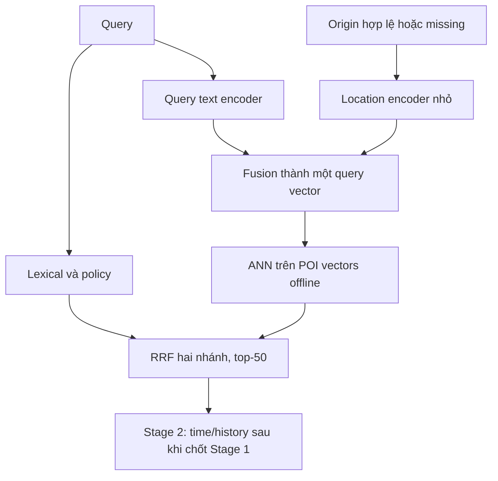

# Origin-aware dense — thiết kế thí nghiệm chính

Revision 15/09/2026. Chưa triển khai hoặc train. Code tại commit 50394ab vẫn là dense query-only + geo-v5. Đây là thiết kế đích theo quyết định mới, không phải báo cáo đã đạt chất lượng.

## 1. Phạm vi

Stage 1: lexical theo query/policy + dense nhận query và origin → RRF **hai nhánh** → cap 50. Stage 2 triển khai sau để dùng time/history/cá nhân hóa. Không thêm nhánh RRF khoảng cách, không bắt buộc learned geo reranker độc lập. Giữ baseline query-only và geo-v5 để đối chứng/rollback.

Giữ global corpus ở vòng so đầu để tách lợi ích representation khỏi scope/filter. Lexical giữ nguyên builder, branch depths=50, RRF c=60 và policy đã khóa. Các giá trị là baseline repo; chỉ tune lại fusion sau phép so cùng cấu hình. Local scope/rescue, MRL và ColBERT không nằm trong vòng chính này.

Origin là điểm đón đã chọn, GPS hoặc map point do người dùng chọn; không ép GPS thành nearest POI. Khoảng cách evaluation dùng geodesic, chưa cần routing engine. Không encode time/history vào Stage 1 ở vòng đầu.

## 2. Hai mức model, thử tuần tự

### O1 — query-side adapter, POI vectors frozen

`q0 = E_query(text)`; `g = G(origin_features)`; `q = normalize(q0 + m * F(q0,g))`, m=0 khi missing/không hợp lệ. Output dimension 384 tương thích index hiện tại. G/F là mạng nhỏ thuộc cùng query model bundle, không phải thêm service/model Transformer riêng. Freeze text encoder và POI vectors ở pilot đầu, train G/F; nhánh null dùng đúng q0 baseline.

Origin features dùng hệ tọa độ/chuẩn hóa có version và validity mask, có thể thêm accuracy. Không chỉ nối lat/lon dạng text vào E5. Tránh ID origin, persona, target, khoảng cách tới target hoặc region label suy từ đáp án làm feature.

**Giới hạn:** POI embeddings frozen có thể chứa locality trong text nhưng không bảo đảm mã hóa hình học. O1 có thể học thuộc vùng/POI thay vì quan hệ gần–xa, nhất là corpus mới/POI cold. Không hứa một adapter nhỏ đủ giải quyết spatial retrieval. Nếu không có generalization gain, giữ baseline hoặc thử O2, không tăng dữ liệu synthetic vô hạn.

### O2 — joint text/location representation

Query vector từ text+origin; POI vector từ text+ranking_point bằng encoder/fusion được train tương thích. Cả hai tạo một vector trong cùng space để ANN; không cần origin-dependent POI vectors. Train với objectives và masks thích hợp, có nhánh null/text anchoring; không mặc định missing origin cho kết quả giống checkpoint cũ vì document space đã đổi.

O2 cần re-encode corpus và rebuild index, đổi embedding_space_id. POI mới chỉ cần encode/index bằng bundle hiện hành. Spatial extrapolation ngoài Hà Nội chưa được chứng minh; test cold POI/region riêng. Không giả định dot product học được chính xác geodesic; nearest retrieval chỉ là tín hiệu có điều kiện theo query.

O1 và O2 là **hai phương án thay thế**, không chạy nối tiếp trong serving. Mỗi request vẫn một text encode, một location/fusion computation và một ANN branch. Không cam kết tốc độ trước benchmark.

## 3. Dataset và qrels

Giữ nguyên corpus/query hiện có, tạo context sidecar. Không cần làm lại 20k queries hoặc nhồi context vào bảng POI.

- `context_requests.parquet`: request_id, query_id, scenario_family_id, split, origin_kind, origin_point nullable, origin_poi_id nullable, accuracy_m nullable, origin_validity, label_set_id.
- `context_qrels.parquet`: label_set_id, poi_id, relevance, label_status, evidence_source. Text relevance và contextual preference phân biệt bằng label set/rubric; unjudged không tự là negative.
- `context_manifest.json`: corpus/query/qrels hashes, sorted origin pool hash, seed/sampler version, coordinate preprocessing, split policy, counts/strata và label rubric.
- Candidate snapshots/mined negatives là artifacts riêng sau generation; không dùng outputs model đang thử để xác định target. origin_poi_id/target cùng corpus; origin pool hợp lệ không giới hạn destination corpus.

Quy mô khởi đầu (requests, không phải negatives hoặc independent labels):

| Tập | Requests | Families/scenarios | Mục tiêu |
|---|---:|---:|---|
| Pilot development | 2.000–3.000 | 500–800 | Sampler, masks và feasibility O1 |
| Train mở rộng | 15.000–25.000 | 4.000–6.000 | Thí nghiệm chính nếu pilot có triển vọng |
| Dev | 2.000–3.000 | Tách khỏi train | Model/threshold selection |
| Eval độc lập | 1.000–2.000 | 400–600 | Holdout sau khóa config; tăng khi CI quá rộng |

Pilot là subset development, có thể tái dùng trong train/dev đúng split đã gán; không cộng lại như ý định mới hoặc chuyển vào locked eval. Các quy mô là đề xuất, không bảo đảm power. Một family gồm các prefix/origins không được chia xuyên split. Khi tái dùng query có split frozen, kế thừa split; không kéo held-out POI/family vào training vì gắn origin mới. Báo thực tế bao nhiêu families/POIs hợp lệ, không ép đủ quota.

Scenario quota khởi đầu: 35% mơ hồ nhạy origin; 35% explicit/invariant gồm remote; 15% near-but-wrong category/branch/address; 15% null/poor/perturbed origin. Dùng primary scenario class để các tỷ lệ không đếm trùng; lỗi dấu/typo/prefix/slash/code phân tầng xuyên nhóm. Chia origin distance strata [0,1),[1,3),[3,10),[10,30),>=30 km, riêng null; bin theo target chỉ dùng audit, không model input.

Origin có tọa độ hợp lệ không biến nhãn synthetic thành hành vi thật. Scenario phải xác định ý định độc lập; query “tiểu học đại” có thể nhiều positives, không ép trường gần nhất là đáp án duy nhất. “tiểu học đại mỗ” vẫn giữ Đại Mỗ dù origin gần Đại Hưng. Cặp đổi origin cần cả sensitive và invariant; thêm GPS perturbation để kiểm stability.

## 4. Negative sampling và loss

Phân biệt label/query-only với label/query+origin. Với context input, một branch có thể kém phù hợp theo scenario, nhưng khoảng cách xa không tự đủ để gán negative. Text-compatible nhưng context chưa rõ giữ ignore/multi-positive, không ép false negative.

Mine train-only từ lexical/exact dense baseline rồi optional origin-aware checkpoint; cùng fixed pool depths=100. Quota pilot tối đa8: 2 random,3 lexical-hard,3 dense-hard sau loại positives/known compatible/verified duplicates/strict holdout. Near-wrong lấy từ pool có evidence, không dùng nearest làm nhãn. Log thiếu quota thay vì chèn mẫu bừa.

Train masked multi-positive contrastive loss trên q(text,origin) và document vectors, bỏ ignore khỏi denominator; batches phải có valid positives/negatives. Giữ collision checks hiện có và test masks khi thêm negatives. Không ép một target ẩn cho input thiếu origin.

Trộn query-only examples, khởi đầu 25% optimizer requests, 75% context; báo số samples thật, không coi tỷ lệ là tối ưu. Khi origin dropout chuyển sang null, **đổi lại qrels/masks theo text-only**; nếu chưa có nhãn đủ thì skip sample/dropout, không giữ negative chỉ sai theo context. O1 nhánh null frozen chỉ là guardrail và evaluation, không có gradient học text mới; nếu muốn fine-tune text thì đó là arm khác có rebuild/parity riêng.

## 5. Benchmark và quyết định

B0 E5 query-only frozen; B1 B0 + geo-v5 hiện tại; B2 O1 origin-aware + cùng lexical/RRF, không geo rerank; B3 O2 chỉ khi O1 hạn chế. Kiểm tra dense exact riêng và hybrid cùng budget, trên cùng origin-conditioned qrels; query-only vẫn báo text metrics riêng.

Để tách data/architecture: cùng init/pairs/compute khi thích hợp; có origin-shuffled/null controls, context-label versus text-label objective được ghi rõ. Không cung cấp contradictory contextual single-target labels cho query-only chỉ để làm baseline yếu. Đánh giá cold-POI/geographic blocks nếu corpus cho phép để phát hiện memorization.

Metrics: CandidateHit@20/50, Hit@1/5, MRR/nDCG với qrels đúng loại; compatible coverage cho ambiguity; prefix/session churn; remote/explicit preservation, null/poor GPS, sensitive/invariant pairs. Target thiếu candidates giữ end-to-end miss, không inject target. Paired cluster bootstrap theo scenario/family, không coi 4 origins là 4 người độc lập.

Gate đề xuất khóa trước holdout: lower CI ΔCandidateHit@50>=−0.005; có uplift xác nhận trên origin-sensitive metric đã chọn; explicit ΔHit@1 lower CI>=−0.01, wrong-branch increase upper CI<=0.005; null-origin text non-inferiority và cold/remote slice đạt. Margins là quyết định dự án trên thang0–1, không chuẩn nghiên cứu. CI rộng: inconclusive, giữ baseline.

So exact trước ANN, sau đó đo ANN/exact cùng origin-conditioned vectors/scope/precision. Serving đo warm/cache miss, offered/achieved QPS, p50/p95/p99, queue/forward/fusion/ANN và API/search RAM. RRF/context không được dùng lại geo-v5 bonus mặc định sau B2/B3 vì có thể tăng thiên lệch gần hai lần.

## 6. Trade-offs và contract serving

O1 ít thay đổi index nhưng hạn chế học spatial; O2 biểu diễn rõ hơn nhưng tốn train/re-encode/reindex. Context labels và generalization khó hơn query-only. POI catalog không phải đủ dữ liệu để chứng minh personal intent.

Có thể cache q0 theo query+text-model hash; final vector cache phải gồm origin features/validity/accuracy khi sử dụng, preprocessing version và model space. Không cache final vector chỉ theo query. Nếu lượng tử hóa origin thành ô để tăng hit, đó là approximation riêng cần đo biên vùng/explicit stability; cache nhỏ hơn không tự đồng nghĩa latency tốt hơn.

`encode_query(query, resolved_origin, bundle)`: null là một đường hợp lệ, không lỗi. Manifest thêm query_context_mode, location_encoder/fusion hashes, coordinate normalization/domain, missing-origin policy, document_space_id và index mapping hash. O1 chỉ tái dùng index khi POI space/pooling/dim thực sự không đổi; O2 fail nếu index cũ. Không dùng cùng384d làm chứng cứ tương thích.

HTTP schema giữ nguyên. `/v1/suggest` ép null origin, không nhận context vào retrieval logic dù shared request model có fields; `/v1/suggest/personalized` resolve origin và dùng new adapter khi bundle đạt gate. Không có bundle mới thì vẫn chạy release cũ với metadata đúng. Endpoint name không chứng minh đã có history personalization.

Stage 2 time/history bắt đầu sau khi encoder/candidates khóa; có thể dùng một tabular ranker chung, không cần thêm Transformer hay model riêng cho mỗi feature group. Learned geo ranker độc lập chỉ còn đối chứng tùy chọn, không phải mốc bắt buộc.
