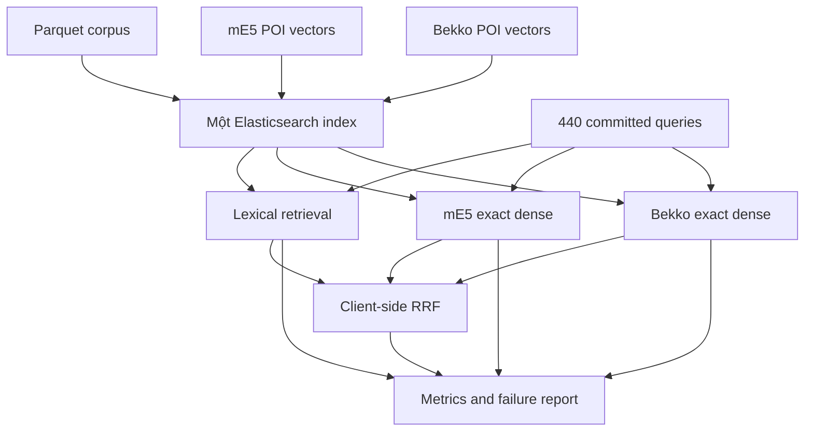

# SEARCH 2.0 — Phương pháp benchmark baseline zero-shot trên Elasticsearch

Ngày khóa bản: 2026-09-17  
Trạng thái: **đủ để chạy pilot diagnostic sau khi hoàn thành bước lọc nhãn bắt buộc**  
Phạm vi: Stage 1 text retrieval, corpus toàn quốc; chưa đánh giá geo rerank, popularity hay personalization.

## 1. Mục tiêu

Vòng benchmark này trả lời ba câu hỏi:

1. Trên cùng corpus và cùng query, lexical, `multilingual-e5-small` và Bekko model nào đưa POI đúng vào candidate set tốt hơn?
2. Hybrid lexical + dense có cải thiện ổn định so với từng nhánh đơn hay không?
3. Bekko có đủ chất lượng để thay mE5-small trước khi đầu tư fine-tune và ANN hay không?

Benchmark không nhằm chứng minh chất lượng production, autocomplete theo từng phím gõ, geo-aware retrieval hoặc cá nhân hóa.


## 2. Artifact được khóa


### 2.1 Corpus


| Artifact                   | Phiên bản / SHA-256                                                                   | Vai trò                                                              |
| -------------------------- | ------------------------------------------------------------------------------------- | -------------------------------------------------------------------- |
| `pois_core.parquet`        | `vn-poi-core-v1` / `e5d75c4783f27d86767ba5d0d46b2449dca19f709377b964672089b5226b658d` | 186.322 POI và metadata retrieval                                    |
| `search_documents.parquet` | `2af90fb4eca0675ef44fcf63f2a933438a44f4619d2736980bcf8f70621e0b72`                    | Text cố định để encode dense                                         |
| `query_sessions.csv`       | `accepted_query_locked` / SHA trong `data/vietnam/pilot_100/manifest.json`            | Pilot query và nhãn (110×4=440); nguồn sự thật sau review 2026-09-17 |


Corpus hiện là `raw_nationwide_core_not_deduped`. Kết quả benchmark phải ghi rõ hạn chế này; không được diễn giải false positive cùng tên hoặc node–way gần trùng thành lỗi model nếu qrels chưa bao phủ chúng.

### 2.2 Model

Khóa chính xác các trường sau trong `benchmark_manifest.json`:

- Hugging Face model ID;
- commit revision;
- tokenizer revision;
- `sentence-transformers`, `transformers`, PyTorch và backend;
- embedding dimension;
- max query/document length;
- normalization;
- template query/document;
- SHA-256 hoặc revision của vector artifact sau encode.

Hai model zero-shot:


| Profile                  | Model ID                             | Query input           | Document input               | Dim |
| ------------------------ | ------------------------------------ | --------------------- | ---------------------------- | --- |
| `dense_me5_exact`        | `intfloat/multilingual-e5-small`     | `query: {query_text}` | `passage: {passage_context}` | 384 |
| `dense_bekko_a25m_exact` | `hotchpotch/bekko-embedding-v1-a25m` | raw `query_text`      | raw `passage_context`        | 384 |


Không fine-tune, không query expansion, không dịch, không sửa chính tả riêng cho một model. Encode float32 và L2-normalize. Max length đề xuất: query 48 token, document 96 token. Nếu thay đổi phải chạy lại toàn bộ hai dense profile.

## 3. Đánh giá dataset query hiện tại


### 3.1 Phần đã đạt


| Kiểm tra                             | Kết quả                                            |
| ------------------------------------ | -------------------------------------------------- |
| Số cặp origin–target                 | 110                                                |
| Số query                             | 440                                                |
| Biến thể mỗi cặp                     | 4                                                  |
| Intended targets                     | 110                                                |
| Origins                              | 110                                                |
| Target/origin thiếu trong corpus     | 0                                                  |
| Target thiếu dense document          | 0                                                  |
| Distance bucket sai so với haversine | 0/110                                              |
| Tỉnh/thành được phủ                  | 8                                                  |
| Khoảng cách được phủ                 | `0–1`, `1–5`, `5–20`, `20–45`, `45–100`, `100+ km` |


Bốn biến thể được cân bằng tuyệt đối: `canonical`, `diacritic_or_ime`, `typing_noise`, `alias_or_disambiguation`, mỗi loại 110 query. Các nhóm POI cũng có brand/branch, địa chỉ, named entity, local category, code/transit/landmark và cross-region.

### 3.2 Phạm vi sử dụng hợp lệ

Bộ này phù hợp với **committed-query retrieval pilot**: người dùng đã nhập xong một chuỗi và hệ thống cần retrieve candidate.

**IME keystroke autocomplete** chưa đánh giá được vì:

- không thu thập IME raw (`raw_keystrokes` / `input_mode` đã drop);
- không có Telex/VNI replay.

**Prefix diagnostic** (token + char): sinh prefixes từ `query_text` → FHC/SHC/PrefixAUC.
- token: `fhc_unit=token_index` (pause-after-word)
- char: NFC grapheme clusters — proxy “gõ bao nhiêu ký tự”

Script: `apps/poi-search/bench/pilot110_prefix_dual_unit_bench.py`. Rule nhãn: `data/vietnam/pilot_100/README.md`. Gate chọn model Stage 1: `docs/specs/SEARCH_2.0_STAGE1_MODEL_SELECTION_PROTOCOL.md` (Recall@100/500/1000, K@95/98).

### 3.3 Trạng thái nhãn sau review (2026-09-17)


| Kiểm tra                              | Kết quả                                             |
| ------------------------------------- | --------------------------------------------------- |
| `review_status`                       | `accepted_query_locked` (440/440)                   |
| Exact duplicate `query_text`          | 0                                                   |
| Telex `*dd` dán đuôi brand (`KFCdd`…) | đã loại                                             |
| Transpose nhân tạo place–BRAND–place  | đã sửa tay; `noise_type` ghi lại theo operator thật |
| Noise taxonomy                        | `v4_telex_collapsed` — whitelist 12 trong README/manifest |
| Nguồn sự thật query                   | `query_sessions.csv` + `manifest.json` SHA          |


Còn lại trước **main metric** (không chặn zero-shot diagnostic):

1. `acceptable_poi_ids_full` trong CSV khóa vẫn single-ID. Overlay screening: `qrels_overlay_v1.parquet` (`brand_fold_all` multi-positive; category generic → `needs_review` / không vào primary gate). Adjudicate tiếp trước khi tin gate.
2. Một số cặp `ORIGIN_LOCAL` vẫn cách origin >20 km — chỉ dùng cho slice quan sát; retrieval baseline **không** nhận origin.
3. Split vẫn `pilot_dev` — không gọi blind test / holdout.

Overlay khuyến nghị (có thể file riêng, không bắt buộc sửa đè CSV nếu đã lock text):

```text
label_status: approved | diagnostic_only | reject | pending
primary_metric_eligible: boolean
exclusion_reasons: string[]
acceptable_poi_ids_adjudicated: string[]
```

Điều kiện vào main metric:

```text
review_status == accepted_query_locked
AND label_status == approved
AND acceptable_poi_ids_adjudicated không rỗng
AND mọi qrel tồn tại trong cùng corpus_version
AND query không phải generic single-positive (hoặc đã multi-positive)
```

Zero-shot **diagnostic** được phép chạy ngay với single intended ID (`QrelHit` ≡ TargetHit); báo rõ hạn chế collision/generic.

## 4. Kiến trúc benchmark tối giản

Elasticsearch được dùng làm document store và retrieval engine duy nhất cho demo. Không cần OpenSearch hoặc database nghiệp vụ riêng ở giai đoạn này.




Nên giữ kết quả benchmark, manifest và run metadata thành JSON/Parquet có version bên ngoài index. Elasticsearch có thể là source phục vụ ứng dụng, nhưng không nên là nơi duy nhất giữ bằng chứng benchmark có thể tái lập.

## 5. Elasticsearch index

Tên gợi ý: `vn-poi-zero-shot-v1`.

### 5.1 Trường tối thiểu

```text
poi_id: keyword
name: text + keyword
name_folded: text
name_prefix: text (edge n-gram)
aliases: text
aliases_folded: text
aliases_prefix: text (edge n-gram)
address_text: text
address_folded: text
category: keyword + text
brand: keyword + text
ref: keyword + text
province: keyword + text
subdistrict: keyword + text
ranking_point: geo_point
destination_searchable: boolean
passage_context: text, index=false
embedding_me5: dense_vector, dims=384, index=false
embedding_bekko_a25m: dense_vector, dims=384, index=false
```

Sử dụng analyzer cố định:

- lowercase;
- `asciifolding` cho các field `*_folded`;
- edge n-gram `min_gram=1`, `max_gram=20` chỉ lúc index cho `*_prefix`;
- search analyzer không dùng edge n-gram;
- giữ field gốc có dấu để exact/phrase match.

Không bật ANN trong vòng chất lượng đầu tiên. Elasticsearch hỗ trợ dense vector không index và `script_score`; lưu ý exact vector scoring quét tuyến tính toàn bộ document khớp, nên đây là quality benchmark, không phải serving benchmark. Tham khảo [dense vector](https://www.elastic.co/docs/reference/elasticsearch/mapping-reference/dense-vector) và [script score](https://www.elastic.co/docs/reference/query-languages/query-dsl/query-dsl-script-score-query).

### 5.2 Nạp dữ liệu

1. Khóa mapping/settings và lưu SHA-256.
2. Bulk index theo `poi_id`; tạm đặt `refresh_interval=-1`, `number_of_replicas=0` nếu chạy local một node.
3. Nạp cùng lúc metadata, `passage_context` và hai vector.
4. Refresh, kiểm tra đúng 186.322 document.
5. Kiểm tra 100% document có hai vector 384 chiều và `destination_searchable=true`.
6. Khóa index read-only hoặc tạo snapshot trước khi benchmark.


## 6. Năm retrieval profile bắt buộc


### 6.1 Lexical

Tên profile: `lexical_v1`.

Dùng một query template cố định, ưu tiên theo thứ tự:

1. exact `name`/`aliases`;
2. exact accent-folded name/alias;
3. phrase name/alias;
4. name/alias prefix;
5. address, street, ref và brand;
6. province/subdistrict chỉ hỗ trợ disambiguation, không được lấn át tên.

Boost khởi đầu được pre-register, ví dụ `12/10/6/4/3/2`. Chỉ cho phép một grid rất nhỏ trên pilot dev; mọi thay đổi phải sinh `lexical_config_id` mới. Không dùng origin, distance hoặc popularity.

### 6.2 Exact dense

Hai profile dense dùng cùng `passage_context`, cùng corpus và cùng cosine similarity:

```json
{
  "query": {
    "script_score": {
      "query": {"term": {"destination_searchable": true}},
      "script": {
        "source": "cosineSimilarity(params.q, 'embedding_FIELD') + 1.0",
        "params": {"q": "QUERY_VECTOR"}
      }
    }
  },
  "size": 100
}
```

Không prefilter theo origin/province trong baseline này vì sẽ làm thay đổi bài toán giữa các query và che lấp chất lượng representation.

### 6.3 Hybrid RRF

Hai profile hybrid:

- `hybrid_lexical_me5_rrf`;
- `hybrid_lexical_bekko_a25m_rrf`.

Mỗi branch lấy top 100. Gộp bằng:


RRF(d)=\sum_b \frac{1}{60 + rank_b(d)}


Tie-break cố định theo `poi_id`. Cắt kết quả cuối tại `K=5,20,50`.

Nên merge RRF trong benchmark runner để không phụ thuộc license hoặc thay đổi API giữa các phiên bản Elasticsearch. Elasticsearch vẫn thực hiện toàn bộ lexical/dense retrieval. Nếu sau này dùng native RRF thì phải coi đó là một implementation profile mới và đối chiếu output. Tài liệu tham khảo: [Elasticsearch RRF](https://www.elastic.co/docs/reference/elasticsearch/rest-apis/reciprocal-rank-fusion).

Không tạo profile lexical + mE5 + Bekko ba nhánh ở vòng này; nó làm tăng chi phí mà không trả lời rõ model dense nào tốt hơn.

## 7. Metric


### 7.1 Primary metrics (Stage 1 screening — high-recall)

Trên `primary_metric_eligible` (và không `needs_review`), depth `D=1000`:

- **`Recall@100` / `@500` / `@1000`** — ≥1 acceptable POI trong top-K (gate chọn model);
- **`K@95` / `K@98`** — K tối thiểu để đạt 95%/98% recall trên sessions eligible.

Qrels: `data/vietnam/pilot_100/qrels_overlay_v1.parquet` (multi-positive brand_fold; category generic → pending).

### 7.1b Diagnostic ranking / UX (không dùng để loại model một mình)

- `SR@1/5/10` (= QrelHit khi single-positive), `MRR@10`;
- Prefix token + char: `FHC@K`, `SHC@K,w=3`, `PrefixAUC@K`.

Với qrel chỉ có một ID, `CandidateHit@K` và `Recall@K` trùng nhau. Không thêm nDCG cho single-positive ở vòng này.

### 7.2 Diagnostic slices

Báo cáo cùng metric theo:

- `query_variant_type`;
- `noise_type`;
- `primary_sampling_stratum`;
- `query_types` (`lang_vi`, `lang_en`, `lang_mixed`, address, code, brand...);
- intended province;
- normalized-name collision bucket: `1`, `2–10`, `11–100`, `>100`;
- distance bucket và `geo_intent_type` chỉ để quan sát, không dùng làm quality gate vì retrieval không nhận origin.

Mỗi slice dưới 20 query phải ghi `descriptive_only`; không dùng để tuyên bố model thắng.

### 7.3 Thống kê so sánh

Bốn query trong cùng `pair_id` có tương quan, nên bootstrap theo cluster `pair_id`, không bootstrap 440 dòng độc lập. Báo:

- delta tuyệt đối giữa từng cặp profile;
- paired cluster bootstrap 95% CI;
- số cặp `win / tie / loss`;
- bảng failure có rank lexical, dense, hybrid và top-5 IDs.

Pilot 110 cặp không phải blind holdout. Kết quả chỉ được dùng để quyết định có đáng mở rộng benchmark/fine-tune hay không.

## 8. Chất lượng và runtime phải tách thành hai báo cáo


### Quality run

- exact dense trên toàn corpus;
- một Elasticsearch index đã khóa;
- không chạy tải đồng thời;
- lưu đầy đủ top 100 của mỗi branch;
- mục tiêu: so representation và fusion.


### Runtime diagnostic

- warm-up tối thiểu 20 query/profile;
- lặp tối thiểu 5 vòng;
- đo riêng encode, Elasticsearch `took`, client end-to-end;
- báo p50/p95/p99, RSS RAM, kích thước index;
- chạy từng profile độc lập trên cùng máy và cùng trạng thái cluster.

Không dùng latency của exact `script_score` làm latency production. Sau khi chọn model mới tạo ANN field/index, rồi đo `ANN Recall@20/50 versus exact` và serving latency riêng.

## 9. Trình tự chạy

1. ~~Review 440 query~~ **Done** — `accepted_query_locked`; SHA trong `data/vietnam/pilot_100/manifest.json`.
2. (Trước main metric) Chốt eligibility overlay + multi-positive cho query mơ hồ; zero-shot diagnostic có thể chạy với intended đơn.
3. Khóa model revisions và `passage_context`.
4. Encode toàn bộ 186.322 POI bằng mE5-small và Bekko a25m (**Kaggle GPU khuyến nghị**).
5. Tạo/nạp một index Elasticsearch local (Docker) chứa hai vector field.
6. Chạy và lưu top 100 của lexical, mE5 exact và Bekko exact.
7. Tạo hai kết quả RRF từ branch outputs đã lưu.
8. Tính metrics, cluster bootstrap và failure slices.
9. Chạy runtime diagnostic tách biệt.
10. Khóa kết luận pilot; sau đó mới quyết định fine-tune hoặc ANN.


## 10. Quy tắc quyết định

Không chọn model chỉ theo một metric tổng.

Bekko a25m được coi là ứng viên thay mE5-small khi:

1. `QrelHit@50` không giảm có ý nghĩa trên primary set;
2. hybrid Bekko không kém hybrid mE5 trên `QrelHit@5` và `MRR@10` vượt quá margin đã đăng ký trước;
3. không có regression nghiêm trọng ở address, brand-branch, Vietnamese noise và structured code;
4. runtime/tài nguyên phù hợp với môi trường triển khai thực tế.

Margin pilot gợi ý: tối đa `-1 điểm phần trăm` cho `QrelHit@50` và `QrelHit@5`. Với chỉ 110 cluster, CI có thể rộng; nếu không phân biệt được thì kết luận đúng là **inconclusive, cần mở rộng eval**, không phải hai model tương đương.

Lexical hoặc dense thắng từng slice không đồng nghĩa phải bỏ hybrid. Profile đề xuất cho vòng sau là profile có candidate recall tốt, top-5 ổn định và failure bổ sung cho nhau.

## 11. Output bắt buộc

```text
benchmark_manifest.json
label_overlay.parquet
run_lexical_v1.jsonl
run_dense_me5_exact.jsonl
run_dense_bekko_a25m_exact.jsonl
run_hybrid_lexical_me5_rrf.jsonl
run_hybrid_lexical_bekko_a25m_rrf.jsonl
metrics_overall.json
metrics_slices.csv
paired_bootstrap.json
failure_cases.csv
runtime_diagnostic.json
ZERO_SHOT_BASELINE_REPORT.md
```

Mỗi run record tối thiểu có:

```text
session_id, pair_id, profile_id, rank, poi_id,
raw_score, lexical_rank, dense_rank, rrf_score,
es_took_ms, encode_ms, end_to_end_ms,
corpus_version, index_uuid, model_revision, config_id
```


## 12. Kết luận readiness

Kiến trúc một Elasticsearch index là phù hợp với quy mô hiện tại và giúp giảm đáng kể độ phức tạp vận hành. Dataset mới có độ phủ tốt hơn bộ Hà Nội cũ cho benchmark toàn quốc và đã cân bằng được bốn nhóm biến thể.

Quyết định: **pass để chạy pilot zero-shot diagnostic** (query đã `accepted_query_locked`).

Trước khi nâng thành main-metric claim:

- multi-positive / `diagnostic_only` cho query generic & name-collision;
- khóa label overlay nếu tách eligibility;
- không gọi đây là autocomplete test hoặc blind test.


### 12.1 Runtime: Kaggle GPU vs Docker local


| Việc                                             | Kaggle GPU                                                              | Docker máy local                     |
| ------------------------------------------------ | ----------------------------------------------------------------------- | ------------------------------------ |
| Encode 186k passage mE5 + Bekko                  | **Nên** (GPU, internet HF)                                              | Được nhưng chậm hơn nếu chỉ CPU      |
| Exact dense top-K (numpy/`script_score` offline) | Được trên Kaggle                                                        | Được                                 |
| Lexical BM25 / Elasticsearch index + query       | **Không tiện** trên Kaggle (ES service lâu, disk/RAM, không persistent) | **Nên** — Docker ES một node theo §5 |
| Hybrid RRF client-side                           | Merge trên máy/Kaggle từ JSONL đã lưu                                   | Merge local                          |


Khuyến nghị thực thi:

1. **Kaggle:** encode → lưu `embedding_me5.npy` / `embedding_bekko.npy` (+ id map) → exact dense + hybrid RRF offline.
   - Pack: `python training/kaggle/prepare_kaggle_pilot110_w2.py`
   - Kernel: `training/kaggle/kernel_pilot110_w2/run_pilot110_dense_hybrid.py` (GPU, internet ON)
   - Dataset: `vn-poi-pilot110-w2` (`search_documents` + `query_sessions` + `lexical_ranks.jsonl`)
2. **Local Docker Elasticsearch:** bulk metadata + hai vector field → chạy `lexical_v1` + dense `script_score` + RRF.
3. Lexical template có thể port từ OpenSearch stage1 (`apps/poi-search/api` lexical route) sang ES mapping §5; không bắt buộc giữ OpenSearch song song.


### 12.2 Parquet / qrels — có cần gen lại?


| Artifact                                         | Cần gen lại?                              | Ghi chú                                                                      |
| ------------------------------------------------ | ----------------------------------------- | ---------------------------------------------------------------------------- |
| `query_sessions.parquet`                         | **Có — đã sync** từ CSV khóa              | Luôn lấy CSV làm SoT                                                         |
| `manifest.json` / `README.md`                    | Metadata + rules (folder đã dọn)          | Không còn review/handcrafted song song                                       |
| `origin_poi_pairs.parquet`                       | Không (trừ khi đổi pair)                  |                                                                              |
| `prefix_states` / FHC                            | **Có — synthetic token-prefix**           | `fhc_unit=token_index`; không phải IME raw                                   |
| `checkpoint_qrels` graded                        | **Chưa bắt buộc** cho zero-shot TargetHit | Làm sau nếu cần nDCG checkpoint                                              |
| `acceptable_poi_ids_adjudicated` / label overlay | **Nên** trước main metric                 | Multi-positive cho generic/collision; zero-shot diagnostic dùng intended đơn |


