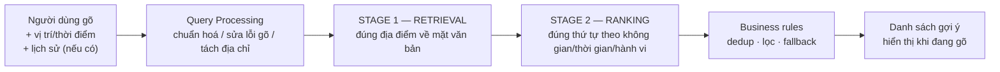
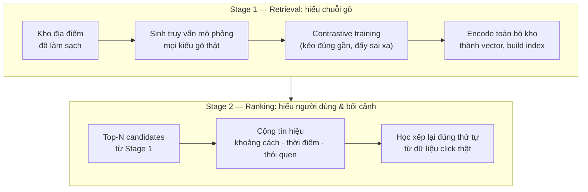
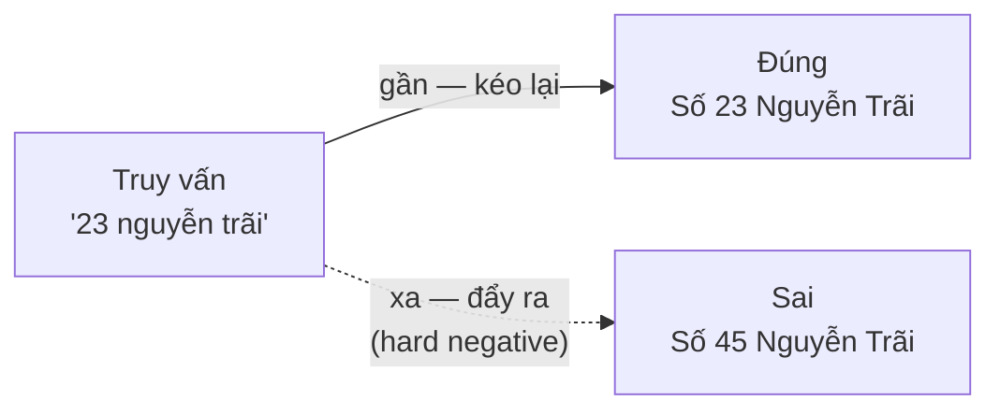
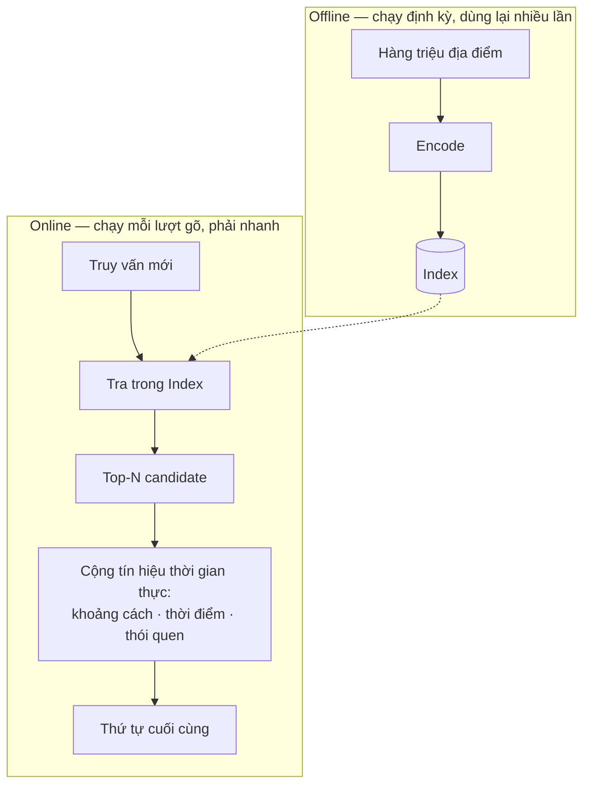
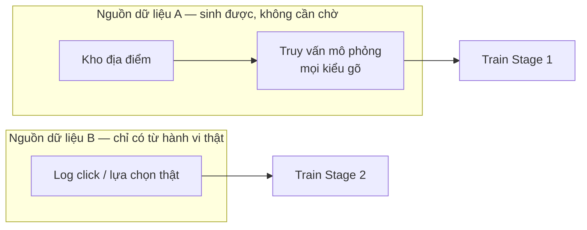

# SEARCH 2.0 — Tầm nhìn & thiết kế tổng quan

> Tài liệu này trả lời: **vì sao làm** (vision), **hệ thống làm gì** (tổng quan),
> **thiết kế thế nào** (kiến trúc), và **làm theo cách nào** (triết lý thực thi).

## Mục lục

- [1. Vision — vì sao làm cái này](#1-vision--vì-sao-làm-cái-này)
- [2. Vì sao bài toán khó — và vì sao cách cũ không đủ](#2-vì-sao-bài-toán-khó--và-vì-sao-cách-cũ-không-đủ)
- [3. Tổng quan hệ thống làm gì](#3-tổng-quan-hệ-thống-làm-gì)
- [4. Thiết kế thế nào — hai stage, ai lo việc gì](#4-thiết-kế-thế-nào--hai-stage-ai-lo-việc-gì)
  - [4.1 Stage 1 — Retrieval: hiểu chuỗi gõ](#41-stage-1--retrieval-hiểu-chuỗi-gõ)
  - [4.2 Stage 2 — Ranking: hiểu người dùng & bối cảnh](#42-stage-2--ranking-hiểu-người-dùng--bối-cảnh)
  - [4.3 Vì sao ranh giới nằm đúng ở đây](#43-vì-sao-ranh-giới-nằm-đúng-ở-đây)
  - [4.4 Business/result layer](#44-businessresult-layer)
- [5. Cách làm — triết lý thực thi và trình tự triển khai](#5-cách-làm--triết-lý-thực-thi-và-trình-tự-triển-khai)
  - [5.1 Bốn nguyên tắc xuyên suốt](#51-bốn-nguyên-tắc-xuyên-suốt)
  - [5.2 Trình tự triển khai — làm gì trước, làm gì sau](#52-trình-tự-triển-khai--làm-gì-trước-làm-gì-sau)
- [Phụ lục — 22 yêu cầu của Stage 1, kèm ví dụ minh hoạ](#phụ-lục--22-yêu-cầu-của-stage-1-kèm-ví-dụ-minh-hoạ)

---

## 1. Vision — vì sao làm cái này

Một người đứng ở Quận 10, mở app đặt xe, gõ "sư vạn hạnh" — chỗ họ muốn tới chỉ
là một quán quen trên con đường đó. Đường Sư Vạn Hạnh dài hàng cây số, hàng
trăm số nhà, và ứng dụng không biết họ đang đứng ở đâu để đoán đúng đoạn nào.
Họ gõ thêm vài ký tự, lỡ tay sai một dấu, kết quả càng lộn xộn hơn. Chưa đầy
mười giây, họ thoát ra tìm cách khác.

Đây là ô tìm địa điểm — nằm ngay đầu phễu đặt xe. Câu chuyện trên không phải cá
biệt: mỗi lần vấp ở đây, dù vì lý do gì, là một chuyến xe tiềm năng mất đi
trước khi kịp bắt đầu.

**Tầm nhìn:** xây một hệ tìm kiếm địa điểm hiểu được *cách người dùng gõ* và
*thói quen đi lại theo không gian – thời gian của từng người*, để đoán đúng điểm
đến ngay từ những ký tự đầu tiên, thay vì bắt người dùng gõ hết rồi mới tìm đúng.

Hai lựa chọn chiến lược đứng sau tầm nhìn này:

- **Tự làm bằng dữ liệu hành vi của chính mình**, không mua kết quả từ bản đồ đối
  tác — lợi thế dữ liệu click/search/booking thật là thứ đối thủ không có sẵn.
- **Cá nhân hóa là lợi thế cạnh tranh chính**, không phải một tính năng phụ:
  người dùng cũ được nhận ra qua lịch sử của họ; người dùng mới được phục vụ tốt
  nhờ học từ đám đông xung quanh.

## 2. Vì sao bài toán khó — và vì sao cách cũ không đủ

Quay lại ví dụ "sư vạn hạnh": chữ họ gõ không sai — hệ thống chỉ cần đọc đúng
chữ là đã tìm ra tên đường. Cái hệ thống thiếu là biết họ đang đứng ở đâu để
chọn đúng đoạn trong hàng trăm số nhà. Đây là manh mối quan trọng: "tìm sai địa
điểm" không phải một loại lỗi — nó là ba loại lỗi khác gốc hoàn toàn, và một
giải pháp duy nhất không xử lý tốt cả ba cùng lúc:

| Nguồn khó | Ví dụ | Bản chất |
|---|---|---|
| **Cách gõ** | `vạn hanhj`, `phợ bò nam định`, `s702` | Vấn đề *văn bản*: không dấu, sai dấu, gõ tắt, gõ dở, mã tòa |
| **Cùng tên/nhiều chỗ** | `sư vạn hạnh` (hàng trăm số nhà), `vincom` (nhiều chi nhánh) | Vấn đề *không gian – thời gian*: đúng chữ nhưng sai chỗ nếu không biết ai đang hỏi, hỏi ở đâu, lúc nào |
| **Độ phủ dữ liệu** | tên tiệm tạp hóa nhỏ, dữ liệu bẩn/thiếu | Vấn đề *chất lượng & quy mô kho dữ liệu*, không phải vấn đề mô hình |

Một embedding văn bản đơn lẻ giải tốt loại đầu nhưng **mù về không gian, thời
gian và hành vi** — nó không thể biết "Vincom" nào là *Vincom của người này*, vào
*giờ này*. Ngược lại, một mô hình xếp hạng theo hành vi mà không có nền tảng hiểu
văn bản tốt thì ngay từ đầu đã không có đúng candidate để xếp. Đây là gốc rễ của
quyết định kiến trúc ở Phần 4: **tách hai bài toán, đừng ép một mô hình gánh cả
hai.**

Điểm khác biệt so với search văn bản thông thường (web/e-commerce search):
người dùng có tọa độ, có thời điểm trong ngày, có lịch sử đi lại — bỏ qua ba thứ
này là bỏ qua chính tín hiệu mạnh nhất mà bài toán ride-hailing có sẵn.

## 3. Tổng quan hệ thống làm gì

Hãy theo đúng truy vấn "sư vạn hạnh" đi hết một lượt qua hệ thống. Nhìn từ
ngoài vào, hệ thống nhận một chuỗi gõ dở + vị trí/thời điểm hiện tại (nếu có) +
lịch sử người dùng (nếu có), trả về danh sách địa điểm xếp theo khả năng đúng
là nơi họ muốn tới, đủ nhanh để gợi ý ngay khi đang gõ:



Vài tình huống tiêu biểu để hình dung "đúng" nghĩa là gì:

| Người dùng gõ | Hệ thống cần làm |
|---|---|
| `hang xach tay` (không dấu, gõ dở) | Vẫn nhận ra đúng tên đầy đủ có dấu — đây là việc của Stage 1 |
| `sư vạn hạnh` lúc đứng ở quận 10 | Trong hàng trăm số nhà cùng tên đường, ưu tiên đoạn gần vị trí hiện tại — việc của Stage 2 |
| `vincom` (người dùng cũ) | Ưu tiên chi nhánh họ hay tới, dù có chi nhánh khác gần hơn về khoảng cách thuần túy — cá nhân hóa ở Stage 2 |
| `chợ` (người dùng mới, chưa cấp vị trí) | Không suy diễn "khoảng cách = 0"; xếp theo mức phổ biến trong khu vực và thời điểm tương ứng |

## 4. Thiết kế thế nào — hai stage, ai lo việc gì

Bốn tình huống ở mục 3 thật ra đang đòi hỏi hai loại năng lực rất khác nhau ở
cùng một hệ thống: đọc đúng chữ, và biết đúng người-đúng-lúc-đúng-chỗ. Trộn
chung hai việc này vào một bước là cách chắc chắn để làm dở cả hai. Nguyên tắc
phân tầng: không cố giải toàn bộ bài toán bằng một bước duy nhất.

- **Stage 1 (Retrieval)** trả lời: *"địa điểm đúng có nằm trong candidate set
  không?"* — chỉ dựa vào văn bản (tên, địa chỉ, mã), bất kể ai hỏi hay hỏi ở đâu.
- **Stage 2 (Ranking)** trả lời: *"trong các candidate này, cái nào nên đứng
  trước?"* — dùng khoảng cách, thời điểm, mức quen thuộc/phổ biến để sắp lại thứ
  tự mà Stage 1 đã tìm ra.
- **Business/result layer** trả lời: *"kết quả nào thực sự nên đưa cho người
  dùng chọn?"* — dedup các bản ghi trùng cùng một địa điểm thật, lọc theo chính
  sách, và có phương án dự phòng khi một phần hệ thống gặp sự cố.



Đi vào từng stage — bắt đầu với phần chỉ cần hiểu chữ, chưa cần biết ai đang
hỏi hay hỏi ở đâu.

### 4.1 Stage 1 — Retrieval: hiểu chuỗi gõ

**Input:** một chuỗi gõ dở, không kèm theo biết ai hỏi hay hỏi ở đâu.
**Output:** một danh sách rút gọn (top-N, cỡ vài chục đến vài trăm trong số hàng
triệu địa điểm) các candidate có khả năng đúng cao nhất *về mặt câu chữ*.

Cơ chế đứng sau là **tìm kiếm bằng vector**: mỗi địa điểm (tên + địa chỉ) được
encode thành một vector sao cho hai địa điểm/câu chữ gần nghĩa nhau thì vector
của chúng cũng nằm gần nhau trong không gian đó. Chuỗi người dùng gõ dở cũng
được encode vào cùng không gian này. Tìm kiếm lúc đó trở thành: *tìm những
vector địa điểm nằm gần vector câu gõ nhất* — nhanh hơn nhiều so với so khớp
từng ký tự với hàng triệu bản ghi. Độ "gần" đo bằng một hàm khoảng cách toán
học đơn giản (ví dụ cosine similarity) — công thức cụ thể không quan trọng
bằng việc nó so sánh được hàng triệu vector gần như tức thời.



*Trước khi train, cả ba vector này nằm rải rác ngẫu nhiên. Train xong, đúng
phải rõ ràng gần hơn sai — đó là toàn bộ mục tiêu của bước 2 dưới đây.*

Vấn đề là **một encoder ngôn ngữ tổng quát không tự nhiên hiểu đặc thù của ô
tìm địa điểm**: gõ không dấu, gõ tắt, trượt phím, mã tòa nhà — cách gõ thật rất
khác văn viết thông thường. Nên phải *dạy riêng*:

1. **Sinh truy vấn mô phỏng** từ chính kho địa điểm — với mỗi địa điểm, tạo ra
   nhiều biến thể mô phỏng cách người thật sẽ gõ (không dấu, sai dấu, gõ dở, gõ
   theo địa chỉ, gõ theo mã...). Làm được điều này *mà không cần chờ log thật*,
   vì cách gõ có thể mô phỏng được, còn thói quen đi lại thì không (đó là lý do
   việc này thuộc Stage 1, không phải Stage 2 — xem 4.3).
2. **Contrastive training:** mỗi lần cho mô hình xem một cặp
   *(truy vấn mô phỏng, địa điểm đúng)* cùng vài địa điểm sai, rồi dạy nó kéo
   vector của cặp đúng lại gần nhau và đẩy các cặp sai ra xa.
3. **Ví dụ sai phải "khó" mới học được nhiều.** Nếu ví dụ sai quá khác biệt
   (hiển nhiên sai), mô hình gần như không học thêm gì. Ví dụ sai hữu ích là
   những địa điểm *na ná* địa điểm đúng — cùng tên khác chi nhánh, cùng đường
   khác số nhà. Đây gọi là *hard negative mining*.
4. **Rủi ro cố hữu của bước 3:** khi tự động tìm ví dụ "khó", có thể vô tình
   chọn nhầm chính một bản ghi trùng của đáp án đúng làm ví dụ sai (kho dữ liệu
   thường có cùng một địa điểm bị nhập nhiều dòng) — gọi là *false negative*.
   Nếu không lọc, mô hình bị dạy sai. Bước lọc này cần một tầng kiểm tra riêng
   trước khi đưa vào train:

   ```mermaid
   flowchart TD
       A["Ứng viên 'na ná' đáp án đúng<br/>(cùng tên khác chi nhánh,<br/>cùng đường khác số nhà)"] --> B{"Có phải bản ghi trùng<br/>của chính đáp án đúng?"}
       B -->|"Đúng — false negative"| C["Loại bỏ"]
       B -->|"Không — negative thật"| D["Dùng làm hard negative"]
   ```

5. **Indexing:** sau khi có encoder đã train xong, encode toàn bộ kho địa điểm
   một lần, lưu vào index để tra cứu nhanh — việc này làm định kỳ (offline),
   không nằm trong lúc người dùng đang gõ.

Bước 1 ở trên không phải phỏng đoán — có 22 kiểu biến thể cụ thể đã cài đặt,
mỗi kiểu bật/tắt và chỉnh trọng số độc lập, từ gõ không dấu, sai dấu, trượt
phím, đến số nhà trong hẻm hay mã tòa nhà. Vài ví dụ:

- `phợ bò nam định` phải ra **Phở Bò Nam Định** (nhầm dấu).
- `pho73 bo2 nam dinh5` phải ra cùng kết quả đó (gõ kiểu VNI chưa convert).
- `16/2 lê văn khương` phải giữ nguyên số nhà trong hẻm, không tách vỡ dấu "/".
- `b3` phải ra **Nhà B3 Tập thể Thành Công** (mã tòa, không phải chữ cái đơn lẻ).

Danh sách đầy đủ cả 22 kiểu, kèm ví dụ cho từng kiểu, nằm ở
[Phụ lục](#phụ-lục--22-yêu-cầu-của-stage-1-kèm-ví-dụ-minh-hoạ) cuối tài liệu —
đây chính là bộ tiêu chí để biết truy vấn tổng hợp ở bước 1 đã đủ đa dạng hay
chưa, và mọi thay đổi sau này ở Stage 1 phải kiểm tra lại không làm hỏng kiểu
nào trong số đó.

Xong phần hiểu chữ. Giờ đến phần khó hơn: hiểu đúng người, đúng lúc, đúng chỗ.

### 4.2 Stage 2 — Ranking: hiểu người dùng & bối cảnh

**Input:** đúng candidate set mà Stage 1 đã trả về, cộng thêm vị trí/thời điểm
hiện tại và lịch sử người dùng (nếu có).
**Output:** vẫn từng ấy candidate, nhưng xếp lại đúng thứ tự — Stage 2 không
tạo thêm candidate mới, không mở rộng phạm vi tìm kiếm.

Cơ chế học ở đây khác hẳn Stage 1: học từ **chính hành vi lựa chọn thật của
người dùng**. Mỗi lần hệ thống từng hiển thị một danh sách kết quả và người
dùng bấm chọn một trong số đó, đấy là một bài học — không phải "địa điểm này
đúng tuyệt đối", mà là *"trong đúng những lựa chọn đã hiển thị lúc đó, cái được
chọn nên đứng cao hơn những cái còn lại"*.

Ví dụ cụ thể: hệ thống hiển thị ba chi nhánh cùng chuỗi "Cà Phê X" (Q1, Q3,
Q7) cho truy vấn "cà phê x"; người này bấm chọn chi nhánh Q3. Bài học rút ra
không phải "Q3 luôn đúng", mà là *"với đúng người này, đúng lúc này, đứng ở
đúng chỗ này, Q3 nên đứng trên Q1 và Q7"* — chỉ đúng trong đúng bối cảnh đó,
không phải một chân lý cố định gắn với Q3.

Tín hiệu dùng để xếp lại:

| Tín hiệu | Vì sao cần |
|---|---|
| Khoảng cách người dùng ↔ địa điểm | Cùng tên, ưu tiên chỗ gần hơn |
| Thời điểm / khung giờ | 8h sáng ưu tiên gần công ty, 20h ưu tiên gần nhà |
| Mức độ quen thuộc (đã từng ghé, tần suất chọn) | Cá nhân hóa cho người dùng cũ |
| Độ phổ biến trong khu vực & thời điểm đó | Cá nhân hóa cho người dùng mới, chưa có lịch sử riêng |

Vì sao các tín hiệu này **không nhét chung vào vector văn bản ở Stage 1** mà
tính riêng ở một bước xếp hạng phía sau? Vì chúng thay đổi theo thời gian thực
— vị trí và giờ giấc khác nhau ở mỗi lượt hỏi — trong khi vector văn bản của
một địa điểm là cố định, chỉ cần tính một lần rồi dùng lại mãi. Nếu trộn chung,
mỗi lượt hỏi sẽ phải tính lại vector cho toàn bộ hàng triệu địa điểm — không
khả thi. Tách riêng cho phép Stage 1 làm nặng một lần (offline), Stage 2 chỉ
tính nhẹ trên vài chục candidate mỗi lượt hỏi (online):



**Trường hợp thiếu vị trí** (người dùng chưa cấp quyền định vị): tuyệt đối
không ngầm định khoảng cách bằng 0 — hệ thống sẽ hiểu nhầm thành "cực kỳ gần"
và ưu tiên sai. Cần một nhóm xử lý riêng cho "không biết vị trí", dựa vào lịch
sử cá nhân và độ phổ biến chung thay vì khoảng cách.

### 4.3 Vì sao ranh giới nằm đúng ở đây

Vì hai bài toán con dùng **hai nguồn dữ liệu train khác hẳn nhau** — Stage
1 học từ *kho địa điểm + truy vấn mô phỏng cách gõ* (không cần log thật, vì mọi
kiểu gõ đều mô phỏng được), còn Stage 2 chỉ học được từ *log click/lựa chọn
thật của người dùng* (không thể mô phỏng thói quen đi lại của một người cụ
thể). Ranh giới kiến trúc đi theo đúng ranh giới dữ liệu — chia ở chỗ khác sẽ
buộc một stage phải học từ dữ liệu nó không có:



*Không thể tráo ngược: không mô phỏng được thói quen đi lại của một người cụ
thể, và log click thật thì chỉ có query đã gõ xong — không có variant sai
chính tả hay gõ dở nào để dạy Stage 1.*

Điểm hai stage bắt buộc phải khớp nhau: định nghĩa "cùng một địa điểm" (gộp bản
ghi trùng) phải nhất quán xuyên suốt — dùng ở cả lúc tìm ví dụ khó cho Stage 1
(mục 4.1 bước 4), lọc nhiễu cho Stage 2, lẫn lúc chấm điểm cuối cùng. Lệch chỗ
này là nguồn gây "false negative" phổ biến nhất trong toàn bộ pipeline.

*Kỹ thuật cụ thể cho từng khối (kiến trúc mô hình, hạ tầng index, thuật toán
tìm hard negative...) là lựa chọn triển khai, không phải một phần của thiết kế
— tự chọn công cụ phù hợp với nguồn lực sẵn có.*

### 4.4 Business/result layer

Ngay cả khi Stage 1 và Stage 2 đều đã làm đúng phần của mình, vẫn còn hai việc
cuối trước khi người dùng nhìn thấy kết quả trên màn hình:

- **Dedup:** nhiều dòng dữ liệu có thể cùng trỏ về một địa điểm thật (một
  tòa nhà bị nhập 5–6 lần) — phải gộp về một dòng duy nhất trong kết quả hiển
  thị, dùng đúng định nghĩa "cùng một địa điểm" đã nói ở 4.3.

  ```mermaid
  flowchart LR
      R1["Bản ghi 1"] --> G(("Cùng một<br/>địa điểm thật"))
      R2["Bản ghi 2"] --> G
      R3["Bản ghi 3"] --> G
      G --> OUT["1 dòng kết quả"]
  ```

- **Fallback theo bậc thang:** nếu một phần hệ thống lỗi hoặc chậm (ví dụ thiếu
  vị trí, hoặc dịch vụ xếp hạng không phản hồi kịp), vẫn phải trả được kết quả
  — dù đơn giản hơn — thay vì trả về màn hình trắng.

  ```mermaid
  flowchart LR
      L1["Bậc 1 — đầy đủ<br/>Stage 1 + Stage 2 + vị trí + lịch sử"] -->|lỗi/chậm| L2["Bậc 2 — rút gọn<br/>Stage 1 + độ phổ biến khu vực"]
      L2 -->|lỗi/chậm| L3["Bậc 3 — tối thiểu<br/>chỉ khớp văn bản, không cá nhân hoá"]
  ```

## 5. Cách làm — triết lý thực thi và trình tự triển khai

Thiết kế đúng trên giấy là một chuyện — làm đúng thứ tự khi bắt tay vào việc
là chuyện khác. Phần này đi từ nguyên tắc chung xuống việc cụ thể cần làm ở
từng bước, theo đúng thứ tự **hiểu dữ liệu → baseline → Stage 1 (retrieval) →
Stage 2 (ranking) → ghép thành service chạy thật → tối ưu cho demo/production.**

### 5.1 Bốn nguyên tắc xuyên suốt

Áp dụng ở mọi bước dưới đây, bất kể chọn công cụ nào:

1. **Hiểu trước khi xây.** EDA + soi tay dữ liệu thật (query, click, POI) trước
   khi chọn kiến trúc — kiến trúc đúng chỉ lộ ra sau khi biết dữ liệu thật trông
   như thế nào.
2. **Có baseline trước khi có mô hình phức tạp.** Một baseline đơn giản (lexical
   + geo filter) dựng nhanh, chấm điểm được ngay, là mốc để mọi cải tiến sau này
   phải chứng minh vượt qua — không có mốc thì không biết "tốt hơn" là tốt hơn
   bao nhiêu.
3. **Mọi cải tiến đi theo vòng Observation → Hypothesis → Experiment → Result,
   có thể trace lại được.** Không "tune cho đến khi số đẹp" — mỗi lần đổi một
   thứ, đo lại, ghi lại vì sao đổi và kết quả ra sao.
4. **Không tối ưu khi chưa đo thấy vấn đề.** Thêm tín hiệu, thêm hạ tầng, tối ưu
   tốc độ — tất cả chỉ làm khi đã đo được rằng thiếu nó thực sự gây hại, không
   làm trước vì "chắc sẽ cần".

### 5.2 Trình tự triển khai — làm gì trước, làm gì sau

Mỗi bước có Input (cái đã có sẵn để bắt đầu), việc cần làm theo đúng thứ tự,
và Output (dấu hiệu cụ thể để biết đã xong, được đi tiếp). Không có Output rõ
ràng thì chưa nên bắt đầu bước sau — đây là cách tránh xây nhầm thứ trước khi
biết mình đang xây đúng hướng.

**Bước 1 — Hiểu dữ liệu**
- Input: kho địa điểm thô, query/click log thô.
- Làm: đếm và soi phân bố kho địa điểm (chất lượng tên/địa chỉ, trùng lặp);
  soi tay 100–200 query thật cùng kết quả hiện có, gom thành danh sách các
  kiểu thất bại (error taxonomy); viết một đoạn ngắn định nghĩa "tìm đúng"
  nghĩa là gì cho bài toán này.
- Output: có error taxonomy + problem statement. Nếu chưa chỉ ra được *vì
  sao* một kết quả cụ thể là sai, chưa nên qua bước 2.

**Bước 2 — Baseline**
- Input: error taxonomy từ bước 1.
- Làm: với mỗi kiểu thất bại, chọn một con số đo được tương ứng (ví dụ
  Recall@K đo "có tìm ra không", MRR/SR@K đo "có xếp đúng vị trí không");
  chuẩn bị một evaluation set có sẵn đáp án đúng, dùng chung cho mọi lần đánh
  giá về sau; dựng baseline đơn giản nhất có thể chạy được (lexical/full-text
  + geo filter).
- Output: điểm baseline theo từng loại query. Đây là mốc — mọi con số sau này
  so với mốc này, không so với cảm giác "có vẻ tốt hơn".

**Bước 3 — Stage 1 (Retrieval)** — theo đúng 5 bước cơ chế ở [4.1](#41-stage-1--retrieval-hiểu-chuỗi-gõ)
- Input: kho địa điểm đã làm sạch, 22 yêu cầu ở [Phụ lục](#phụ-lục--22-yêu-cầu-của-stage-1-kèm-ví-dụ-minh-hoạ).
- Làm, theo thứ tự: viết bộ sinh truy vấn mô phỏng cho vài nhóm phổ biến nhất
  trước (không dấu, sai dấu, gõ dở — chiếm phần lớn query thật), rồi mở rộng
  dần sang các nhóm còn lại trong Phụ lục; chọn một kiến trúc encoder để
  fine-tune; cài vòng contrastive training chạy thử trên tập nhỏ trước khi
  chạy full; thêm bước tìm hard negative, soi tay 50–100 cặp để ước lượng tỉ
  lệ false negative trước khi tin số liệu; train full, encode và index toàn
  bộ kho.
- Output: điểm trên evaluation set của bước 2, tách theo từng nhóm trong Phụ
  lục — phải vượt baseline rõ rệt, đặc biệt các nhóm gõ tiếng Việt phổ biến.
  Nhóm nào chưa vượt là nơi cần soi tiếp, không phải lý do bỏ qua.

**Bước 4 — Stage 2 (Ranking)** — theo đúng cơ chế ở [4.2](#42-stage-2--ranking-hiểu-người-dùng--bối-cảnh)
- Input: Stage 1 đã train, candidate set của Stage 1 chạy trên log click thật.
- Làm: build feature cho từng tín hiệu ở bảng mục 4.2; thêm từng tín hiệu
  một — text-only → +khoảng cách → +thời điểm → +hành vi — đo lại điểm sau
  mỗi lần thêm; xử lý trường hợp thiếu vị trí bằng một bucket riêng, không
  truyền giá trị 0.
- Output: so với retrieval-only baseline trên tập test tách theo thời gian
  (không random); mỗi tín hiệu thêm vào phải chứng minh được đóng góp qua
  ablation — thêm vào mà điểm không đổi hoặc giảm thì bỏ lại, không giữ vì
  "chắc sẽ cần".

**Bước 5 — Ghép thành service chạy thật** — theo đúng phân việc ở [4.4](#44-businessresult-layer)
- Input: Stage 1 và Stage 2 đã có.
- Làm: tách offline (đánh index định kỳ) và online (trả lời mỗi lượt gõ);
  dedup theo đúng định nghĩa "cùng một địa điểm" đã dùng xuyên suốt từ
  [4.3](#43-vì-sao-ranh-giới-nằm-đúng-ở-đây); dựng fallback theo bậc thang và
  tắt thử từng bậc để xác nhận nó hoạt động thật, không chỉ nằm trên giấy.
- Output: gõ vào có kết quả ra thật, đo được latency ở từng bước.

**Bước 6 — Tối ưu cho demo/production**
- Input: service E2E từ bước 5.
- Làm: chạy thử các tình huống đại diện (truy vấn đúng hẳn, gõ dở, theo địa
  chỉ, cùng tên nhiều chi nhánh, gõ sai, cùng truy vấn nhưng khác vị trí
  người dùng, truy vấn hiếm, và tình huống lỗi/fallback); chỉ tối ưu (cache,
  giảm candidate size...) ở chỗ đã đo được là chậm/lag thật.
- Output: demo chạy ổn định và tái hiện lại được đúng như lúc đo.

Tối ưu sớm khi chưa có baseline hay evaluation set là công sức dễ đổ sông đổ
biển nhất — mỗi bước ở trên chỉ nên bắt đầu khi bước trước đã có Output rõ
ràng để so sánh.

---

## Phụ lục — 22 yêu cầu của Stage 1, kèm ví dụ minh hoạ

Đây là danh sách đầy đủ các tình huống Stage 1 phải xử lý được (nhắc tới ở
mục 4.1), ứng với 22 kiểu biến thể truy vấn đã cài đặt — mỗi kiểu tạo truy vấn
mô phỏng riêng, có thể bật/tắt và chỉnh trọng số độc lập. Mọi truy vấn tổng hợp
dùng để train phải phủ đủ các nhóm này, và mọi thay đổi sau này ở Stage 1 phải
kiểm tra lại không làm hỏng nhóm nào.

**A. Biến thể trong cách gõ tên**

| # | Yêu cầu | Người dùng gõ | Phải nhận ra là |
|---|---|---|---|
| 1 | Gõ không dấu | `hang xach tay facestory trinh cong son` | Hàng Xách Tay Facestory Trịnh Công Sơn |
| 2 | Gõ sai dấu / nhầm thanh điệu | `phợ bò nam định` | Phở Bò Nam Định |
| 3 | Gõ telex, sót phím bật dấu | `cuwar hafng myx phaamr cor meemf` | Cửa hàng Mỹ phẩm Cỏ Mềm |
| 4 | Gõ kiểu VNI, chưa convert | `pho73 bo2 nam dinh5` | Phở Bò Nam Định |
| 5 | Trượt phím kề nhau (QWERTY) | `Sua Xe Tan hon 54A Lo Lu` | Sửa Xe Tấn Phong 54A Lò Lu |
| 6 | Dấu nửa vời — vài từ có dấu, vài từ không | `phở bo nam dinh` | Phở Bò Nam Định |
| 7 | Biến thể chính tả hợp lệ (không phải lỗi gõ) | `Lí`, `thuý`, `hòa` | "Lý", "thúy", "hoà" — cùng một từ, hai cách viết đều đúng |
| 8 | Lặp phím do double-tap trên mobile | `Càà Phê Đen` | Cà Phê Đen |
| 9 | Dính/rời từ do gõ nhanh trên mobile | `báchhóa xanh` | Bách Hóa Xanh |
| 10 | Đảo thứ tự từ trong tên | `Dũng Photocopy Hà Thanh Hải Nguyễn` | Dũng Hà Photocopy Nguyễn Hải Thanh |
| 11 | Bỏ từ coi là hiển nhiên, ngẫu nhiên vị trí | `Hòa 214A Bùi Ba` | Tiệm của Hòa 214A Bùi Văn Ba |
| 12 | Bỏ hẳn cụm từ chung ở đầu tên | `cơm tấm ba ghiền` | Quán Cơm Tấm Ba Ghiền |
| 13 | Thay cụm dài bằng viết tắt quen dùng | `bvđk tỉnh hòa bình` | Bệnh viện Đa khoa Tỉnh Hòa Bình |
| 14 | Gõ dở, cắt giữa chừng theo ký tự | `Bún Đậu` | Bún Đậu Cô Én 7 Ngõ 36 Duy Tân |
| 15 | Gõ dở, dừng đúng ở ranh giới từ | `bệnh viện đại học` | Bệnh viện Đại học Y Dược |
| 16 | Chỉ nhớ đoạn giữa/cuối tên, không nhớ đầu | `ba ghiền` | Quán Cơm Tấm Ba Ghiền |

**B. Biến thể trong cách gõ địa chỉ / mã**

| # | Yêu cầu | Người dùng gõ | Phải nhận ra là |
|---|---|---|---|
| 17 | Số nhà + đoạn đầu tên đường | `a58 nguyễn trãi` | Rau Má Mix, A58 Nguyễn Trãi... |
| 18 | Chỉ tên đường, không kèm số nhà | `Sư Vạn Hạnh` | Cơm Gà Hải Nam Yummy, 11 Sư Vạn Hạnh, Quận 5... |
| 19 | Theo ngõ/ngách/hẻm, có thể kèm số nhà | `72b ngõ 119 trung kính` | 72b Ngõ 119 Trung Kính, Phường Yên Hòa... |
| 20 | Số nhà kiểu "a/b" trong hẻm, giữ nguyên "/" | `16/2 lê văn khương` | KidsPlaza, 16/2 Lê Văn Khương... |
| 21 | Dán nguyên cả địa chỉ (kiểu copy từ tin nhắn) | `121 Lê Lợi, Phường Bến Thành, Quận 1, TP HCM` | giữ nguyên, có thể chỉ thêm ", Việt Nam" |
| 22 | Mã tòa / mã lô ngắn | `b3` | Nhà B3 Tập thể Thành Công |
